# C++笔记


## Day1

### 1、Ubuntu18.04手动配置IP/DNS


默认网关的设置，是在VMware中的菜单栏中点击“编辑” --> "虚拟网络编辑器", 打开如下窗口:


### 2、简单命令的使用：

cd :  change directory   改变工作目录

/    :  根目录，相当于windows上的“**此电脑**”

ls  :  list 列表，显示当前目录下有哪些文件

pwd:  打印当前的目录路径

clear: 清屏命令

df :  查看磁盘空间的使用情况   -h(human) 表示以人类看得懂的方式展现

Tab: 在敲击命令的过程中，可以使用Tab键进行**自动联想**

↑ ： 向上查找已经使用过的命令

↓：向下查找已经使用过的命令

ctrl+a : 可以从命令行末尾跳到开头

cd ~ : 表示当前用户的家目录

cd - : 表示回退到上一次使用的工作目录


目录系统：


ls -a :  列出当前目录下的所有文件，包括隐藏文件

在文件的前面加上一个点，表示该文件是一个隐藏文件

. (一个点)： 当前目录

..(两个点)：上一级目录（父目录）


**第一个字符**表示的是文件类型：

d : 代表的是目录

— : 代表的是普通文件 

l : 链接文件 （快捷方式）


第二个到第十个字符，表示的是文件的权限，权限一共有三种：

>  可读、可写、可执行

针对于三种用户: 当前用户、组用户、其他用户

111   7

r-x     5

rw-    6

r--     4

### 3、常见概念

蓝色的是 **目录**

天蓝色的是 **快捷方式**

黑色的是 **普通文件**


在/bin目录之下的是可执行程序:

在windows上，可执行程序是以.exe结尾的文件；

但在Linux之下，一个文件是否可以执行，取决于其有没有**可执行权限**。


‘#’  针对于shell（脚本语言script language）的注释

```shell
$ cd ~    # 切换到家目录
```


### 4、用户

每创建一个用户，都会在 /home/ 生成一个目录

超级用户：root用户，具有最高权限  rm -rf /

切换用户：

```shell
$ su root   # 切换到root用户   （su: select user）
```


普通用户的 最后一个字符是以 $ 符号结尾；超级用户root的最后一个字符是以 # 结尾


exit命令：退出当前用户


sudo命令:  该命令是以普通用户的身份提升到超级用户的权限

```shell
$ sudo useradd test1 
$ cat /etc/passwd
$ sudo passwd test1
```


查看用户是否创建成功，要执行如下命令，查看/etc/passwd的文件内容

```shell
$ cat /etc/passwd
```


```shell
$ userdel test1
$ sudo userdel test1  # 删除一个用户
```

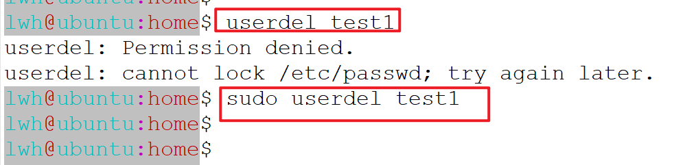

创建一个带有家目录以及指定shell的用户

**注意**：shell的应用程序是有多种的，常见的有/bin/bash [功能更多]  /bin/sh，它的作用是用来解析命令。

```shell
$ sudo useradd -m test2 -s /bin/bash
$ sudo passwd test2
$ su test2
$ cd ~
```


用户的删除操作：


```shell
$ sudo userdel test3 -r   # 删除用户的同时，删除其家目录
```


## Day2

### 几个要注意的事儿：

#### 1、WinScp的使用

#### 2、Ubuntu上安装软件和工具

apt包管理工具

```shell
$ sudo apt install gcc 
$ sudo apt install lrzsz  
```


#### 3、多网卡的关系

- 上课时，先禁用掉VMnet1/VMnet8

  

  VMnet8相当于是虚拟出来的一个交换机， 192.168.30.1

  Ubuntu是该交换机之下虚拟出来的一台物理主机

  

  


下课之后，如果要去练习，再启用**VMnet8**


#### 4、**vimplus**的安装


```shell
$ git clone https://gitee.com/chxuan/vimplus.git
$ cd vimplus
$ ./install.sh  # 等待执行完毕

# 在下载的过程中，需要大家选择是[python2/3]
# 统一按3
```


#### 5、Xshell的使用


采用这样的配置后，左键选择要复制的内容，点击右键就是粘贴的功能.

#### 6、如果是发现在xshell上无法执行回退操作


#### 7、为超级用户配置密码

```shell
$ sudo passwd root
```


#### 8、root用户的家目录

```shell
$ su root
# cd ~
# pwd
```


9、目录相关的命令

- mkdir : 创建一个目录

  ```shell
  $ mkdir dir1 dir2
  ```

- touch： 创建一个文件

  ```shell
  $ touch test1.txt
  ```

- tree： 递归查看目录之下的所有文件

  ```shell
  $ tree
  ```

  

- 以层次的方式创建目录

  ```shell
  $ mkdir -p dir3/dir4
  ```

  

- 以权限（模式mode）的方式创建目录

  ```shell
  $ mkdir -m 755 dir5
  $ cd dir5  # 能够进入dir5子目录
  
  $ mkdir -m 644 dir7
  $ cd dir7  # 不能进入dir7子目录，权限不够; 进入到一个目录，需要可执行权限
  ```

  

- 如果要想进入，就必须重新设置权限

  ```shell
  $ chmod 755 dir7
  ```

#### 9、修改配置文件 /etc/sudoers

1）查看


2）修改权限之后，使用vim添加sudo权限


3）修改完毕之后，需要再将/etc/sudoers文件重新设置为440的权限。


#### 10、vim的简单操作

打开一个文件，

```shell
$ vim 文件名
```

文件打开之后，vim有三种模式:  normal模式/Insert模式/底栏模式

> normal模式：默认打开文件时的模式
>
> insert模式： 按 i 键之后，进入到编辑(insert)模式
>
> 从insert模式回到normal模式，按ESC键
>
> 编辑完文件之后，想要保存： 先按ESC键，进入Normal模式，然后按冒号：进入底栏模式,之后再按w键写入
>
> 如果要退出vim, 进入底栏模式之后，按 :q
>
> 如果无法正常退出，可以使用强制退出方式 按 :q!

#### 11、文件的创建

1）touch命令

```shell
$ touch test2.txt # 创建一个空文件
```

2）vim编辑器

```shell
$ vim test.txt  # 创建一个文件
```

3）echo

```shell
$ echo hello > test3.txt  # 将字符串hello 写入test3.txt文件
$ echo world > test3.txt  # 先清空原来文件中的内容， 再写入新的内容
$ echo wuhan >> test3.txt # 以追加的方式在文件的末尾写入新的内容

>   >>  这两个符号叫做 重定向，通过管道完成的操作
```

4）cat

```shell
$ cat > test4.txt # 将用户输入的字符串写入一个新文件，按ctrl + d 结束输入
```


#### 12、特殊快捷键的使用

Ctrl + c :  发送一个中断信号给进程，终止程序的运行

Ctrl + d:  结束用户的输入

#### 13、文件的拷贝操作

1） 拷贝普通文件

```shell
$ cp test.txt dir2/   # 如果目的地文件存在，会直接覆盖
```

2）拷贝整个目录（文件夹）

```shell
$ cp dir7 dir2/ -r   #  递归拷贝该目录下的所有文件
```


#### 14、删除文件或文件夹

```shell
$ rm dir2/test.txt
$ rm dir7 -rf       #  -r  递归删除   -f  强制删除
```


#### 15、移动文件后者文件夹

```shell
$ mv test1.txt ./dir7/    
$ mv dir7 ./dir2/
```


修改一个文件的名字

```shell
$ mv test.txt test1.txt
```


拷贝文件的同时，修改文件的名字

```shell
$ cp test1.txt ./dir1/test5.txt
```

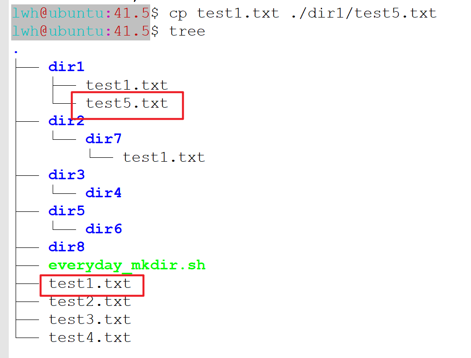

#### 16、远程拷贝文件

```shell
$ scp test1.txt aliyun@112.124.31.45:~/   # 易考点
```


#### 17、硬连接和软连接

```shell
$ ls -ali     #  -i  获取该文件在磁盘中的inode信息(在磁盘中的索引信息)
```


```shell
$ ln test2.txt test5.txt   # 硬连接， 能够看到其引用计数发生了变化
```


```shell
$ ln -s test2.txt test5.txt # 软连接，类似与windows中的快捷方式
```


#### 18、文件的查看

1）cat 命令

```shell
$ cat test1.txt  # 直接打到屏幕上
```

2）vim 

```shell
$ vim test2.txt # 当文件存在的情况下，会查看文件
```

3）less 

```shell
$ less The_Holy_Bible.txt
```

4）more

```shell
$ more  The_Holy_Bible.txt # 显示百分比
```

5）head

```shell
$ head The_Holy_Bible.txt  # 默认查看头10行有内容的，不包括空行
$ head -n 20 The_Holy_Bible.txt # 查看头20行
```

6）tail

```shell
$ tail The_Holy_Bible.txt  # 默认查看末尾的10行有内容的，不包括空行
$ tail -n 20 The_Holy_Bible.txt # 查看末尾的20行
$ tail -f test1.txt 
```

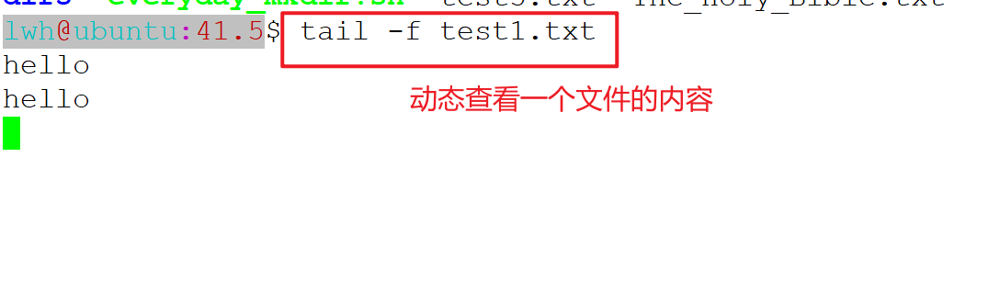

#### 19、文件的查找

```shell
$ find ./ -name The*
```


#### 20、vim编辑器的使用

1）光标的移动 [**Normal模式**]

h, j, k, l   ： 分别表示的是 向左、下、上、右移动

gg : 两个g连按，就回到文件的开始位置(第一行)

G:  按下大G，就能跳到文件的最后一行

n回车： 在当前的行号基础上向下跳n行

:n回车：直接跳转到n行

ctrl+f:    向前移动一个屏幕

ctrl+b:   向后移动一个屏幕 

w: 移动到下一个单词的开始位置

b: 移动到上一个单词的开始位置

e: 移动到下一个单词的末尾位置

^ :  移动到行首

$ : 移动到行尾


2）数据的复制

yy: 复制光标所在的一行

nyy: 复制多行，从光标所在的行开始向下数n行

ynG: 从当前行往下/往上复制到n行

p: 粘贴就是 p 键


3）数据的删除

dd: 删除光标所在的这一行

ndd: 删除多行，从光标所在的行开始向下数n行

dnG: 从当前行往下/往上删除到n行

dw: 删除一个单词


4）撤回你的上一步的操作

u ：


5） 查找某一个字符串【Normal】

/string回车

跳转到下一个要匹配的字符串，按n键

跳转到上一个要匹配的字符串，按N键

6）竖选模式（Visual Block）

**在n行的最开始的位置添加字符串**

先竖选n行，再按大写的i键，进行编辑，ESC


## Day3

### 一、其他命令行操作

#### 1、vimplus的安装

#### 2、文件的压缩和解压缩

1）对目录文件的打包

```shell
$ tar cvf 41.5_test.tar 41.5
```


2）对目录文件进行压缩

```shell
$ tar czvf 41.5_test.tar.gz 41.5
```


3）对windows上的*.zip文件进行解压缩

```shell
$ unzip plugged.zip
```

4）对*.tar.gz 的文件进行解压缩

```shell
$ tar xzvf 41.5_test.tar.gz   # 解压缩之后，放在当前目录	
```

5）对*.tar.gz 的文件进行解压缩

```shell
$ tar xzvf 41.5_test.tar.gz -C ~/
```


#### 3、查找文件中的内容

1）查看字符串

```shell
$ grep "main" hello.cc
$ grep "main" * -rn
```


2）特殊字符

```shell
$ grep "^ab" The_Holy_Bible.txt  -n  # ^ 匹配以...开头的行
$ grep ";$" main.cc  -n   # $  匹配以...结束的行
```


#### 4、查看文件的类型

```shell
$ file filename
```


在windows上，换行的是用两个特殊符号： \r\n ，编码规则默认情况下，一般是GB2312/GBK

在linux之上，换行是用1个特殊字符： \n  编码规则默认情况下，是UTF8，非UTF8的字符是会乱码。


#### 5、设置PS1

PS1变量控制命令行的提示信息，它可以在家目录的.bashrc文件中进行设置。

```shell
$ cd ~
$ vim .bashrc # 在该文件的最后一行添加PS1的设置信息
$ source .bashrc # 修改完毕之后，可以通过该命令重新加载.bashrc文件
```

> export PS1 = '\u@\h:\w\$ '
>
> export PS1='\[\e[36;47m\]\u\[\e[31;47m\]@\[\e[36;47m\]\h\[\e[35;47m\]:\[\e[31;47m\]\W\[\e[0m\]\$ '


### 二、编译工具链

#### 1、预处理

```shell
$ gcc -E hello.c -o hello.i  # hello.i是经过预处理之后得到的源代码
```


#### 2、编译得到汇编文件

```shell
$ gcc -S hello.i -o hello.s
```


#### 3、汇编得到机器能够理解的目标文件

```shell
$ as hello.s -o hello.o  # hello.o  才是计算机能识别的机器语言
```


#### 4、链接得到最终的可执行程序

```shell
$ gcc -o hello hello.o
```


#### 5、常见的用法

1）一步到位得到可执行程序(源文件少时)

```shell
$ gcc -o hello hello.c   # 生成一个可执行程序
```

2）先得到目标文件，最后进行链接操作，生成可执行程序（源文件多时）

```shell
$ gcc -c hello.c -o hello.o 
$ gcc -c main.c -o main.o 
$ gcc hello.o main.o -o main 
```


#### 6、静态库

在windows上，以xxx.lib结尾的，表示是静态库

在linux上，以 libxxx.a 结尾的，表示的是静态库 

静态库的生成

```shell
$ gcc -c hello.c -o hello.o
$ ar crsv libadd.a hello.o           # 关键性命令
$ sudo mv libadd.a /usr/local/lib/   # 将静态库移动到系统路径之下

$ gcc main.c -o main -ladd 
```

未链接静态库时，编译会报错的


#### 7、动态库

在windows上，以xxx.dll结尾的，表示是动态库

在linux上，以 libxxx.so 结尾的，表示的是动态库

```shell
$ gcc -fPIC -c hello.c   # 自动生成一个hello.o文件
$ gcc -shared -o libadd2.so hello.o
$ sudo mv libadd2.so /usr/local/lib/

$ gcc main.c -o main   # 报错
$ gcc main.c -o main -ladd2  # 正常执行,得到了一个可执行程序
$ ./main   # 运行时会报错
```


该错误是一个常见错误，这与动态库的使用方式有关。

解决方案：

```shell
$ sudo ldconfig  # 
```


在/etc/ 目录下有两个文件和一个目录：


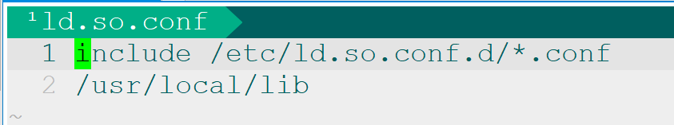


执行命令 **sudo ldconfig** 之后，所有的动态库的信息就会被缓存到ld.so.cache中；

可执行程序运行时，如果需要加载动态库时，会从ld.so.cache之中进行查找。


## Day4

### 一、C++发展历史


### 二、C++基础

#### 1、命名空间

1）using编译指令


2）作用域限定符


3）using声明机制


4）匿名的命名空间


5）嵌套的命名空间


6）加入命名空间之后，函数的使用也可以分为函数声明和定义


#### 2、const关键字

const关键字修饰变量时，该变量必须要进行初始化，不能够进行修改。

问题：const常量与宏定义的区别是什么？

> a. 他们发生的时机是不同的。宏定义是在预处理阶段进行的；而const常量就是在编译时
>
> b. 宏定义只是做了一个字符串的替换，没有进行类型检查，不安全；const常量是有类型检查的，更安全


#### 3、虚拟地址空间

五个区域：栈、堆、全局静态区、文字常量区、程序代码区


#### 4、new/delete表达式

问题：mallloc/free 与new/delete的区别是什么？（面试常考点）

> a. malloc/free是库函数；new/delete是表达式
>
> b. malloc在申请空间的过程中，不会进行初始化；而new表达式会进行初始化
>
> c. free回收空间时，如果针对的是数组，只需要给一个首地址即可；对于delete表达式，必须要加上一个[]

#### 5、引用

特点：

- 引用必须要进行初始化，不能单独存在
- 引用一经绑定之后，不能再改变其指向
- 引用底层实现就是指针，它是一个受到限制的指针
- 引用的使用跟普通的变量是一致的。

**问题**：指针与引用的区别是什么？（面试常考点）

指针的特点：

- 指针是可以单独存在，也不一定要进行初始化
- 指针是可以改变指向的，比引用更灵活，但同时风险更高
- 指针需要进行间接访问，才能得到相应的数据


引用作为函数的返回值时：

1. 不能返回局部变量的引用
2. 不要轻易返回堆空间变量的引用，除非你有了内存回收的策略

**内存泄漏**的危害是什么？当程序执行的过程中，如果不断发生内存泄漏（只申请不回收），一定会有一个时刻，无法再申请堆空间的内存，此时**程序会崩溃**。


#### 6、函数重载


#### 7、extern关键字

在C++中按C的方式调用相应的函数


## Day5

### 一、C++基础

1、默认参数

默认参数必须从右向左连续进行赋值(C/C++参数入栈的顺序是从右向左)

2、C++强制转换

static_cast

1、基本数据类型之间的转换 ，例如：int  float

2、void *的指针与其他类型的指针之间的转换  例如：void * --- > int *

const_cast

去除常量属性

3、bool类型


4、inline函数

C++头文件的路径：/usr/include/c++

5、异常安全


6、string

### 二、类和对象

1、类的定义


2、class与struct的唯一区别是默认访问权限不一样，class默认为private，struct默认为public的

3、类的无参构造函数

## Day6 

### 1、析构函数

析构函数的调用时机：

1）当栈对象销毁时，自动调用

2）当全局对象销毁时，自动调用

3）当静态对象销毁时，自动调用

4）当堆空间的对象被销毁，执行`delete`表达式时，自动调用

### 2、拷贝构造函数

其调用时机有三种情况：

1）当用一个已经存在的对象初始化另一个新对象时

2）当形参是对象，实参与形参进行结合时

3）当函数的返回值是对象，执行return语句时

### 3、赋值运算符函数

当类中有指针成员指向堆空间时，必须要重定义。在实现时，要遵循四部曲：

1）自复制

2）回收左操作数的空间

3）进行深拷贝

4）return *this

### 4、特殊数据成员的初始化

1）const成员函数：必须要在构造函数的初始化表达式中进行初始化

2）引用成员：必须要在构造函数的初始化表达式中进行初始化

3）类对象成员：必须要在构造函数的初始化表达式中进行初始化

4）静态数据成员：在类中声明，但必须要在类之外进行初始化


### 5、 特殊的成员函数

1）静态成员函数

不能访问非静态的数据成员和非静态的数据成员，只能访问静态的数据成员和成员函数。

2）const成员函数

不能修改类中的数据成员，只能读取数据成员。

加上const关键字后，其实是对隐含的this指针进行了限定， `const 类名 * const this`

## Day7

### 一、单例模式

需求：自定义类类型只能创建出一个对象

解决方案：

> 1. 构造函数私有化
> 2. 定义一个静态的指向本类型对象的指针变量
> 3. 在public区域定义一个静态的getInstance函数，返回本类型对象的指针


## Day8 

### 一、new/delete表达式的工作步骤

#### 1、new表达式的工作步骤：

1）调用`operator new`库函数，申请一片未初始化的空间

2）调用相应构造函数（针对于自定义类类型），初始化对象的数据成员

3）返回一个相应类型的指针

```c++
String *pve = new String("home");
//在缓冲区生成一个对象
char * buffer = new char[BUF];
p1 = new (buffer) test; 
p2 = new (buffer + sizeof(test)) test2();
```

此时，为定位new运算符，不可以直接用delete运算符直接销毁，需要显式调用析取函数

#### 2、 delete表达式的工作步骤：

1）调用析构函数，回收数据成员中申请的资源

2）调用`operator delete`库函数，回收对象所在的空间

### 3、生成一个栈对象，需要的条件：

1）构造函数位于public区域

2）析构函数位于public区域

#### 3、定义一个类，只能生成栈对象，不能生成堆对象

解决方案：将operator new库函数放入private区域

#### 4、定义一个类，只能生成堆对象，不能生成栈对象

解决方案：将析构函数放入private区域

### 二、C++输入输出流

#### 1、流的状态

- good()    有效状态，流才能正常使用
- bad()      系统级别的错误，无法恢复
- fail()       可以恢复的错误   --> 使用clear() 恢复
- eof()      达到了流的末尾

#### 2、标准IO   

1）std::cin

2）std::cout    带缓冲区，行缓冲    std::endl， 就可以直接输出缓冲区的数据

3）std::cerr      不带缓冲区

#### 3、文件IO

1）ifstream  ==> 文件输入流，读取文件，std::ios::in模式打开文件，文件必须存在

2）ofstream ==> 文件输出流,把内存中的数据写入到文件  

​		默认情况下，会以 std::ios::out模式打开文件。 不要求文件存在。

​       如果文件不存在，会直接生成一个新文件；

​       如果文件存在，会直接清空文件的内容。

​       如果文件存在，且不希望数据被清空，可以使用std::ios::app模式打开文件

3）fstream ==>  集合了ifstream和ofstream的功能于一体

4）定位信息：

​	   tellg/tellp

​       seekg/seekp

#### 4、字符串IO

进行数据格式转换

1）istringstream  ==> 在字符串类型到其他类型的转换

2）ostringstream ==>把其他类型转换成字符串

​		str()  => 可以获取缓冲区中的数据

3）stringstream

#### 5、vector

头文件： #include <vector>

push_back操作：在数组的尾部添加新的元素

size操作: 获取当前vector中的元素个数

capacity操作：获取当前vector中的能够存储的元素个数


遍历方式：

> 1.可以直接用下标访问某一个元素，前提条件是该下标是有元素的
>
> 2.使用增强for循环  for(auto & elem : array) 
>
> 注意：增强for循环中的引用符号，不能删除；如果删除，直接对数组元素进行了复制
>
> 3.迭代器的写法 
>
>   begin()    第一个元素
>
>   end()      最后一个元素的下一个位置，这里是没有元素的

## Day9

### 一、gdb的使用

```shell
$ g++ String.cc -g    # 编译时加上 -g 选项
$ gdb a.out

(gdb)  b 行号  # break  设置断点
(gdb)  r      # run 开始运行
(gdb)  p 变量  # print 打印变量的信息
(gdb)  n      # next 单步运行,每一次运行一行
(gdb)  bt     # 查看函数栈空间的调用情况
```


## Day10

### 一、日志系统概述

对于服务器来说，一般可能会设计成守护进程的形式，没有终端，不能与用户直接交互。

为了获取其程序执行过程中，记录其发生哪些事情， 就必须要有一个完备的日志系统。


日志类型：系统日志、业务日志。


日志系统的设计：日志来源、日志格式控制、日志输出目的地、日志过滤器

### 二、Log4cpp  ==》 log4J

#### 1、 Category  ==> 日志记录器（日志来源）


#### 2、 Layout ==>  日志的格式控制

BasciLayout

SimpleLayout

`PatternLayout`的格式化控制的用法

调用方法setConversion

%c  :  表示日志记录器的名字

%d :  表示的是时间

%m : 表示消息本身

%p :  表示的是优先级

%n : 表示的是换行符

#### 3、Appender ==》 附加目的地

OstreamAppender  => 可以向一个C++输出流中写入日志

FileAppender：写入到一个文件

RollingFileAppender: 回卷文件（回滚文件） 用最新的日志信息不断覆盖之前的日志信息

#### 4、Priority ==》 优先级

每一个日志记录器Category有一个优先级，每一行日志记录时，也有一个优先级；

当每行的优先级高于或者等于Category的优先级时，该行日志才会被记录下来。


## Day11

1、作业log4cpp的封装

错误1：多次重复定义


```shell
$ g++ *.cc -llog4cpp -lpthread
```


解决方案：将Mylogger::_pInstance的定义放入实现之中进行初始化即可。


vim的全局格式对齐快捷键: gg=G


### 一、友元

面向对象的四大基本特征：抽象、封装、继承、多态。

```C++
class A
{
    friend 函数原型；//friend void func();
    friend class B;
  private:
    //数据成员
    //成员函数
};
```

函数原型：成员函数与非成员函数。

非成员函数：全局函数、自由函数、普通函数

#### 友元的三种形式

1、友元的第一种形式：普通函数（自由函数、全局函数）
2、友元的第二种形式：以成员函数的形式出现
3、友元的第三种形式：友元之友元类

#### 友元的形式

友元的性质：友元是单向的，友元是没有传递性的(A->B->C)，友元是不能被继承的

友元不受访问权限的控制（public/protected/private）


### 二、运算符重载

#### 哪些运算符不能重载

成员访问运算符 .

成员指针运算符  .*

条件运算符 ?:

作用域运算符  ::

sizeof运算符  sizeof

#### 运算符重载的规则

1、至少有一个对象是类类型或者枚举类型


2、不能改变运算符的优先级与结合性

3、不能改变操作数的位置、个数、顺序，也不能设置默认值。

4、重载&&、||，不再具备短路求值特性

5、不能臆造一个不存在的运算符。


#### 运算符重载的三种形式

1、运算符重载之普通函数的形式（全局函数、自由函数）（对于+而言，需要get函数获取私有数据成员）

2、运算符重载之成员函数的形式。（对于+而言，形式上少一个参数）

3、运算符重载之友元函数的形式。（不需要get函数就可以直接访问私有成员，形式上也是2个参数）


#### 特殊运算符的重载

1、复合赋值运算符的重载（+=  -=   *=   /=   %=  <<=   >>=   &=   |=）

推荐使用**成员函数**的形式进行重载。对象本身会发生变化，隐含着一个对象，可以使用this指针替代

2、自增自减运算符（前置++  后置++ 前置--  后置--）

也是以成员函数的形式进行重载，也是对象本身会发生变化。

区别：前置++函数返回值是左值，后置++函数返回值是右值

前置++比后置++效率高？


## Day12

未上课

## Day13

### 一、问题回顾

1、友元的三种类型？友元的性质？

2、不能重载的运算符有那五个？运算符重载的规则有哪几条？

3、运算符重载的三种形式是怎样的？

普通函数、成员函数、友元函数

4、前置++与后置++的区别？函数定义形式、效率、内存占用


### 二、特殊运算符的重载

#### 输入输出流运算符的重载


#### 函数调用运算符的重载

将重载了函数调用运算符的类创建的对象称为函数对象


#### 下标访问运算符的重载

以成员函数


## Day14

作用域：变量（对象）在定义完成之后到变量（对象）销毁之前。
可见域：变量（对象）可以看见的范围。
如果没有发生同名变量之间的屏蔽现象，可见域与作用域是相等的，否则作用域是大于可见域。


## Day15

### 一、std::string的底层实现

### 1、深拷贝（Eager-Copy）

进行**复制或者赋值**操作时，都是深拷贝。但如果使用的过程中，并不会对复制的对象进行修改操作，感觉是没有必要的，可以优化。

### 2、写时复制(Copy-On-Write)

写时复制的技术是对深拷贝的一个优化。进行复制或者赋值时，直接共用字符串的内容。随之而来，带来另一个问题，就是如何去回收申请的资源。  ==》引用计数应运而生。 


在具体的COW_String的实现中，采用的是 **引用计数与字符串内容放在一起，并且引用计数在字符串的前面，用4个字节进行存储**。


对于**引用计数的操作**，都是属于该类内部需要去使用，不需要作为类的接口而存在，因此将引用计数的几个操作封装成小函数后，放在private区域。


**当发生复制或者赋值时，进行浅拷贝，不再进行深拷贝，只将引用技术加1。**

**当对象被销毁时，先将引用j计数减1，如果引用计数的值为0时，才真正去释放空间。**


在实现拷贝构造函数和赋值运算符函数时，其具体代码为：


当需要对**字符串内容进行修改**时，才执行深拷贝。 以operator[]为例：


该实现有一个问题，是**下标访问运算符返回的对象**其实不知道接下来会执行读操作，还是写操作。


在成员函数中，即使提供const的版本，也无法调用到


#### 2.1 **如何做到让下标访问运算符区分出读操作和写操作呢？**

提供的思路有：下标运算符返回的不再是char&，而是一个自定义类类型`CharProxy`，接下来，只需要对`CharProxy`重载输出流运算符和赋值运算符，就可以解决该问题。  ---- 设计模式中的**代理模式**


#### 2.2 **该类应该是全局类还是嵌套类？**

因为CharProxy是为了解决COW_String而出现的，因此是为COW_String服务的，不需要在全局的位置创建任何CharProxy的对象。

#### 2.3 **该类中应该存放什么数据成员？**

由于该类是由下标访问运算符来返回的，最终还是希望通过该对象得到一个char的类型的数据的，所以第一个就是下标，第二个很自然就是字符串本身了。


#### 2.4 读操作的实现：


#### 2.5 写操作的实现:


### 3、短字符串优化(Short String Optimization)

字符串长度小于等于15个字节时，字符串内容与字符串对象放在同一个空间；

字符串长度大于15个字节时，字符串内容放在堆空间中，字符串对象中有一个指针指向该堆空间；


## Day16

### 一、继承

### 1、C++中继承的定义


基类 与 派生类对应， 父类与子类进行对应。


### 2、对于三种继承权限的总结

​	a. 对于**派生类对象**而言，只有采用**public继承**时，只能访问**基类的public成员**，其他的情况，一律不能访问。

​	b. 对于基类的**私有成员**，采用任意继承方式，只能在**基类内部访问**，其他的情况，一律不能访问。

​	c. 对于基类的**非私有成员**，采用任意继承方式，都可以直接在**直接派生类内部**进行访问。

> pubic继承时，基类的非私有成员在派生类内部的权限与基类保持一致
>
> procted继承时， 都是protected的
>
> private继承时，都是private的

​	d. procted继承与private继承的区别在于，

​	protected继承，在整个继承层次中，**任意一个层次**都可以访问基类的**非私有成员**

​	private继承，在整个继承层次中，只要有一处使用了private继承，其后的派生类中就不能访问非私有成员

|                    | public继承           | protected继承          | private继承          |
| ------------------ | -------------------- | ---------------------- | -------------------- |
| public成员变为     | public               | protected              | private              |
| protected成员变为  | protected            | protected              | private              |
| private成员变为    | 只能通过基类接口访问 | 只能通过基类接口访问   | 只能通过基类接口访问 |
| 是否可隐式向上转换 | 是                   | 是（但只能在派生类中） | 否                   |

**隐式向上转换**（implicit upcasting）：无需显式类型转换，就可以将基类指针or引用指向派生类对象（动态多态）。

### 3、不能被继承的有哪些？

构造函数

析构函数

赋值运算符函数

operator new/delete

友元

### 4、派生类对象的创建

分不同的情况讨论：

1）情况一：


2）情况二：


3）情况三：


### 5、隐藏（改造基类成员）


当基类中定义了一个print方法时，派生类中也定义了一个同名函数print方法，当用派生类对象调用print方法时，只会调用派生类的print方法，而不会调用基类的print方法，这称为**隐藏（oversee）**机制。

**隐藏**：发生在父子类之间，子类定义了与基类同名的函数，不管参数如何，基类部分的同名函数全部被隐藏。

**重载**：发生在同一个类内部，当函数参数的类型、顺序、个数不同时，构成重载

### 6、当派生类对象创建时，构造函数被执行的顺序

基类构造函数执行体 --> 类对象成员的构造函数 --> 派生类构造函数执行体

### 7、派生类对象的销毁

派生类对象销毁时，析构函数的调用顺序：

派生类析构函数 --> 类对象成员析构函数 --> 基类析构函数


### 8、多基派生

1）基类被初始化的顺序


2）成员名访问冲突的二义性问题


3）菱形继承的二义性，称为存储二义性问题


解决方案：采用虚拟继承


### 9、基类与派生类之间的转换

一定能够成功的方式：

1）将一个基类指针指向派生类对象    （向上转型）

2）将一个基类引用绑定到派生类对象（向上转型） 

3）将派生类对象赋值给基类对象

**注意：**向下转型是有风险的，取决于指向的位置是不是派生类对象；如果是派生类对象，转型是安全的；否则，就是会失败的。


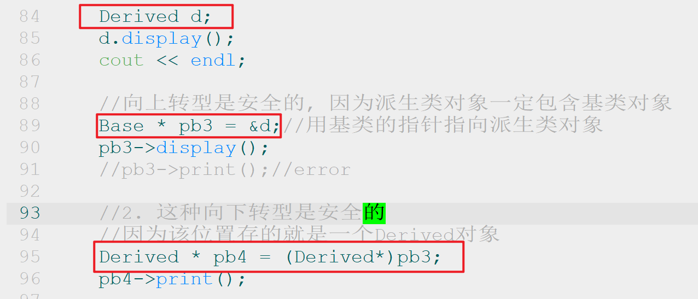


### 10、has a 关系的建立

既可以使用包含对象（contained object），也可以使用私有继承。


## Day17

### 一、继承

派生类对象之间的复制控制操作：


### 二、多态

#### 1、静态多态


#### 2、动态多态


#### 3、虚函数的定义

1）在基类中，定义普通的成员函数print。在派生类中，重新定义该成员函数print.

当用一个基类的指针指向一个派生类对象时，再通过基类的指针调用print方法，此时一定会执行**基类的print方法**。这在编译时就可以确定下来。


2）在基类中，在一个普通的成员函数print的前面加上virtual关键字，该函数就称为虚函数。

在派生类中，重定义该虚函数。有了虚函数之后，**当用一个基类的指针指向一个派生类对象**时，再通过基类的指针调用虚函数print，此时会执行派生类重定义的虚函数，**不会调用基类的print方法**。


**动态多态**被激活的条件有：

> a. 在基类中，要定义一个虚函数。
>
> b. 在派生类中，要重定义该虚函数。
>
> c. 创建一个派生类对象
>
> d. 用基类指针指向派生类对象（基类引用绑定到派生类对象）
>
> e. 用基类指针（基类引用）调用虚函数

**虚函数的实现原理**（经典问题）：

当类中定义了一个虚函数时，就会在对象的存储布局的开始位置，添加一个**虚函数指针vfptr**，该虚函数指针指向的是一张**虚函数表**，简称**虚表**，虚表之中存放的就是虚函数的入口地址，如果**派生类重定义该虚函数**，会**覆盖**虚函数表中的入口地址。

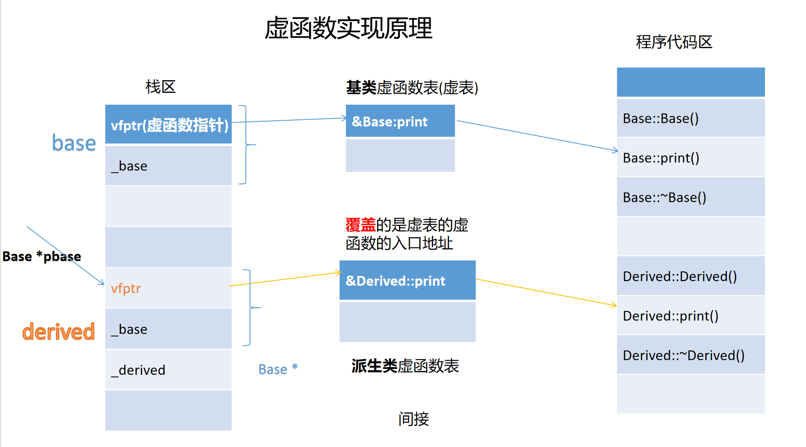

动态多态的本质需求：希望**用基类的指针调用到派生类的方法**。

通常，编译器处理虚函数的方法是：给每个对象添加一个隐藏成员一个**虚函数指针vfptr**，无论有几个虚函数，都只会有一个地址成员。

**使用虚函数的代价**：（空间+时间）

1、对象增大，Δ量为存储地址的空间

2、对于每个类编译器都会创建一个虚函数地址表（数组）

3、每个函数调用都需要额外执行一项操作——到表中查找地址

#### 4、虚函数的访问

1）通用**基类引用**可以表现动态多态


2）通过**对象**来访问虚函数表现**静态多态**，virtual关键字失效，表现为隐藏。


3）通过普通成员函数进行访问，有this的存在，表现动态多态


4）在构造函数和析构函数中访问虚函数，表现静态多态。


5）静态成员函数无法访问虚函数，因为没有this指针。


#### 5、有哪些函数不能设置为虚函数？

答：普通函数、构造函数、静态成员函数、inline函数、友元函数


#### 6、析构函数为什么要设计成虚函数？


当用一个基类指针指向一个堆空间的派生类对象，然后回收时，要通过基类指针来回收派生类对象，此时希望调用到的是派生类析构函数，而不是基类析构函数。因此**当类中出现了一个虚函数时，必须要将析构函数也设置为虚函数**。

**为何需要虚析构函数**：若析构函数不是虚的，则会只调用指针or引用类型的析构函数。使用虚析构函数可以确保正确的析构函数被调用

#### 7、纯虚函数


#### 8、抽象类

1）定义了纯虚函数的类，称为抽象类

2）**定义了protected构造函数的类**，也称为**抽象类**。因为构造函数是位于protected区域，所以不能直接实例化对象的，但其派生类可以初始化基类部分，也就是派生类可以实例化。


误用情况：


## Day18

### 一、多态

1、纯虚函数的应用


### 二、可视化对象的内存布局


#### 1、单重继承

测试一：

//一个类中有多个虚函数时，只会产生一个虚函数指针，只有一张虚表


#### 2、多重继承


// 测试二：多重继承（带虚函数）
//　１.　每个基类都有自己的虚函数表
//    ２.　派生类如果有自己新的虚函数（基类没有的），会被加入到第一个虚函数表之中
//	３.    内存布局中，其基类的布局按照基类被声明时的顺序进行排列
//　４.　派生类会覆盖基类的虚函数，只有第一个虚函数表中存放的是真实的被覆盖的函数的地址；其它的虚函数表中存放的并不是真实的对应的虚函数的地址，而只是一条**跳转指令**


## Day19

### 一、虚拟继承

#### 1、单重虚拟继承，派生类没有自己新的虚函数

虚继承与继承的区别
//	１. 多了一个虚基指针
//	２. 虚基类位于派生类存储空间的最末尾

//     3. 如果派生类没有自己的虚函数，此时派生类对象不会产生虚函数指针


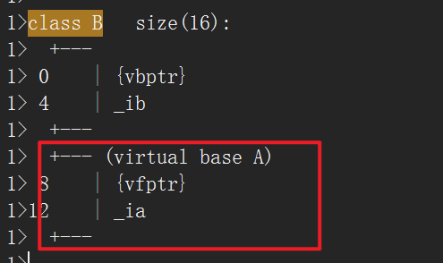


#### 2、单重虚拟继承，派生类有自己新的虚函数

如果派生类拥有自己的虚函数，此时派生类对象就会产生自己本身的虚函数指针，并且该虚函数指针位于派生类对象存储空间的开始位置

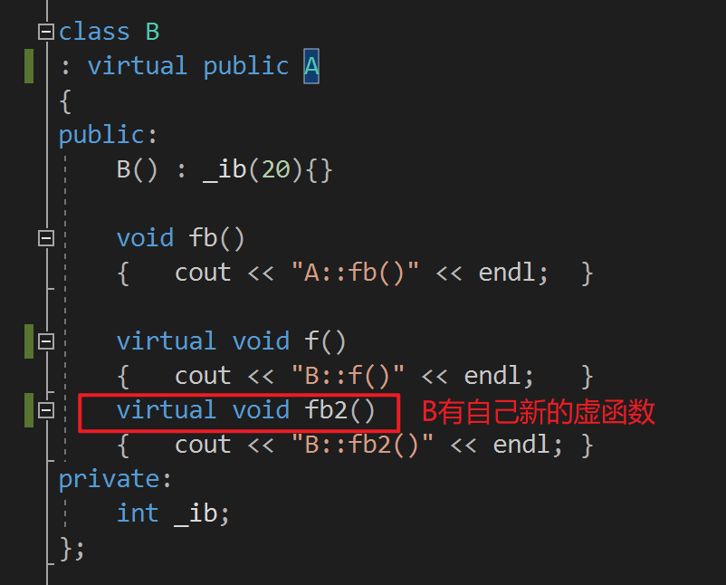


#### 3、多重继承，有虚拟继承


#### 4、菱形继承，未使用虚拟继承，存在存储二义性的问题


#### 5、菱形继承，采用虚拟继承

//虚基指针所指向的虚基表的内容：
//1. 虚基指针的第一条内容表示的是该虚基指针距离所在的子对象的首地址的偏移
//2. 虚基指针的第二条内容表示的是该虚基指针距离虚基类子对象的首地址的偏移


## Day20

### 一、模板

#### 1、模板的定义

```c++
template <typename T1, ...>    //模板的定义
```

后面接函数，也可以接类定义。


#### 2、模板的分类：函数模板和类模板


#### 3、模板重载

1）函数模板与函数模板之间进行重载

2）函数模板与普通函数进行重载，普通函数会优先调用

#### 4、模板的实现原理

模板可以看成是代码生成器，原理：**模板参数推导**。

当进行**函数调用**时，根据**实参传递的类型**进行推导。

​                 实例化

函数模板   ====>  模板函数

对于函数模板的实例化可以分为**隐式实例化**和**显式实例化**。

```c++
template <typename/class T>
T add(T x, T y)
{
    return x + y;
}

void test()
{
    int x1 = 1, x2 = 2;
    cout << add(x1, x2) << endl;//隐式实例化
    cout << add<int>(x1, x2) << endl;//显式实例化
}
```


#### 5、模板的特性

模板也可以分成**声明**与**实现**，模板要么看到全部实现，要么不给。不然编译时会报错。

如果分成声明与实现之后，并且分成了头文件和实现文件，一般是要在头文件之中包含(#include)实现文件，才能正常使用。与原来的非模板的操作有所不同。


#### 6、模板参数

模板参数分为两类：

1）类型参数

2）非类型参数，常量表达式，整型数据 (bool/char/short/int/long/long long)

模板参数可以设置默认值。


#### 7、成员函数模板

在**普通类**中定义一个函数，该函数是一个函数模板，称为**成员函数模板**.

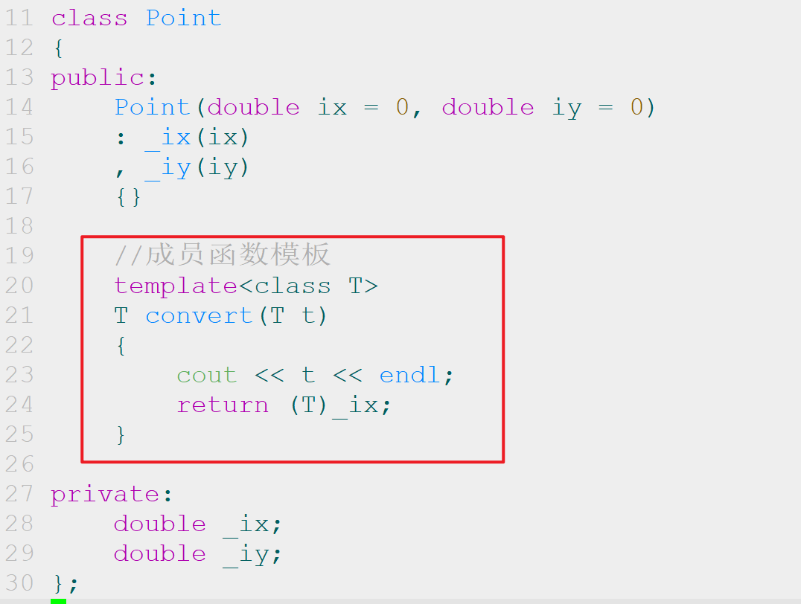


#### 8、类模板

```c++
#define Max 1024
const int number = 10;

template <class T, int kCapacity = 10>
class Stack
{};
```


#### 9、可变模板参数

```c++
template <class... Args>     //Args  模板参数包 
void display(Args... args);  //args  函数参数包   声明时， ...是在参数包的左边

sizeof(t);//求取某一个对象的类型占据的空间大小
sizeof...(args);//求取的是参数包中参数的个数，并不是求取参数占据的空间


//递归调用的出口，必须要在通用写法的上面，
//不能放在下面，否则会报错
void print()
{}

template <class T, class... Args>//模板参数包在声明时，必须是参数列表中的最后一个，与函数参数包相同
void print(T t, Args... args)    //函数参数包在声明时，必须是参数列表中的最后一个
{
    cout << t << endl;
    print(args...);//  将函数参数包展开   解包（拆包）时， ...在参数包的右边
    			   //递归调用，就必须给一个出口
}
```


### 二、移动语义

#### 1、右值引用

```c++
int && ref = 1; //右值引用的定义
```

#### 2、移动构造函数

有了右值引用之后，在类中会多一个构造函数，称为移动构造函数。


#### 3、移动赋值运算符函数

有了右值引用之后，在类中会多一个赋值函数，称为移动赋值运算符函数。


#### 4、std::move 可以显式的将一个左值转换为右值


#### 5、右值引用本身一定是右值吗？

右值引用本身是左值还是右值，取决于其有没有名字；有名字，就是左值；没有名字就是右值。


#### 6、当函数的返回值是对象时，规则有更新


### 三、资源管理

#### 1、RAII技术

RAII的全称是（Resource Acquisition Is Initialization）,**资源获取即初始化时机**，其**本质**是利用对象的生命周期来管理资源。

**特征**：

>  1）对象创建时，托管资源。

>  2）对象析构时，释放资源。

>  3）一般不允许复制或者赋值。(表达对象语义)

>  4）提供若干访问资源的方法。

由RAII的技术衍生出了四种智能指针。

#### 2、auto_ptr

被弃用。

#### 3、unique_ptr

独享所有权的智能指针。

不能进行复制或者赋值。

重载了 * 和 -> 运算符

具有移动语义，可以将其作为容器的元素。

#### 4、shared_ptr

共享所有权的智能指针

强引用的智能指针

采用了引用计数，当进行复制或者赋值时，引用计数加1；

当shared_ptr对象被销毁时，引用计数减1，直到引用计数为0时，才真正释放对象。

**缺陷**：循环引用会导致内存泄漏

#### 5、weak_ptr

弱引用的智能指针。

在复制或者赋值时，不会导致引用计数加1.

不能直接访问资源，如果要访问资源，必须调用lock方法进行提升，提升为shared_ptr

它知道托管的资源的是否还存活。 expired


Day21

#### 6、自定义删除器


#### 7、辅助类std::enable_shared_from_this


## Day22

### 一、STL概述

本质上就是数据结构和算法的封装。

六大组件：

**容器**：存放数据的容器

**迭代器**：对容器中的元素进行访问，可以隐藏容器的底层实现

**适配器**：将A事物经过一些变化之后，让他看起来像一个B事物

**算法**：使用**迭代器**对容器中的元素进行操作。

**函数对象**(仿函数Functor)：对算法的操作进行定制化的设置

**空间配置器**：对内存进行管理和分配。

### 二、序列式容器


vector的底层实现：是由三个指针维护的一片连续的数组。

deque的底层实现：是由多个片段构成的，片段内部是连续的，片段之间是不连续的。片段是由中控器连接起来。

list的底层实现：循环的双向链表


操作                             vector                      deque                         list

size()                              1                                1                                 1

capacity()                      1                                 0                                0

empty()                          1                               1                                 1

begin()                          1                                1                                 1

end()                             1                                 1                                 1

front()                            1                                1                                 1

back()                            1                                1                                 1

push_front                   0                                1                                 1

pop_front                     0                                1                                 1

**push_back**                    1                                1                                 1  

pop_back                       1                                1                                 1

insert()                           1                                1                                 1

erase()                           1                                1                                 1

clear()                            1                                1                                 1

shrink_to_fit()               1                                1                                 0   


**list**的特有操作：

merge/sort/unique/reverse/remove/splice


## Day23

### 三、关联式容器


### 四、无序关联式容器


### 五、迭代器


#### 1、输出流迭代器

本身的实现，就是采用了**适配器**的设计模式，让这个类产生的对象，使用起来像一个迭代器。

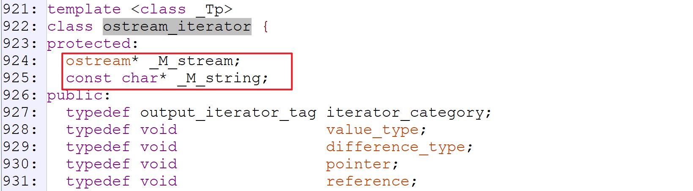


#### copy的实现：


测试用例：


测试结果：

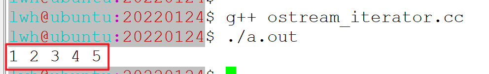


## Day24

#### 2、输入流迭代器


测试用例：


#### 3、插入迭代器

在尾部插入元素的迭代器


#### 函数模板back_inserter


### 六、算法库

分类：非修改式的序列操作、修改式序列操作、划分操作、排序、二分查找、集合操作、堆排序、

#### 1、非修改式序列操作

for_each:


#### 2、**lambda**表达式，匿名函数

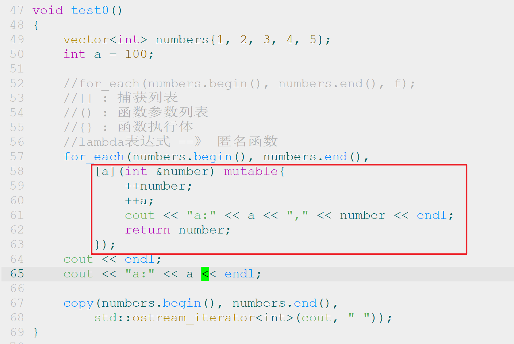

##### 2.1 lambda表达式的实现原理是什么？


##### 2.2 捕获列表的使用

[a] :  以值传递的方式，捕获某一个变量

[&a] : 以引用传递的方式，捕获某一个变量

\[=]: 以值传递方式，捕获当前上下文环境中的所有变量。

[&] : 以引用传递方式，捕获当前上下文环境中的所有变量。

\[=, &a, &b]: 除了a,b以引用形式进行捕获，其他都是值传递方式进行捕获

[&, a] :  除了a以值传递形式捕获，其他都以引用形式捕获。


#### 3、修改式序列操作

remove：引出erase-remove惯用法


replace_if：引出函数适配器


#### 4、std::bind的使用


一般情况下，std::bind提前绑定参数时，都是值传递；如果要使用引用传递，就必须要使用引用包装器std::ref、std::cref


#### 5、std::function的使用

在C++中函数形态有多种形式：普通函数、成员函数、函数指针、成员函数指针。

C风格的函数指针


C++中的成员函数指针的用法：


function的融合：


## Day25

### 一、空间配置器

```c++
std::allocator空间配置器可以感知类型的。

T* allocate( std::size_t n );//n表示的是元素的个数，并不是字节数
void deallocate( T* p, std::size_t n );//n表示的是元素的个数，并不是字节数

void construct( pointer p, const_reference val );//在p所指的位置上，拷贝构造一个对象
void destroy( pointer p );//显式调用析构函数
```


#### std::allocator的设计原理

总体：allocator是一个接口层，真正开辟空间的其实是__default_alloc_template.

__default_alloc_template是实现层。


考虑**内存碎片**的问题，提高**管理内存的性能**。

1、对于内存的管理：**页式管理（4K一页）**、**段式（程序本身的结构）管理**、**段页式管理**

2、内部碎片无法优化，但是**外部碎片可以进行优化**。

​      优化的方向：**尽量减少内存碎片(小内存)的产生**.

​	

3、malloc的使用会涉及到系统调用，而系统调用频繁使用，开销会很大。

​      优化的方向，**尽量少使用系统调用**。

4、**以空间换时间**。只有第一次申请的时候，需要调用malloc，后续直接以能够以O(1)的时间复杂度获取空间。

std::allocator的具体步骤：

>  1. 对于大内存，直接调用__malloc_alloc_template（**一级配置器**）进行操作。
>
>  2. 对于实现层__default_alloc_template（**二级配置器**）来说，当内存小于等于128字节时，认为是**小内存**。当申请的内存大于128字节时，认为是**大内存**。对于小内存，使用**内存池**和**自由空闲链表**进行管理。


#### 缺点：占用的内存比较多，对内存的使用变得不可控。


#### std::allocator的源码


#### 定位new表达式

在指定的位置上，构造一个对象


#### __malloc_alloc_template（一级配置器）

__malloc_alloc_template本质上就是对malloc/free的封装


#### __default_alloc_template（二级配置器）

默认情况下，使用的是__default_alloc_template。它才是默认的空间配置器，只负责开空间


#### allocate方法的解析：

```c++
template <bool threads, int inst>
class __default_alloc_template {

	//通过申请的字节数，获取到相应的能够容纳该字节数的最小空间的自由空闲链表的首地址
    //取26作为例子
    26 + 8 - 1 => 33
    33 / 8 - 1 => 3
  	static  size_t _S_freelist_index(size_t __bytes) {
		return (((__bytes) + (size_t)_ALIGN-1)/(size_t)_ALIGN - 1);
  	}

    //向上取到最小的大于__bytes的8的倍数
    //取26作为例子
    26 + 8 - 1 => 33
    
    33                   => 0010 0001
        
    ~ 7   =>   0000 0111 => 1111 1000
                            0010 0000 ==> 32
    static size_t _S_round_up(size_t __bytes) 
    { return (((__bytes) + (size_t) _ALIGN-1) & ~((size_t) _ALIGN - 1)); }

public:
//二级配置器:
//__n 代表的是字节数，不再是元素的个数了
static void* allocate(size_t __n)
{
    void* __ret = 0;

	if (__n > (size_t) _MAX_BYTES) {        //当申请的空间大于128字节时，是大内存
    	__ret = malloc_alloc::allocate(__n);  //直接调用一级配置器
   	}
    else {
    	_Obj* * __my_free_list = _S_free_list + _S_freelist_index(__n);
     
      	_Obj*  __result = *__my_free_list;
      	if (__result == 0)
        	__ret = _S_refill(_S_round_up(__n));
      	else {
            
        } 
	}
}
    
private:   
static void* _S_refill(size_t __n)
{
	int __nobjs = 20;
    char* __chunk = _S_chunk_alloc(__n, __nobjs);//32 * 20 = 640
	_Obj* __result;
    _Obj* * __my_free_list;
    __my_free_list = _S_free_list + _S_freelist_index(__n);
    _Obj* __current_obj;
    _Obj* __next_obj;
    
    //将所申请的空间(__nobjs个__n字节的空间)串起来，构成一个单链表
    __result = (_Obj*)__chunk;
    *__my_free_list = __next_obj = (_Obj*)(__chunk + __n);
    for (__i = 1; ; __i++) {
        __current_obj = __next_obj;
        __next_obj = (_Obj*)((char*)__next_obj + __n);
        if (__nobjs - 1 == __i) {
            __current_obj -> _M_free_list_link = 0;
            break;
        } else {
            __current_obj -> _M_free_list_link = __next_obj;
        }
    }
    return(__result);
}

//__size : 32字节
//__nobjs: 20
static char* _S_chunk_alloc(size_t __size, int& __nobjs)
{
    
    //第一次申请32字节的空间
    char* __result;
    size_t __total_bytes = __size * __nobjs; // 32 * 20 = 640
    size_t __bytes_left = _S_end_free - _S_start_free;// 0
    
    size_t __bytes_to_get = 2 * __total_bytes 
        + _S_round_up(_S_heap_size >> 4);//2 * 640 = 1280 

	_S_start_free = (char*)malloc(__bytes_to_get);
    
    _S_heap_size += __bytes_to_get;// 1280
    
    _S_end_free = _S_start_free + __bytes_to_get;
    return(_S_chunk_alloc(__size, __nobjs));
    //递归调用_S_chunk_alloc
    char* __result;
    size_t __total_bytes = __size * __nobjs; // 32 * 20 = 640
    size_t __bytes_left = _S_end_free - _S_start_free;// 1280
    if (__bytes_left >= __total_bytes) {
        __result = _S_start_free;
        _S_start_free += __total_bytes;// _S_start_free += 640;
        return(__result);
    }
    
    //第二次申请64字节的空间
    char* __result;
    size_t __total_bytes = __size * __nobjs; // 64 * 20 = 1280
    size_t __bytes_left = _S_end_free - _S_start_free;// 640
    
    else if (__bytes_left >= __size) {
        __nobjs = (int)(__bytes_left/__size); // 640 /64 = 10
        __total_bytes = __size * __nobjs;// 64 * 10 = 640
        __result = _S_start_free;
        _S_start_free += __total_bytes;
        return(__result);
    }
    
    //第三次申请96字节的空间
    char* __result;
    size_t __total_bytes = __size * __nobjs; // 96 * 20 = 1920
    size_t __bytes_left = _S_end_free - _S_start_free;// 0
	size_t __bytes_to_get = 2 * __total_bytes 
        + _S_round_up(_S_heap_size >> 4);//2 * 1920 + 1280 /16 = 3840+80 = 3920
    _S_start_free = (char*)malloc(__bytes_to_get);
    _S_heap_size += __bytes_to_get;// 1280 + 3920 = 5200
    _S_end_free = _S_start_free + __bytes_to_get;
    return(_S_chunk_alloc(__size, __nobjs));
    
    //递归调用_S_chunk_alloc
    char* __result;
    size_t __total_bytes = __size * __nobjs; // 96 * 20 = 1920
    size_t __bytes_left = _S_end_free - _S_start_free;// 3920
    if (__bytes_left >= __total_bytes) {
        __result = _S_start_free;
        _S_start_free += __total_bytes;// _S_start_free += 1920;
        return(__result);
    }
    
    //第四次申请72字节，假设内存池耗尽，堆空间耗尽
    
    _S_start_free = (char*)malloc(__bytes_to_get);
    if (0 == _S_start_free) {
        size_t __i;
        _Obj* __STL_VOLATILE* __my_free_list;
	    _Obj* __p;
            // Try to make do with what we have.  That can't
            // hurt.  We do not try smaller requests, since that tends
            // to result in disaster on multi-process machines.
        for (__i = __size;
             __i <= (size_t) _MAX_BYTES;
             __i += (size_t) _ALIGN) {
             __my_free_list = _S_free_list + _S_freelist_index(__i);
             __p = *__my_free_list;
             if (0 != __p) {
                 *__my_free_list = __p -> _M_free_list_link;
                 _S_start_free = (char*)__p;
        	     _S_end_free = _S_start_free + __i;
                 return(_S_chunk_alloc(__size, __nobjs));
	//递归调用_S_chunk_alloc
    /*
    char* __result;
    size_t __total_bytes = __size * __nobjs; // 72 * 20 = 1440
    size_t __bytes_left = _S_end_free - _S_start_free;// 96
    
    else if (__bytes_left >= __size) {
        __nobjs = (int)(__bytes_left/__size); // 96 /72 = 1
        __total_bytes = __size * __nobjs;// 72 * 1 = 72
        __result = _S_start_free;
        _S_start_free += __total_bytes;
        return(__result);
    }
    */
                                          
              }
         }
    }
}
    
};

//16个自由空闲链表的初始情况
template <bool __threads, int __inst>
typename __default_alloc_template<__threads, __inst>::_Obj* 
__default_alloc_template<__threads, __inst>::_S_free_list[_NFREELISTS] = 
{0, 0, 0, 0, 0, 0, 0, 0, 0, 0, 0, 0, 0, 0, 0, 0, };

//内存池的初始情况
template <bool __threads, int __inst>
char* __default_alloc_template<__threads, __inst>::_S_start_free = 0;

template <bool __threads, int __inst>
char* __default_alloc_template<__threads, __inst>::_S_end_free = 0;

template <bool __threads, int __inst>
size_t __default_alloc_template<__threads, __inst>::_S_heap_size = 0;

```


## Day26

### 一、Linux多线程

#### 1、线程的创建


第一个参数是线程类型，

第二个参数是线程属性，一般情况下，直接设置为空指针即可

第三个参数是子线程的入口函数

第四个参数是子线程入口函数的参数传递过去。

#### 2、查看线程的状态

```shell
$ ps -elLf |grep a.out
```


**进程**对于内核来说，就是一个task任务。

**线程**是粒度更细的进程，称为**轻量级的进程（LWP）**。在Linux中，线程的实现本质上其实还是进程。所有的进程都用一个结构体来描述的， 就是**task_struct**.


以上图片之中，主线程的pid（进程id）是6030，两个子线程的pid分别是6031, 6032, 因为当前进程的id都是相同的，都为6030。 这里**LWP的值**是给**内核**使用的。


#### 3、pthread_t 类型

在一个进程内部，区分不同的线程。


pthread_self: 在当前线程中，获取自身的线程Id的接口（函数）。


#### 4、线程的等待

```c++
void pthread_join(pthread_t id, void ** ret);
```


#### 5、互斥锁


1）互斥锁的初始化

```c++
//第一个参数是互斥锁的类型
//第二个参数是互斥锁的属性，一般情况下，直接用空指针NULL（nullptr）
void pthread_mutex_init(pthread_mutex_t *, const pthread_mutexattr_t *);
```


2）加锁解锁操作

```c++
int pthread_mutex_lock(pthread_mutex_t* );
int pthread_mutex_unlock(pthread_mutex_t* );
```


3）互斥锁的回收（销毁）

```c++
int pthread_mutex_destroy(pthread_mutex_t*);
```


#### 6、条件变量

1）条件变量的初始化

```c++
//第一个参数表示的是条件变量类型
//第二个参数表示的是条件变量的属性，一般情况下直接设置为空指针即可。
int pthread_cond_init(pthread_cont_t * , const pthread_condattr_t *);
```

2）条件变量的销毁

```c++
//销毁条件变量
int pthread_cond_destroy(pthread_cond_t* );
```

3）条件变量的等待和通知

```c++
//作用：当条件不满足时，阻塞当前线程
//它的使用分为上半部和下半部：
int pthread_cond_wait(pthread_cond_t *, pthread_mutex_t *);

//通知(唤醒)一个线程
int pthread_cond_signal(pthread_cond_t *cond);

//通知(唤醒)多个线程
int pthread_cond_broadcast(pthread_cond_t *cond);
```


## Day27

### 一、生产者消费者问题


### 二、面向对象设计

#### 1、为什么要面向对象设计？


#### 2、类与类之间的关系

##### 继承（Generalization）

语义：A is B （往上泛化）

图像：空心三角箭头指向的是基类、派生类是基类

关系紧密耦合性强

##### 关联（Association）

双向or单向（只有A 知道B的存在但是B不知道A的存在）

彼此并不负责对方的生命周期

语义：A has B（以数据成员的形式出现） 关系是固定的

代码：一般使用指针or引用

##### 聚合（Aggregation）

比较强的关联关系（有了**整体和局部**的概念）

对象之间的关系表现为整体和局部

图像：空心的菱形箭头

语义：A has B

代码：整体不负责局部的生命周期

##### 组合（composition）

更强的关联关系

有整体和局部的概念

图像：实心的菱形箭头

语义：A has B

代码：整体负责局部的生命周期，以**对象成员**的形式

##### 依赖（dependency）

偶然的，临时的，非固定的

语义：A use B

图像：虚线箭头

代码：成员函数（不调用成员函数，则彼此无关）  

#### 3、面向对象设计原则

低耦合、高内聚

##### SOLID5原则：

单一职责原则（Single Responsible）：一个类只做一件事——解耦和增强内聚性

开闭原则（Open Close）：对扩展开放，对修改闭合（核心为对抽象编程）。

里氏替换原则（）：核心：派生类必须能够替换其基类——派生类可以扩展基类的功能，但是不能修改基类院有的功能。（**针对非虚函数**）。

表现为：子类可以实现父类的抽象方法，表现多态，但是不能覆盖父类的非抽象方法。（隐藏不满足里氏替换原则，所以尽量不要使用隐藏）

接口分离原则：核心：使用多个小的专门的接口，而非一个大的总接口。接口应该是内聚的，避免“胖接口”，一个类对于另一个类的依赖应该建立在最小的接口上，不哟啊强迫依赖不用的方法，这是一种污染接口。

依赖倒置原则：面向接口编程，依赖于抽象

1、高层模块不依赖于底层模块，两者皆依赖于抽象

2、抽象不依赖于具体，具体依赖于抽象

##### 2大原则：

迪米特原则：一个软件实体应当尽可能少的与其他实体发生相互作用

一个类应该对自己需要调用的类知道的越少越好

类内部如何实现、如何复制均与调用者or依赖者没关系

调用者or依赖者只需要知道他需要的方法即可，其他一概不关心

组合复用原则：尽量采用组合、聚合的方式而不是继承的关系来达到软件复用的目标。

继承复用会破坏类的封装性、耦合度高、静态

黑箱复用、新旧类之间的耦合度较低、动态

## Day28

### 一、线程的封装

  基类有一个虚函数，派生类有一个方法去覆盖，用动态多态的方法运行

#### 1、线程的入口函数是在类内部定义的，`void* threadFunc(void*)`, 为什么必须要将其设置为静态的？

由于`pthread_create`线程创建函数的第三个参数，要求的是一个返回值是void\*，参数也是void\*的函数，因此作为成员函数的threadFunc必须要消除this指针的影响，因此必须要将其设计成static的，这样函数参数就不会有隐藏的this指针了.


#### 2、pthread_create的第四个参数为什么要传递this指针？

因为子线程入口函数threadFunc是一个静态的成员函数，而在该静态成员函数内部，需要调用虚函数run方法，此时需要一个Thread*的指针，因此，必须通过第四个参数传递过来。


#### 3、run方法和threadFunc方法为什么要设计成private的？

因为threadFunc方法是子线程的入口函数，不应该在类之外直接调用，同理，run方法是子线程内部要执行的任务，因此也不应该直接在类之外调用。因此都应该设计成private的。


### 二、23种设计模式

A、创建型设计模式

主要用于描述如何创建对象

B、结构型设计模式

主要用于描述如何实现类和对象的组合

C、行为型设计模式

主要用于描述类或对象怎样交互以及怎样分配职责


## Day29

### 一、生产者消费者问题

A、Producer and Consumer均继承Thread方法

B、error： 互斥锁、条件变量、线程都是系统资源不可直接复制or赋值

solution1：把其拷贝构造函数与重载赋值运算符=delete

solution2：设计一个nonCopyable基类类将且全部为protected其拷贝构造函数和=函数设为=delete，让互斥锁等继承nonCopyable（派生类对象的复制控制）。


### 二、线程池（面向对象的实现）

本质上是一个生产者消费者问题

process方法表现的是任务的处理流程

start方法开启线程池的运行

stop方法停止运行

addTask用于添加任务

**A、线程的数量应该怎么设置？**

和cpu的核数正相关，一般1核对应1-2个线程

**B、线程池退出时，任务队列中仍有任务怎么办**

因为只判断了isExit这个标志位，而没有判断任务队列中是否已空，因此会出现这种现象，用一个while循环判断任务队列是否为空，若不为则sleep（1）；。

C、子线程回收不干净（虚假唤醒）

状态：任务队列中无任务，会阻塞，pop方法不会返回

reason：当任务执行过快，在还没有来得及将_isExit设置为true之前，子线程又进入了while之中，并且阻塞在了pop方法上，因此即使isExit已经是true，子线程也无法正常退出。

solution：唤醒阻塞线程。且是broadcast方法唤醒所有子线程，此外


### 三、基于对象的线程池的设计与实现

**面向对象的本质是**：消息传递

用function取代virtual来实现动态多态

bind函数中要传引用要用引用包装器std::ref(taskque)，or传递复制

## Day3031

### 一、计算机网络概述

0. TCP`连接建立的过程需要三次握手，为什么？

   **当tcp为两次握手时，**

   **若第一次握手被延迟，syn又到达了B，此时B会认为这是一个新的连接，因此给A回复一个ACK后，自己会进入到eatablished的状态，且等待A的发送数据，然而此时A并没有建立一个新的连接，这是对服务器资源的浪费。**

   **若第二次握手丢失，对于A，因为没有收到ACK确认，所以会超时重传SYN。对于B，当ACK发出后，由于没有确认报文，所以会认为连接已经建立进入established状态，但是此时A认为没有建立连接。**

1. `TCP`连接断开的过程需要四次挥手，为什么？

   **tcp的连接是全双工的所以需要从两个方向上去关闭连接。**

   **1、如果当客户端发送FIN报文时，表明了客户端已经没有数据要发送给服务端了**

   **，服务端回复一个ACK表示知道了客户端的数据发送完毕。**

   **2、此时若server端还有数据要发送给client端，server端还可以发送数据。**

   **3、当server端发送完全部数据给client端时，也发送FIN表示结束，而client发送一个ACK表明知道。**

2. 关闭连接时,服务器端可不可以主动断开链接?为什么？

   **一般不主动断开连接因为，主动断开连接的一方需要额外进入TIME——WAIT状态，等待2MSL，这是一段相对比较长的时间，会极大的浪费服务器的资源。**

3. 为什么需要`TIME_WAIT`状态，该状态可以删除吗？

   **不能**

   **1、若第四次回收没有被对端收到，那么连接就是非正常断开。**

   **2、若删除，当第一次建立的连接与第二次建立的连接的五元组信息保持一致时，若第一次连接中产生的数据被延迟（由于确认重传的机制，而产生的重发的数据）时，可能会导致数据窜连。** 

4. `TCP`协议和`UDP`协议有啥区别？

   **udp是无连接，不可靠，数据包，将数据可靠传输的需求向上推，交给应用层来解决。**

   **tcp是面向连接的，可靠传输，面向字节流的，全双工的连接，建立连接时候要三次握手四次挥手，首部有至少20B的报文头信息。**

5. 什么是`TCP`的“粘包”问题？怎么解决？

   **采用TCP连接时，因为TCP没有长度标识，多个包紧挨在一起时，会误认为是一个包。**
   **在包头添加长度标识进行拆包，或使用push指令使数据立即发送，不必等待缓冲区满。**

   eg：连续两次send 只执行一次recv-->内核发送缓冲区中有两个hello连在一起

   recv会一次性获取到两个hello，即send多次一次recv全部获取，没法确定边界。

   solution：认为设置一些边界信息such as “/n”

6. 如何抓包？你使用过的有哪些抓包工具（`Windows`下，`Linux`下）？自己动手抓包试试。

   **windows下：wireshark**

   **linux下：tcpdump命令**

   **1、sudo tcpdump -i ens33 -S -w test2.pcapng**

   **2、再将该文件下载到windows上，使用wireshark进行分析**


### 二、TCP协议

socket编程——流式socket——TCP编程

一切皆文件。

#### 1、TCP通信流程


服务器端是需要人为绑定网络地址（IP地址（本机的）和端口号），尤其是端口号，对外告诉客户端的

客户端自己本身的话，是不需要设定IP地址和端口号，**系统会自动分配**。

#### 2、查看指定端口号的状态：


#### 3、测试用例：

server端：


client端：


#### 4、recv函数的用法

```c++
ssize_t recv(int sockfd, void *buf, size_t len, int flags);
```


#### 5、send函数的用法

```c++
int send(int s, const void *msg, size_t len, int flags);
```

返回值大于等于0时，表示发送了多少个字节的数据；

返回值小于0时，表示发生了错误。

#### 6、SIGPIPE信号的处理（经典问题）

client:


server:


server端的运行结果：


client端的运行结果：


**整个过程的描述**：

当客户端执行了一次数据的发送和接收之后，就断开了连接。而服务器第一次循环操作时，正常进行；

第二次循环操作时，**发现连接已经断开了**，因为recv函数的返回值为0了，但依然执行了**第一次send操作**；当第三次循环操作时，**进行第二次send**，此时**会触发SIGPIPE信号**，该信号的默认处理方式就是直接终止程序的运行。

**解决方案**：

在程序开始执行的位置，注册该信号的处理方式，一般情况下，就是忽略该信号。


#### 7、Bug

当服务器主动断开连接时，会进入到TIME_WAIT的状态，需要等待2MSL的超时时间，才能继续使用同一个网络地址。

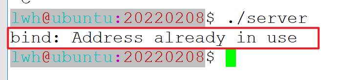


**解决方案**：通过setsockopt函数去套接字的属性进行设置。

```c++
int setsockopt(int sockfd, int level, int optname, const void *optval, socklen_t optlen);
```


#### 8、Bug

当希望在同一台物理主机上，启动多个相同的服务器程序时，会出现问题：


解决方案：


#### 9、完整源码(server端)

```c++
  1 #include <unistd.h>
  2 #include <string.h>
  3 #include <signal.h>
  4 #include <arpa/inet.h>
  5 #include <sys/types.h>
  6 #include <sys/socket.h>
  7 #include <sys/epoll.h>
  8 #include<iostream>
  9 #include<algorithm>
 10 #include<vector>
 11 #include<new>
 12 #include<string>
 13 using namespace std;
 14 void test0(){
 15     signal(SIGPIPE, SIG_IGN);//SIGPIPE信号的处理，不处理会导致服务器直接跳出崩溃
 16     //socket函数的第一个参数是指定ipV协议的类型：4:AF_INET,6:AF_INET6
 17     //2nd:网络协议的类型:tcp:SOCK_STREAM; UDP:SOCK_DGRAM;
 18     //3rd:socket使用的传输协议编号,genarally is 0
 19     //success-return 套接字; fail- return -1
 20     int listenfd = socket(AF_INET, SOCK_STREAM, 0);//服务器监听套接字
 21     //在这里是一个文件描述符可以对应到内核的某一数据结构
 22     printf("listenfd:%d\n", listenfd);
 23     if(listenfd < 0){
 24         perror("socket failed");
 25         return;
 26     }
 27 
 28     //一、1、对套接字进行属性进行设置，让地址可以重用
 29     int on = 1;
 30     if(setsockopt(listenfd, SOL_SOCKET, SO_REUSEADDR, &on, sizeof(on)) < 0){
 31         perror("socket set error");
 32         return;
 33     }
 34     //1st、需要设置的套接口
 35     //2nd、选项定义的层次——SOL_SOCKET;IPPROTO_IP;IPPRO_TCP
 36     //3rd、需要设置的选项
 37     //4th、指针，指向存放选项值的缓冲区，选项值是对选项是否take effect的说明,<0说明生效
 38     //5th、缓冲区的长度
 39 
 40     //一、2、端口号复用
 41     if(setsockopt(listenfd, SOL_SOCKET, SO_REUSEPORT, &on, sizeof(on))<0){
 42         perror("socket set error");
 43         return;
 44     }//Linux的内核已经在系统层面上实现了负载均衡
 45     //但是，高并发量还是需要第三方的nginx
 46     struct sockaddr_in serveraddr;
 47     //sockaddr_in可以看成是sockaddr的派生类
 48     serveraddr.sin_family = AF_INET;
 49     //将端口号由主机字节序转换成网络字节序
 50     serveraddr.sin_port = htons(8888);
 51     //将点分十进制ip转换为网络字节序,转换后的类型为in_addr_t
 52     serveraddr.sin_addr.s_addr = inet_addr("192.168.233.128");
 53 
 54     //二、1、将网络地址与监听套接字相绑定
 55     int ret = bind(listenfd, (struct sockaddr*)&serveraddr, sizeof(serveraddr));
 56     //1st、socket返回的套接口描述符
 57     //2nd、结构体指针，指向结构体中存储的要绑定的ip与端口
 58     //3th、上述结构体的长度；中为网络字节序
 59     if(ret < 0){
 60         perror("bind error");
 61         close(listenfd);//记得回收套接字资源
 62         return;
 63     }
 64     //三、1、 对网络地址进行监听
 65     //listen函数是这个服务器端口和ip处于监听状态等待网络中的某一客户机的连接请求
 66     ret = listen(listenfd, 10);
 67     //1st、socket的返回值
 68     //2nd、指定能够同时处理的最大连接请求 5/10 max128
 69     
 70     //三、2、 创建epoll的实例
 71     //之后可以通过epfd来访问内核的数据结构
 72     //epoll会创建一个struct里面有红黑树以及双向链表
 73     //epoll使用一个文件描述符管理多个描述符，将用户关心的文件描述符的事件
 74     //存放到内核的一个事件表中，这样在用户空间和内核空间的copy只需一次。
 75     int epfd = epoll_create1(0);
 76     if(epfd < 0){
 77         perror("epoll_create1 error");
 78         return;
 79     }
 80 
 81     //3 epoll实例需要对监听套接字进行监听，监听的是读事件
 82     struct epoll_event value;
 83     value.events = EPOLLIN;//读事件
 84     value.data.fd = listenfd;
 85     ret = epoll_ctl(epfd, EPOLL_CTL_ADD, listenfd, &value);//注册函数
 86     //1st、epoll_create1的返回值
 87     //2nd、表示动作 EPOLL_CTL_ADD;EPOLL_CTL_MOD;EPOLL_CTL_DEL;
 88     //3rd、需要监听的fd
 89     //4th、告诉内核要监听什么事件
 90     if(ret < 0){
 91         perror("epoll_ct1 error");
 92         close(epfd);
 93         close(listenfd);
 94         return;
 95     }
 96 
 97     struct epoll_event *evtList =
 98         (struct epoll_event*)malloc(sizeof(struct epoll_event) * 1024);
 99     //4 事件循环
100     while(1){
101         //5 等待事件发生
102         //当监听的文件描述符发生了事件时，就会返回；
103         //如果没有就绪时间则等待；如果到了超时时间还无就绪事件发生
104         //那也返回，return 0;
105         //if set timeout =-1 ->无限等待
106         int nready = epoll_wait(epfd, evtList, 1024, -1);
107         //1 epoll实例
108         //2 从内核得到监听事件的集合
109         //3 这个集合最大有多大
110         //4 超时时间
111         //返回需要处理的事件的个数
112         if(nready == 0){
113             printf("epoll_wait timeout\n");
114             continue;//直接进入下一次循环
115          }
116         for(int idx = 0; idx < nready; ++idx){
117             int fd = evtList[idx].data.fd;
118 
119             if(fd == listenfd){//which means new connection come
    //按位与用于发生读事件会把某位置为1 so并不是==
120                 if(evtList[idx].events & EPOLLIN){                                   121                     //调用accept函数，获取对端进行交互的文件描述符
122                     int peerfd = accept(listenfd, NULL, NULL);
123                     if(peerfd < 0){
124                         perror("accept");
125                         close(listenfd);
126                         return;
127                     }
128                     printf("accept a client, peerfd %d\n", peerfd);
129                     
130                     //添加对于peerfd的监听操作
131                     struct epoll_event value;
132                     value.events = EPOLLIN;//read事件
133                     value.data.fd = peerfd;
134                     ret = epoll_ctl(epfd, EPOLL_CTL_ADD, peerfd, &value);
135                     if(ret < 0){
136                         perror("epoll_ctl");
137                         return;
138                     }
139                 }
140             }else{
141                 //对于已经建好的连接的数据进行读操作
142                 if(evtList[idx].events & EPOLLIN){
143                     char buf[1024] = {0};
144                     ret = recv(fd, buf, sizeof(buf), 0);
145                     if(0 == ret){
146                         //连接被断开了
147                         //删除对于peerfd的监听操作
148                         struct epoll_event value;
149                         value.events = EPOLLIN;
150                         value.data.fd = fd;
151                         ret = epoll_ctl(epfd, EPOLL_CTL_DEL, fd, &value);
152                         if(ret < 0){
153                             perror("epoll_ctl");
154                             return;
155                         }
156                         continue;
157                     }
158                     printf("recv msg from client: %s, ret: %d\n", buf, ret);
159                     ret = send(fd, buf, strlen(buf), 0);
160                     printf("send ret: %d\n", ret);
161                 }
162             }
163         }
164     }
165     close(listenfd);
166     close(epfd);
167 }
168 int main(){
169     test0();
170     return 0;
171 }                                                                                     
```

#### 10、完整源码(client端)

```c++
  1 #include<unistd.h>
  2 #include<string.h>
  3 #include<arpa/inet.h>
  4 #include<sys/types.h>
  5 #include<sys/socket.h>
  6 #include<iostream>
  7 #include<algorithm>
  8 #include<vector>
  9 #include<new>
 10 #include<string>
 11 using namespace std;
 12 void test0(){
 13     //1、创建客户端的套接字
 14     int clientfd = socket(AF_INET, SOCK_STREAM, 0);
 15     if(clientfd < 0){
 16         perror("socket");
 17         return;
 18     }
 19 
 20     //2、设置好服务器的网络地址
 21     struct sockaddr_in serveraddr;
 22     serveraddr.sin_family = AF_INET;
 23     serveraddr.sin_port = htons(8888);
 24     serveraddr.sin_addr.s_addr = inet_addr("192.168.233.128");
 25 
 26     //3、与服务器进行连接请求
 27     int ret = connect(clientfd, (struct sockaddr*)&serveraddr, sizeof(serveraddr));
 28     if(ret < 0){
 29         perror("connect");
 30         close(clientfd);
 31         return;
 32     }
 33     cout << "connect server success"<<endl;
 34     string line;
 35     while(1){
 36         //客户端从标准输入流获取一行数据，在发送给服务器
 37         cout<< "pls input a line"<<endl;
 38         getline(cin, line);
 39         send(clientfd, line.c_str(), line.size(), 0);
 40         char buff[1024] = {0};                                                        41         recv(clientfd, buff, sizeof(buff), 0);
 42         printf("recv from server: %s\n", buff);
 43     }
 44     close(clientfd);
 45 }
 46 int main()
 47 {
 48     test0();
 49     return 0;
 50 
 51 }
                                                                                                         
```


## Day32

### 一、网络IO模型

#### 1、阻塞式的IO

默认情况下就是阻塞式的IO

#### 2、非阻塞式的IO

1）修改recv的第四个参数，只会对这一次调用起作用


运行结果：


2）fcntl函数设置为非阻塞的，一直有效，直到被设置为阻塞的。


### 二、异步io vs 同步io

关注的是消息通信机制，要涉及到两个对象

阻塞和非阻塞关注的是程序（进程/线程）的状态是否处于等待

## Day33

### 一、并发服务器经典方案reactor+线程池

#### 1、reactor模型（反应器模式）

A、注册就绪事件和相应的事件处理器

B、事件分离器等待事件的发生

C、当就绪事件发生后，就用相应的事件处理器进行处理即可

要求：

在事件循环的过程中对于每一个连接的处理，事件不宜过长

如果过长就会影响实时性。

#### 2、Threadpool

业务逻辑交给线程池进行

当线程池任务处理完后，还要通知io线程进行发送

### 二、Proactor（异步模型）

#### 主动器模式——不再关注读写事件，而是关注读写完成事件

eg：读取操作：

A、应用程序初始化一个异步读取操作，然后注册相应的事件处理器，**此时事件处理器不关注读就绪事件，而是关注读取完成事件，这是区别于Reactor的关键**

B、事件分离器等待读取操作完成事件

C、在事件分离器等待读取操作完成的时候，os调用内核线程完成读取操作，并且将读取的内容放入用户传递过来的缓冲区中。**这也是区别于Reactor的一点，Proactor中，应用程序需要传递缓冲区。**

D、事件分离器捕获到读取完成事件后，激活应用程序注册的	事件处理器，事件处理器直接从缓冲区处理数据，而不需要进行实际的读取操作。

#### ！：在win中表现比较明显，io完成端口

### 三、实现

1、抽象出InetAddress类

2、Socket是一种稀缺的资源，用完以后一定要记得回收，用RAII技术来进行管理资源，做一个职责划分。

3、 建立一个Acceptor类（新链接的连接器）

4、TcpConnection

WARN：recv（peerfd，buff，128，0）函数除了拷贝数据。同时还从内核缓冲区中移走了数据。若将0改为MSG_PEEK则只拷贝数据，不宜走内核缓冲区中的数据。

因此读取一行的思路：

1、先从内核中取出一部分数据，但不宜走

2、再去判断有没有‘\n’，如果有，那么获取这一行的长度

3、最后再从内核缓冲区中移走就可以了

### 四、Version2

epoll本质上就是一个事件循环

EventLoop对象需要管理所有的TCP链接

所以有_conns:map<int , TcpConnectionPtr>其中tcpcon为智能指针（因为不可复制性）

！：loop函数与unloop函数要运行在不同的线程才可以发挥作用（loop在死循环）

### 五、网络编程过程中会发生的三个半事件

1、当连接建立的时候

连接建立好后可以做一些事情

所作的事情都是根据需求会有所变化

which means that在此挖一个空——》onConnection（）

2、当消息到达的时候

同上onMessage

3、当连接关闭的时候

也是可以做事情的onClose

4、当消息发完的时候

综上：**TcpConnection需要更多的实现**

​           **三个回调函数时为了扩展需求；当需要发生改变的时候，注册过去就好。**

eventLoop的三个回调函数是为了交给tcp对象的

eventLoop和TcpConnection是一对多的关系so若eventLoop的回调函数若为右值引用

会导致后面tcp对象注册到空函数，因此这里用复制的方式。

### 六、Version3.0设置一个TcpServer封装Acceptor和EventLoop

组合关系--

_acceptor:Acceptor

_loop:EventLoop

做为TcpServer的成员对象

## Day34

### 一、Basic Reactor的问题

onMessage处理事件不宜过长，必须控制在毫秒级别

solution：业务逻辑的处理交给线程池来处理。

！：从0至1的过程是一种自底向上的过程，但是阅读代码的过程更多的是自顶向下

### 二、用线程池来处理产生的问题

#### Q1、传什么值

假设经过业务逻辑的处理后，得到了要返回给对端的结果response那么接下的操作就是发送了，发送操作一定是有一个连接进行的，因此还要传入tcpconnection对象。

#### Q2、send操作可以在process中完成吗

process方法只是运行在线程池中的某一个子线程中（计算线程），而发送操作只可有IO线程（EventLoop方法进行），所以send操作不可以在process方法中进行--》此时需要一个通知操作，有计算线程通知IO线程发送数据。

#### Q3、计算线程如何通知IO线程

用eventfd对于进程or线程间通信

```c++
#include <sys/eventfd.h>
int eventfd(unsigned int initval, int flags);
//initval:初试化计算器值，该值保存在内核
//flags:若是2.6.26后版本的内核。flag必须设置为0
```

Eventfd支持read和write操作，当recv/send的flag置为0时和read/write一样

•read：如果计数器A的值不为0时，读取成功，获得到该值。如果A的值为0，非阻塞模式时，会直接返回失败，并把error置为EINVAL;如果为阻塞模式，一直会阻塞到A为非0为止。

•write：将缓冲区写入的8字节整形值加到内核计数器上，即会增加8字节的整数在计数器A上，如果其值达到0xfffffffffffffffe时，就会阻塞（在阻塞模式下），直到A的值被read。

•select/poll/epoll：支持被io多路复用监听。当内核计数器的值发生变化时，就会触发事件

#### Q4、fork()函数

执行成功时候，会有两个进程，一个是父进程，一个是子进程，返回值有两种suitualation————。0是子进程，其他为父进程

#### Q5、RESULT

1、对于eventfd，只要read一次，内核计数器的值就会清0

2、当epoll检测到eventfd对应的内核计数器的值发生变化时，就会触发读事件

3、假设write操作时在A线程中进行，read是在B线程中进行，那就有一个A线程通知B线程处理任务的效果了。

### 三、通知模型

start方法的作用是对eventfd进行监听；

wakeup方法是在另一个线程中执行唤醒操作

若poll触发后不去做read处理，poll会一直被触发

### 四、运用于reactor模型中

```c++
using Functor=std::function<void()>;
```

#### Q1、实现计算线程如何通知IO线程

1、采用eventfd来操作

2、将send函数的执行延迟到IO线程，把send函数打包成一个回调函数，注册给EventLoop对象，并通知IO线程（by：sendInLoop方法）。

#### Q2、子线程的执行过程是无法确定的，导致pendingFuctors会出现多线程安全问题

使用锁来保护pendingFunctors

!:扩展性体现在，对于任务的处理可以根据实际情况任意修改

### 五、定时器Timerfd

是linux提供的一个定时器接口。这个接口基于文件描述符，通过文件描述符的可读事件进行超时通知，so能够被用于select/poll/epoll的应用场景。

```c++
#include <sys/timerfd.h>
int timerfd_create(int clockid, int flags);
int timerfd_settime(int fd , int flags,
                   const struct itimerspec *new_value,
                   struct itimerspec *old_value);
```

#### timerfd_create函数

功能：该函数生成一个定时器对象，返回与之关联的文件描述符

参数：

clockid：CLOCK_REALTIME:相对时间——1970.1.1到目前的时间

​				CLOCK_MONOTONIC：绝对时间——系统重启至现在的时间

flags：TFD_NONBLOCK(非阻塞)

​			TFD_CLOEXEC(同O_CLOEXEC)

#### timerfd_settime函数

功能：该函数能够启动和停止定时器

fd：timerfd对应的文件描述符

flags：0表示是相对定时器，TFD_TIMER_ABSTIME表示绝对定时器

new_value：设置超时时间，如果为0则表示停止定时器

```c++
struct timespec
{
	time_t tv_sec;
    long   tv_nsec;//ns
}
struct itimerspec
{
    struct timespec it_interval;//周期性超时时间
    struct timespec it_value;//第一次超时的时间
}
```

old_value：一般设置为NULL，不为NULL，则返回定时器这次设置之前的超时时间。（储存用）

#### timerfd支持的操作

•read：读取缓冲区中的数据，其占据的存储空间为sizeof(uint64_t)，表示超时次数。

•select/poll/epoll：当定时器超时时，会触发定时器相对应的文件描述符上的读操作，IO复用操作会返回，然后再去对该读事件进行处理。

#### Timer模块

start方法的作用是对timerfd进行监听

# 项目笔记

## 搜索引擎整体架构

### 1、客户端

1、实现客户端，与服务器进行交互

2、浏览器 ——B/S-browser-server

3、PC程序 ——C/S-client-server

### 2、模块一：关键字推荐服务部分

消息长度（4B）+消息ID（4B）+消息

UTF8——linux默认的编码规则、中文占据三个字节且包含中英文

Q1、如何解析RSS文件

Solution：使用xml库——tinyxml2库

#### 1、离线部分（offline指不需要和客户端进行交互的操作）

（1）创建词典

Word——frequency

这里使用RSS文件（XML），且需要把候选词中的大写全部转成小写。

使用map来统计词频

再用vector<pair<string, int > >存储（可以用O（1）访问到任意一条记录。）

（2）创建索引文件

数据结构为unordered_map<string, set<int> >

（3）建立倒排索引，并生成网页去重之后的网页库和网页偏移库

#### 2、在线部分（需要和客户端交互的操作）

（1）查找候选词

采用一定的策略筛选候选词——计算相似度

**最小编辑距离算法**

/最长公共子序列

/KMP

与百度不同：baidu使用的是前缀匹配的策略

候选词的选取策略

a、优先比较最小编辑距离

b、在编辑距离相同的条件下，在比较候选词的词频

c、在词频相同条件下，按照字母表顺序比较候选词

返回几个候选词给客户端

此时使用优先级队列

```c++
struct MyResult{
	int d;//k<=5
	int freq;
	string word;
};
poriority_queue<MyResult> 
```

(2)发送给客户端

数据以JSON数据格式的方式

不适用jsoncpp，可以使用nlohmann/json【git上有】

#### 3、功能优化

（1）缓存系统的设计

LRU Cache（自行实现） or Redis

Q1、only 1 Cache？

每个查询是由一个工作线程完成的，so每一个工作线程有一个单独的cache

Q2、经过一段时间的运行，各个Cache产生不一致的问题？

在固定的时间执行更新策略，（从上一次更新之后到这一次更新之前产生的记录）

1、把一号cache作为一个中转点

2、先把其他cache的内容添加到1号cache中，此时1号cache共享了其他cache的内容了

3、再把一号cache的内容写回到其他每一个cahce中

4、为了防止程序宕机造成的cache丢失的情况出现，需要将cache的内容写回到文件中进行保存，which is called持久化——cache文件。

Q3、如何实现Cache

1、list<pair<key, json> >

假设头部是热数据，尾部是冷数据，则查找数据是O(N),增删改查是O(1)。

2、unordered_map<key , iterator>

查找数据是O1，其中存储的是List中元素的迭代器

要保存的是热数据，冷数据淘汰

```c++
class LRUCache;//1000条
```

3、list<pair <key, json> >  pendingUpdateList

每一个LRUCache中都有的待更新的数据——热数据

Q4、如何保证查询请求不能中断，在更新的同时

在更新时，先对每个线程对对应的Cache进行复制

solution1：备用服务器方案

solution2：一个工作线程对应2个Cache

### 3、模块二：网页查询服务部分

1、建立网页库和网页偏移库(离线阶段)

（1）网页库格式采用xml格式

标题/摘要信息/原始内容

组成ripepage.dat

ds：WebPage类 docid/title/url/content/set

vector<WebPage> pages

（2）网页偏移库（便于在线阶段读取）

获取格式化好的网页后，通过c++的文件输出流将文档写到文件中去，同时记录下该篇文档在文件中的位置信息，即offset.dat

正向索引

位置信息即1000 position length

​                   1001 position2 length2

ds：unordered_map<id, pair<long, long> > _offsetLib

（3）网页去重

Q1、如何判断两篇网页是相同的？

1、通过一些方式找到一个特征，能够代表这篇网页

2、对两篇文章的特征进行计算，得到相似度

3、相似度与一个阈值进行比较

solution：topK（词频最高的十个词）/simhash算法（google出品）

Q2、当只有网页库时，搜索一个词只可全部遍历

a：倒排索引表——invertIndex.dat 

ds：unordered_map<string, set<pai<int, double> > > invertIndexTable

排序时使用权重值（最核心的）——TF-IDF算法

tf（term frequency）——某个词在文章中出现的次数

df（Document Frequency）——某个词在所有文章中出现的次数，即包含该词语的文章数量。（要说明区分度，所以越低越有区分度）

IDF（Inverse Document Frequency）——逆文档频率，表示该词对于该篇文章的重要性的一个系数IDF=log(N/(DF+1)),其中N表示文档的总数or网页库的文档数。

**最终词语的权重w为 w=TF * IDF。**

而一篇文章会包括多个词语w1,..wn，还要对这些词语

W=w/sqrt(w1^2+...+wn^2)

W几位最终所保存的InvertIndexTable中的double的值

2、提供网页查询的服务

（1）对于查询的关键词需将其是为一篇文档x，通过TF-IDF算法计算each关键词的权重系数；将其组成一个向量(x1,x2,x3,...xn);将其分词，计算出查询词所对应的权重，

X=(w1, w2, w3)——线性代数，向量的概念，用向量空间模型

（2）余弦相似度算法（cos值越大相似度越高,用于解决网页排序问题）


cosθ=（X*Y）/（|X| * |Y|）

（3）pageRank算法（google的）

3、摘要信息的生成

要根据不同的关键字生成不同的摘要信息

且要设定一个长度限制

字符串匹配

### 4、拓展和优化

#### 1、拓展

用户画像？

搜索排行榜？

#### 2、优化

用redis进行工业级的实现——内存数据库

DS：list、hash、string、set、zset

常见的redis面试题

### RSS文件的解析

使用tinyXml2解析，生成一个网页库pagelib.dat

```c++
#include "tinyxml2.h"
struct RssItem
{
    string 
}

//tinyXml2的用法
int exp()
{
    XMLDocument doc;
    doc.LoadFile("collshell.xml");
    return doc.ErrorID();//没错误返回0
    XMLElement * item = doc.FirstChildElement("rss")
        ->FirstChildElement("channel")
         ->FirstChildElement("item");//返回一个指针
    const char *title
    if(item){
        XMLElement * ptitle = item->FirstChildElement("title");
        if(ptitle){
            title = ptitle->GetText();
        }
    }
}
```

使用tinyXml2解析content内容时候需要过滤来去掉html标签

使用正则表达式的库-》regex库--regex_replace()找一个正则表达式匹配html标签

```c++
std::regex vowel_re("<.+?>")
cout<<std::regex_replace()
```

找下一个<item>标签（兄弟关系--兄弟节点siblings）

```c++
NextSiblingElement
    
//之后用while
 while(pItem)
```

### 中文处理

设定cppjieba的路径makefile文件

```c++

```

程序执行的目录会决定程序启动的路径

UTF-8的编码规则

eg：

```c++
void test1()
{
	string s1 = "种";
    cout<<s1.size()<<endl;//一个汉字占据3B空间而英文字母占据1B
}
```

结论：std：：string是一个字节流的字符串

utf一个字符最多可以占据6B

用这个函数来判断该字符占几个字节

如用获取一个字符串的字符长度

```c++
int nbit(const char ch)
{
	int len = 1;
    if(ch & 1<<7){
	//多字节字符
     for(int idx = 0; idx < 6; idx++){
			if(ch &(1<<6 - idx))	{
                ++len;
            }else{
                return len;
            }
     }
    }else{
        return len;
    }
}
```

eg：一额

一：s[0],额：s[3]

```c++
int length(const string &str)//求取一个字符串的字符长度
{
    int len = 0;
    for(size_t idx = 0; idx <str.size() ;++idx)
    {
		int bytes = nbit(str[idx]);
        idx+=bytes-1;
        ++len;
    }
    return len;
}
```

求取最小编辑距离（中英文混合）

以字符为单位进行

```c++
int editDistance(const std::string & lhs, const std::string &rhs)
{//计算最小编辑距离-包括处理中英文
	size_t lhs_len = length(lhs);
	size_t rhs_len = length(rhs);
	int editDist[lhs_len + 1][rhs_len + 1];
	for(size_t idx = 0; idx <= lhs_len; ++idx)
	{
		editDist[idx][0] = idx;
	}

	for(size_t idx = 0; idx <= rhs_len; ++idx)
	{
		editDist[0][idx] = idx;
	}
	
	std::string sublhs, subrhs;
	for(std::size_t dist_i = 1, lhs_idx = 0; dist_i <= lhs_len; ++dist_i, ++lhs_idx)
	{
		size_t nBytes = nBytesCode(lhs[lhs_idx]);
		sublhs = lhs.substr(lhs_idx, nBytes);
		lhs_idx += (nBytes - 1);

		for(std::size_t dist_j = 1, rhs_idx = 0; dist_j <= rhs_len; ++dist_j, ++rhs_idx)
		{
			nBytes = nBytesCode(rhs[rhs_idx]);
			subrhs = rhs.substr(rhs_idx, nBytes);
			rhs_idx += (nBytes - 1);
			if(sublhs == subrhs)
			{
				editDist[dist_i][dist_j] = editDist[dist_i - 1][dist_j - 1];
			}
			else
			{
				editDist[dist_i][dist_j] = triple_min(
					editDist[dist_i][dist_j - 1] + 1,
					editDist[dist_i - 1][dist_j] + 1,
					editDist[dist_i - 1][dist_j - 1] + 1);
			}
		}
	}
	return editDist[lhs_len][rhs_len];
}
```

### 线性局部存储

若关键字id为1（msgid = 1）

做关键字推荐的服务

1、先查询缓存，如果有的话可以直接返回

a、问题：获取缓存时，idx如何得到

process方法的执行，即在线程池中的一个子线程的执行

在定义线程池

单例类：cachemanager

```c++
int idx;//是线程池种某一个子线程的编号
//法一
pthread_t pid = pthread_self();//建立全局pthread_t到idx的映射即map
//法二 线程局部存储 TLS
__thread int tNumber = 10;//全局位置，但是每个子线程都拥有一个单独的tNu
//但是tNumber的访问方式与全局变量一样
//但是不会影响其他线程的tNumber
auto & cache = CacheManager::getInstance()->getCache(tNumber);
//同样的，errno变量本身也是tls变量
auto & cache = CacheManager::getInstance()->getCachen(idx);
```

__thread 只可以修饰常量即POD类型——标量类型（c风格的）、c风格的class

so，在thread.hpp中定义一个全局的__thread int idx=0，但是不太合理，更好的设计是对线程取一个名字

2、如果没有，就只能进行查询


### LRUCache的实现

unordered_map

淘汰用链表slice操作,尾部是最近最少使用元素，每用一次放到头部

```c++
  1 #include<iostream>                                               2 #include<algorithm>
  3 #include<vector>
  4 #include<new>
  5 #include <list>
  6 #include <unordered_map>
  7 #include<string>
  8 using namespace std;
  9 class LRUCache
 10 {
 11 public:
 12     LRUCache(size_t capacity)
 13     :_capacity(capacity){}
 14     int get(int key);
 15     void put(int key, int value);
 16 private:
 17     struct CacheNode
 18     {
 19         int key;
 20         int value;
 21         CacheNode(int k, int v)
 22         :key(k),value(v){}
 23     };
 24     using iterator = list<CacheNode>::iterator;
 25     size_t  _capacity;
 26     list<CacheNode> _data;
 27     unordered_map<int, iterator> _hashmap;
 28 
 29 };
 30 
 31 void LRUCache::put(int key, int value)
 32 {
 33 
 34     auto iter = _hashmap.find(key);
 35     if(iter != _hashmap.end()){
 36     //key存在,需修改对应的value的值
 37     //还需要将该节点放到list的头部
 38     iter->second->value = value;
 39     _data.splice(_data.begin(), _data, iter->second);//o(1)
 40     //更新hashmap中的位置
 41     _hashmap[key] = _data.begin();
 42     }else{
 43     //key不存在
 44     if(_data.size() == _capacity)
 45     {
 46         //达到上线,淘汰末尾元素
 47         int key = _data.back().key;
 48         _data.pop_back();
 49         auto it = _hashmap.find(key);                            50         _hashmap.erase(it);
 51     }
 52     else{//直接添加元素
 53         _data.push_front(CacheNode(key, value));
 54         _hashmap[key] = _data.begin();
 55     }
 56     }
 57 }
 58 
 59 int LRUCache:: get(int key)
 60 {
 61     //cun zai
 62     auto iter = _hashmap.find(key);
 63     if(iter != _hashmap.end()) {
 64         _data.splice(_data.begin(), _data, iter->second);
 65         _hashmap[key] = _data.begin();
 66         return iter->second->value;
 67     }else{
 68         return -1;
 69     }
 70 }

```

该类的对象复制时候需要提供复制控制函数

由于--迭代器的指针会导致浅拷贝->迭代器紊乱，∴要重新生成相应的hashmap记录

```c++
LRUCache(const LRUCache &rhs)
:_data(rhs._data)
{
    auto iter = _data.begin();
    for(;iter!= _data.end(); ++iter ){
        _hashmap[iter->key] = iter;
    }
}
LRUCache & oprator=(const LRUCache & rhs)
{
    if(this != &rhs){
        _data =rhs._data;
        _hashmap.clear();
        
    }
}
```


## 项目介绍

### 1、关键字推荐

离线阶段

数据结构

```c++
Map<string, int>//<关键词，词频>
unordered_set<string>//停用词
vector<pair<string,int> >//<关键字，词频>->dict.dat
unordered_map<string, set<int> >//<汉字，出现过该汉字的关键词下标>->dictIndex.dat
  
```

在线阶段

1、导入dict,dat/dictIndex.dat/cache.dat到内存

2、查到有查询需求，从客户端中获取查询的关键字，先从cache里查找该关键字推荐，若有则直接返回查询结果。

3、将结果发送给client，并且将其结果写入cache中

### 2、网页搜索

离线阶段

lruCache

1、遍历

线上模块

1、

遇到的困难：

关键字去重

XML解析速度问题

# 数据库笔记

## day1

1、Db（可以永久存储且更好的查询）

--存储结构化数据

--关系型数据库通过外键关联来建立表与表之间的关系

•DQL：数据查询语言

•DML：数据操作语言

•DDL：数据定义语言

•DCL：数据控制语言

•TPL：事务处理语言

CCL：指针控制语言

数据库自带：

information_schema元数据

mysql核心库

performance_schema性能相关

sys对DBA有好处

**注释为：# -- /* */**

### 数据库定义语言DDL

```mysql
#消除声音
mysql --no-beep -uroot -proot --auto-rehash
#显示数据库
show databases;

create database cyy;


mysql> use cyy;

drop database cyy;

TRUNCATE//清空表结构只剩下表名字
/先drop再3创建
CREATE/ALTER/DROP/TRUNCATE
create table table_name
(
	field1 datatype,
    field2 datatype
);[c]
#显示表的结构（字段，列，域）
show craete table table_name
desc table_name
float (M, D) M为显示长度，d指定小数位数
```

列column = 域 filed

数值类型：int（相关）

文本、二进制：char、varchar

日期：date、datetime

```mysql
#修改表
alter table table_name add english float default 60;
#修改表 修改字段
alter table member modify name varchar(20);
#change 可以改变列的名字
alter table member change mname name varchar(20);
#delete
alter table member drop english;


```


### 数据库管理语言DML

INSERT UPDATE DELETE

用于向数据库表中插入、删除、修改数据

```mysql
#字符串使用单引号，而不是双引号
#数据的插入
insert into table_name (id, name) values (2, 'xxx')

#数据的修改
update member set age=24 where id=2

update member set e_date='1999-10-10 10:10:10';
#+where
delete from member where id=8;

```

和insert及update一样，，从一个表中删除记录将引起其他表的参照完整性问题，在修改db数据时，应始终不忘这个问题


Tip：中文乱码

latin1 utf8 GBK

### 数据库查询语言DQL

select指定查询哪些列的数据

column指定列名

from指哪张表

distinct可选，指显示结果时，是否剔除重复数据

```mysql
select [distinct] [*] |{column1,2,3} from table [where]

#zhiding
select id,name from member;
#别名
select column as 别名 from biao
```

1、比较运算符

```
> < <= >= = <>
between and//显示某一区间的值含头含尾
in(set)//显示在列表中的值in(100,200,300)
like ' '//模糊查询_表示一个字符%表示0个or多个字符
is null
```

mind:db的退出 exit quit ctrl+d

2、排序

```mysql
#order by
asc/desc 升序/降序
#限定
limit 1（条）
#偏移
offset 3往下偏移三行开始

```

### 数据完整性

——为了保证插入到数据库中的数据是正确的，防止用户可能的输入错误。

1、实体完整性：规定表的一行在表中是唯一的实体。实体完整性通过表的主键来实现

2、域完整性：指数据库的列必须符合某种特定的数据类or约束。such as not null。

3、参照完整性：保证一个表的外键和另一个表的主键对应。参照的完整性要求关系中不允许引用不存在的实体。与实体完整性是关系模型必须满足的完整性约束条件，目的是保证数据的一致性。

几种约束

1、主键约束(primary key(id))

2、唯一约束

3、非空约束

4、自动增长（auto_increment)

5、定义外键约束

### 多表设计

一对多：减少数据冗余

多对多：主键可以是一列or多列放在一起

一对一

### 复杂查询

```mysql
alter table order_table modify user_id int foreign key(user_id) references customer(id);
user_id int, foreign key(usr_id) reference customer(id )
```

删除带外键的需要优先删除有依赖的

#### 1、连接查询

```mysql
select * from table1 join_type table2 [on (join_condition)][where (query_condition)]
```

交叉连接（cross join）——不带on的查询，返回一个笛卡尔积

内连接（inner join）——返回连接表中符合连接条件及查询条件的数据行

```mysql
select * from customer as c inner join order_table as o on c.id=o.usrid;//别名的作用

```

隐式内连接：不包含inner join 和on关键字，用where进行比较

三种内连接的形式：等值连接（=应用于），大于链接，自然连接


select database();查看当前所属db

表的复制

```mysql
create table cu_tmp select * from customer;//结构与数据全部复制
create table cu_tmp like customer;//只复制结构
//将id改为主键
alter table cu_tmp modify id int primary key;
//若一个表有外键约束，此时想要修改，必须要先删除外键，在添加外键
//修改外键约束
alter table member drop foreigner key 。。。
alter table order_table_tmp add foreign key(usr_id) reference cu_tmp(id);
//若想修改表的外键名字，可以先删除外键约束，然后在新建
alter table order_table_tmp add [constraint 'order_table_tmp_ibfk_1'] foreign key(usr_id) reference cu_tmp(id);
```

#### 2、外连接（outer join）

连接时必须加上连接条件on

分——左外连接,将符合条件的所有行显示出来，然后将左表中的其他列也显示出来，右表不符合条件的列用null填充！外连接时，必须加上连接条件on

```mysql
select * from customer as c left outer join join order_table as o on c.id =o.usr_id;where o.order_id is not null;
#不符合的也会显示出来并用null填充
```

#### 3、全连接

### 子查询（嵌套查询）

指在where子句or from语句中有嵌入select查询语句--临时表（取别名、子查询）

```mysql
select *from orders where customer id = (select id from customer where name like '%xx%')
```

### 联合查询

合并两条查询语句的查询结果，去掉其中重复的数据行，然后返回没有重复数据行的查询结果。关键字union

若要不去重则，用union all

**group by And count\ max\sum\avg\min**

```mysql
select count(age),max(maths) ,age from member group by age;
```


报表查询（having）

```mysql
[group by age having age > 40]
```

### 数据库备份

```bash
//备份
mysqldump -u root -p test>test.sql
//恢复
mysql -u root -p cyy<cyy.sql
```

备份原理：insert

通过协议连接到MySQL数据库，将需要备份的数据查询出来并转换对应的insert语句，当需要还原这些数据时。只要执行这些insert语句，即可将对应的数据还原。

### 数据库编程

架构：C/S模型

API

```c++
int mysql_query(MYSQL *mysql, const char *query);
查询成功返回0，失败返回非0值
MYSQL_RES *mysql_store_result(MYSQL *mysql)
```

## day2（理论性）

### 事务

#### 1、基本概念

概念：构成单一逻辑工作单元的操作集合，称之为事务

#### 2、四大特征

ACID：

1、原子性：事务要么全部不发生，要么全部都发生

2、一致性：事务作为一个原子性操作，他从一个一致性的数据库状态开始运行，事务结束时，数据库的状态必须是再次是一致的

3、隔离性：尽管多个事务可能并发执行，但系统保证，对于任何一对事务i/j，在i看来要么j在i前完成，要么j在i后开始执行，so，每个事务都感受不到系统中有其他的事务并发的执行。//和隔离级别也有关系

4、持久性：一个事务成功完成后，它对数据库的改变必须是永久的，即使出现系统故障。

#### 3、事务的基本操作

start transaction/begin：开启一个事务，标记事务的起点

commit：递交事务，表示事务成功被执行。

roll back：回滚事务，回滚到初始状态or回滚点

save point：回滚点

release savepoint：删除回滚点

set transaction：设置隔离级别

```mysql
start transaction;
begin;
commit;
roll back;
savepoint sp1;
rollback to sp1;
```

结束事务的情况有两种：

a commit：表示事务成功被执行，结束事务；

b 发送故障：结束事务，不管有无设置回滚点，都会回到事务开始前的状态

ROLLBACK：

不表示发送故障，也是一个数据库操作，属于事务的一部分。表示回滚事务，回滚到事务开启前的状态，or中间的某个回滚点。想要rollback生效，必须要commit。

#### 4、并发执行事务可能会引发的问题

（1）脏写

违背事务的一致性

**多个事务**并发**写同一数据**时，先执行的事务所写的数据会被后执行事务所写数据覆盖。

（2）脏读

若以一个事务a向数据库写数据，但该事务并没有递交or终止，另一个事务b就看到了事务a写入的数据（过程值）。

（3）不可重复读

一个事务对同一数据项的多次读取，但是在某前后两次读取之间，另一个事务更新该数据项，并**提交**了，在后一次读取时，感知到了提交的更新。

（4）幻读

一个事务需前后两次统计，对于事务b而言，a事务新增了一条数据，导致B事务前后进行读的时候，后一次比前一次多读了一条数据。

#### 5、隔离级别（隔离性依次增高，串行程度越来越高）

读未提交

——允许读取未提交的数据

读已提交

——只允许读取已提交的数据，但不要去可重复读，eg：在事务两次读取一个数据项期间，另一个事务更新了该数据项并提交

可重复读

——只允许读取已提交数据，且在一个事务读取一个数据项期间，其他事务不得更新该数据，但该事务不要求与其它事务可串行化。eg：在两次统计查询中，另一个事务可以插入一些记录，当记录符合一些查询条件的就会产生幻读。

可串行化

——事务好像串行执行一样，一个结束，另一个才开始

**所有隔离级别都不允许脏写**(会卡住！)

lock wait timeout exceed！

```mysql
#查询隔离级别当前事务
select @@ [session|global] transaction_isolation;
select @@tx_isolation;

#查询当前隔离级别
select @@session.transaction_isolation;

#设置当前隔离级别
set session transaction isolation level read uncommitted;//脏读/不可重复读/幻读
										read committed//不可重复读/幻读
										repeatable read//幻读
										serializable//只能执行读操作
```

### 索引

#### 1、什么是索引

Index是帮助MySQL**高效获取数据**的**数据结构**

#### 2、常用的数据结构

考虑的维度：时间复杂度，对内存要求，磁盘IO的次数，范围查找

1、顺序查找的时间复杂度O（n）

2、二分查找O(logn)但是对内存要求高，索引加载到内存时，要求连续的存储空间

3、二叉树索引时间复杂度O(logn)对内存要求低但会导致高磁盘IO——二叉树高度过高，将索引从磁盘加载到内存时间比较长。

4、hash时间复杂度o（1）低对内存要求低磁盘IO低，但是只支持等值比较查找不支持范围查询

5、B树-多叉平衡搜索树：B树数据+Key ID（4B）+value地址（8B）——限制了一个节点存key值数目——树高变高

6、B+树（MySQL底层索引）：B+树内部节点只保存key（4B）+keyID（4B）（尽量让一个节点中存入尽可能多的索引）/叶子节点保存key和data+key ID+ data地址

**降低树高**

#### 3、索引的分类

```mysql
show index from table_name
							\G;//竖着显示
```

1、主键索引（以主键作为索引）

建立规则--int优于varchar，最好是与表的其他字段不相关的列or是业务不相关的列，一般设为int且auto_inrement

特点：非空唯一。int天生就具有比较功能。

2、辅助索引（非主键）

（一）唯一索引

特点：唯一但可以为空

（二）普通索引


（三）组合索引

用多个列同时作为索引

查找时用最左前缀——eg：先用名字进行排序再以数学成绩进行排，则只查数学成绩时是用不到该索引的。——每次进行查找的时候。必须要用到组合索引最左边的一列	

#### 4、创建和删除索引

```mysql
create table test (id int , age int, primary key(id));
//创建主键在创建表ing
//在创建完表后，再去创建主键
alter table table_name add primary key(id);

//创建唯一索引
create unique index index_name on table_name(name);
//创建普通索引
create index name_idx on table_name(name);
alter table test add index  
//创建组合索引
create index name_maths_idx on test(name, maths)
alter table test add index name_maths_idx(name , maths)
```


删除

```mysql
alter table table_name drop index index_name;
drop index index_name on table_name;
```

#### 5、索引的优缺点

good：

提高数据检索效率，降低db的IO成本

bad：

1、占据额外的空间。有时候索引占用的空间甚至比数据占用的空间还要多

2、索引过多之后，更新表的时候，也需要更新索引树，时间开销比较大

## day3

### MySQL的优化

#### 1、MySQL逻辑架构

接口——》解析——》优化——》缓存

buffer：更注重写

cache：更注重读

MySQL可分为以下两层：

存储引擎层：负责存储数据与提取数据——MyISAM、InnoDB、Memory，插件式的（即插即用）。

server层：

客户端—tcp可靠连接（半双工）—》服务器——》查询缓存【用redis代替】—miss—》解析——》查询优化器——》执行计划——》查询执行引擎—api接口查询—》

```mysql
select version();
//查看MySQL的版本信息
select database();
//查看当前db

```


#### 2、不同存储引擎的区别

不同的存储引擎支持不同的特性

```mysql
show engines;
//查看支持的引擎

```

##### InnoDB（默认）：

特点：1、支持事务2、支持行锁和表锁3、支持MVCC（多版本并发控制——操作过程中会把时间戳记下）4、支持崩溃恢复。5、支持外键一致性约束

//会生成两个文件1.frm存放表结构2.ibd存放数据和索引——放一起叫聚集索引

##### MyISAM：不支持事务（无回滚点）

特点：1、查询速度很快。2、支持表锁（两个进程同时进一个表会把表锁了）3、支持全文索引（正排索引、倒排索引）。4、不支持事务

//会生成三个文件1.frm存放表结构2.myd存放数据3.myi存放索引的

//索引和数据是分开存放的，这样的索引叫非聚集索引。

##### MEMORY：HASH based

特点：1、所有数据都存放在内存中，因此数据库重启后会丢失2、支持表锁3、支持hash、btree索引4、不支持Blob和Text字段（text是存大文本的，blob是存大二进制文件的eg：图片/视频）

查询速度是最快的，一般用memory存放临时表，

```mysql
create temporary table test_tmp (id int)..
```

**#临时表与存储引擎是memeory的表的区别**

临时表创建完成之后，不能显示表的名字，但是可以进行正常的sql语句的执行，且临时表的存储引擎默认也是InnoDB，临时表只存在当前会话，当会话关闭时，，表及表结构和数据都不会存在。

memory引擎的表在断电重启之后数据会丢失

！：查找MySQL存储引擎文件路径：cd /var/lib/mysql

#### 3、使用不同的存储引擎以及如何选择

```mysql
engine = memory;//前为普通创建

```

InnoDB存储限制64TB，MyISAM限制256TB，memory限制为ram。 

InnoDB唯一支持事务，支持全文索引，均支持树索引，唯一支持外键。。

引擎的选择：大小限制，对事务的支持，对锁的支持，对外键的支持。

#### 4、MySQL中的锁

InnoDB支持行级锁，也支持表级锁，默认为行级锁

BDB采用的页面锁。

对数据操作的粒度划分：

表级锁：开销小加锁快，不会死锁，并发读最低

行级锁：开销大加锁慢，会死锁，并发度高

对数据操作的类型划分

读锁（共享锁）：同一份数据，多个读操作可以同时进行而不互相影响

写锁（排它锁）：当前操作没有完成之前，会阻断其他读锁和写锁

##### MyISAM的表锁

1、执行查询语句前会自动对所有涉及的表上读锁

更新语句时，上写锁（全自动）

```mysql
lock table table_name read;write

```

2、一个会话对一张表加读锁后，不能读其他的表，若想读其他表，可以先对其他表上锁再读。

3、可以对同一张表加多次读锁。

可以使用show open tables来显示表的使用情况

4、对一张表加了读锁就不可以进行写操作（任何会话都不能进行写操作）

5、一个会话（进程or线程）对一张表加了写锁，表明本会话可以写此表，当然也可以读，其他会话不可读写。（排它锁）

conclude：读锁会阻塞写，但不会阻塞读。而写锁会阻塞读写。

##### InnnoDB的行锁

锁定粒度最细，能大大减少数据库操作的冲突

```mysql
select ___ lock in share mode;
select ___ for update;
```

均支持不可脏写+行锁

1、一个会话对某一行加了读锁之后，另一个会话可以读该行，但是不能对该行进行写操作，但可以去读or写其他行（行锁）。

2、间隙锁——锁了id=3~5的行（即使不存在），另一个会话再去进行写操作，写的是刚刚锁的间隙

总结：读上可加读，不可写上+写也不可堵上+写


#### 5、业务设计

范式设计——设计数据库时要遵守的规则

##### 第一范式（确保每列保持原子性）

所有字段值都是不可分解的原子值，即每个字段原子性不可再分。

##### 第二范式（确保表中每列都和主键相关）

所有非主键字段完全依赖主键，不能产生部分依赖。

多对多：三张表，关系表中用外键建立另外两张表的主键间的联系

##### 第三范式（确保每列都和主键列直接相关，而不是间接相关）

需要确保数据表中的所有非主键字段直接依赖主键，不能产生传递依赖

BC范式：不存在 “部分函数依赖和传递函数依赖” 

好：

1、可以尽量的减少数据冗余

2、表的关系简单

3、更新表比较容易

坏：

1、进行连表查询比较麻烦

2、索引更新也比较麻烦

反范式化设计：允许存在少量的冗余，即空间换时间，

好：

1、可以减少表的关联

2、可以更好的进行索引优化

坏

1、存在数据冗余以及数据维护异常

2、对数据的修改需要更多的成本

总结：依据需求来选择，需求>性能>设计

### 索引（key）

深入

#### 文件结构分类

聚集索引：数据和索引放在一起

非聚集索引：数据和索引分开存放

#### 以主键分类

主键索引：以主键建立索引树

非主键索引（辅助索引）：以非主键作为索引。包括：普通索引、唯一索引、组合索引、全文索引。

主键索引中存放的数据是**完整数据**

辅助索引中存放的数据是**主键**

对于非聚集索引——主键索引中存放的是数据的**首地址**instead of数据

​									辅助索引存放的也是数据的首地址

InnoDB的特色：∵聚集索引

回表（bad）：以辅助索引去查数据时，InnoDB会遍历辅助索引，并且通过辅助索引的叶子节点，获取主键，再通过主键索引来找到一个完整的行记录——》这就称为回表。若查找的列在辅助索引树上直接可以查到，此时就可以不用回表（成为**索引覆盖**） 

若MySQL灭有创建主键索引——会将非空唯一索引提升为主键，若非空唯一索引也无，则MySQL会新增一个隐藏列将其作为主键。

## day4

### 1、慢查询

慢查询日志：就是记录了查询比较慢的SQL日志

```mysql
显示慢查询日志的开关状态及文件的存储位置
show variables like '%slow%';

```

用于进行优化。

### 2、执行计划(important)

查询语句：explain + select语句

expain是解释执行计划的

我们可以得知表的读取顺序，数据读取操作的操作类型，哪些索引可以使用，哪些索引被实际使用，表之间的引用，每张表有多少行被优化器查询

#### **id**

每个select子句的标识（id相同，执行顺序由上至下，不同则越大优先级越高。

#### select_type:select语句的类型

simple:简单查询不包括子查询

primary：查询中托包含任何复杂的子部分，则最外层标记为

subquery：在select or where列表中包含了子查询

derived：在from列表中包含子查询会有这个标签，MySQL会递归执行，并存在临时表里

union：若第二个select出现在union之后，则被标记为union

union result：从union表获取结果的select。


type:连接类型，又叫访问类型

possible_keys：可选择的索引

key：实际选择的索引

key_len：使用索引的长度

extra：