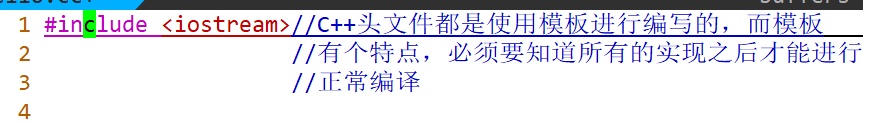
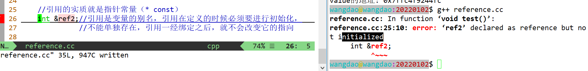

## C++Day1

### 一、基本环境配置

1、电脑无法插网线的，需要购买转接头（建议绿联牌的）
2、安装winScp（传输资料的工具）
3、极域，直接安装student版本（大家上课需要接收老师广播的屏幕，可以不需要设置密码）

杀毒软件、防火墙、虚拟网口关闭掉

4、VMWare + Ubuntu （大家后面写代码的环境）
5、xshell（写代码的连接工具）
6、服务器上可以安装其他软件，typora、xmind（破解app.asar）、everything


> 大家达到教室以后需要做这些事情：
> 1、使用有线网连接电脑
> 2、在互联网上搜索winscp并下载安装（使用mac的同学可以使用其他scp工具）
> 3、使用winscp新建站点，输入如下信息：
> 主机名：192.168.2.100
> 端口： 22
> 用户名：student
> 密码：W2a0n2g1dAO#Be@tToR$
> （密码较长建议复制）
> 4、保存用户名密码
> 5、winscp左边界面是本地电脑的资源管理器，右边是共享服务器的资源管理器
> 6、到目录/wangdao/share/C++/Tools/中， 找到极域学生端并安装。
> 7、安装极域过程中建议不设置任何密码


### 二、开班介绍

纪律问题、课程问题、职业规划、学习方法、软件安装、作业

```C++
https://gitee.com/cplusplus2020/CPP2022S2_homework  #交作业的网站

https://gitee.com/cplusplus2020/CPP2022S2_homework/invite_link?invite=c215d34e94b748c757da5f72d13b02bfe626e505c69efbd8b7993663152babc5efbf2e303c90188e5f318cd36bbddc3a  #直接加进来
```


### 三、Linux历史

Linux    unix

汇编语言   与硬件相关性比较大  移植性差

1972年C语言重写Unix内核

1983年GNU计划  unix hurd   微内核、宏内核

1991年Linus在minix基础上开发Linux


### 四、Linux基础

ifconfig看ip、netmask、网关（.2）

如果没有ifconfig命令的话，安装sudo apt install  update   net-tools  ssh  vim   g++  gcc


Linux的文件系统是属于树形结构，没有C盘、D盘、E盘的说法。
Linux的根节点（root结点），/表示

### 五、linux命令

查相应命令的方式：man + 命令

1、cd — change the working directory 改变工作目录

- cd ..  来到上一级目录（相对路径）
- cd /home/wangdao/ （绝对路径）
- cd ~  等价与cd  

tab具有联想的功能

路径：

绝对路径

相对路径

2、pwd - print name of current/working directory 打印当前目录的名字

3、ls - list directory contents 列出目录的内容

4、useradd - create a new user or update default new user information 创建用户

- sudo  useradd  test   sudo可以提升用户的权限
- sudo useradd -m test10 -s /bin/bash  可以指定用户的home目录以及bash

5、cat - concatenate files and print on the standard output 查看文件内容

cat /etc/passwd

```C++
test2:x:1002:1002::/home/test2:/bin/sh
test1:x:1003:1003::/home/test1:/bin/bash
mysql:x:123:127:MySQL Server,,,:/nonexistent:/bin/false
    
    
wangdao:x:1000:1000:wangdao,,,:/home/wangdao:/bin/bash
test:x:1004:1004::/home/test:/bin/sh
test4:x:1005:1005::/home/test4:/bin/sh
用户、密码、用户ID、组ID、用户对应的主目录、shell的类型
前面0-999已经被默认预留
```

6、配置用户的密码  sudo passwd test

7、切换用户 su test

https://wangchujiang.com/linux-command/c/cat.html   中文网站


## C++Day2

### 一、问题回顾

1、环境问题（极域、vm + ubuntu（不行麻烦的可以买阿里云）、xshell、typora、xmind），注意：安装vimplus

2、作业提交的网站，以及入仓库

3、基本命令的敲击，反复练习，键盘不熟悉的，下载金山打字通多熟悉熟悉


### 二、Linux命令

#### 用户删除相关

1、userdel - delete a user account and related files 删除用户

```C++
wangdao@wangdao:~$ sudo userdel -r test3
userdel: test3 mail spool (/var/mail/test3) not found
wangdao@wangdao:~$ 
```

为了保证安全，unbuntu不允许root进行直接登录

#### 目录文件的创建与删除

2、mkdir - make directories 创建目录（文件夹）

```C++
wangdao@wangdao:20211230$ mkdir  -p dir4/dir5/dir6
```

dir1/dir2/dir3

dir4/dir5/dir6

3、rmdir - remove empty directories 删除空目录

```Linux
wangdao@wangdao:20211230$ rmdir dir10
wangdao@wangdao:20211230$ 
wangdao@wangdao:20211230$ rmdir dir4
rmdir: failed to remove 'dir4': Directory not empty
wangdao@wangdao:20211230$ 
```

4、打印目录结构 tree

安装： sudo apt install tree

使用：tree

```C++
wangdao@wangdao:20211230$ tree
.
├── dir1
│   └── dir2
│       └── dir3
└── dir4
    └── dir5
        └── dir6

6 directories, 0 files
wangdao@wangdao:20211230$
```

#### 普通文件的基本操作

5、普通文件的创建

- touch  touch - change file timestamps 改变文件的时间戳

  touch + 文件名  例如：touch file1

- echo  echo - display a line of text

  重定向

  ```C++
  echo "hello,world" > file2
  ```

- cat  

  ```C++
  cat > file   回车  结束的时候ctrl + d
  ```

- vi/vim  

  vim的安装：sudo apt install vim

  vim/vi + 文件名字  退出的时候使用shift + : + wq + 回车

6、文件的查看

- head - output the first part of files 

  ```C++
  head -n  10 bind.cc
  ```

- tail - output the last part of files

- more  可以翻屏查看文件内容，使用enter键下翻，但是不能倒退

- less   可以翻屏查看文件内容，使用enter键下翻，可以使用方向键上下翻

7、cp - copy files and directories 文件的拷贝

- 将文件拷贝到目录  cp  file1  dir1

- 将文件拷贝到文件  cp  file1 file2

- 目录拷贝到目录，注意-r选项，递归的含义

  ```C++
  wangdao@wangdao:dir$ cp dir1/ dir2/
  cp: -r not specified; omitting directory 'dir1/'
  wangdao@wangdao:dir$
      
  wangdao@wangdao:dir$ cp -r dir1/ dir2/
  ```

  -i 选项有提示的意思

8、mv - move (rename) files  文件的移动（改名）

```C++
 mv file2 file1
 mv dir1 dir2
```

9、rm - remove files or directories 文件或者目录的删除

-r递归  -f强制 -i提示

10、ls详解

“.”代表当前目   “..”代表上一级目录  Linux下面以点开头的文件都是隐藏文件

**Linux下面一切皆文件**


11、硬链接与软连接

创建方式：ln  file1 hard    ln -s file2 soft

对于硬链接而言，删除其中一个对另外一个没有影响，但是修改其中一个文件的内容对另外一个是有影响的。硬链接会共享inode节点号

软连接，删除其中一个对另外一个是有影响的，删除主文件时候，链接文件会失效，软连接各有自己的节点号（类比与windows下的快捷方式）

12、chmod - change file mode bits 改变文件的权限

- 文字设定法u本用户  g组用户  o其他用  a所有用户
- 数字设定法  r=4, w=2,x=1,-=0

```C++
wangdao@wangdao:dir$ chmod u=r,g=w,o=x file4
wangdao@wangdao:dir$ ls -l file4
-r---w---x 1 wangdao wangdao 6 12月 30 16:40 file4
wangdao@wangdao:dir$ chmod 421 file5
wangdao@wangdao:dir$ ls -l file5
-r---w---x 1 wangdao wangdao 0 12月 30 11:25 file5
wangdao@wangdao:dir$ chmod 777 file5
wangdao@wangdao:dir$ ls -l file5
-rwxrwxrwx 1 wangdao wangdao 0 12月 30 11:25 file5
wangdao@wangdao:dir$ 
```

13、find - search for files in a directory hierarchy 文件的查找

find  起始目录  表达式  （表达式可以使用名字、文件类型、时间等等）

```C++
find /home/wangdao/teach  -name bind.cc
```

通配符 *匹配0个到任意个字符   ?匹配0个或1个字符   [a-z] 匹配范围内的

```C++
wangdao@wangdao:dir$ find . -name "file*"
./file7
./file8
./file5
./file123
./file1
./file6
./file4
wangdao@wangdao:dir$ find . -name "file?"
./file7
./file8
./file5
./file1
./file6
./file4
wangdao@wangdao:dir$ find . -name "file[5-7]"
./file7
./file5
./file6
wangdao@wangdao:dir$ 
```


14、重定向

fd文件描述符

- stdin  标准输入 0      <
- stdout 标准输出 1     >
- stderr 标准错误输出 2   2>
- 重定向的追加   1>>       2>>
- cat << baba  相当于以baba为终止符

15、grep, egrep, fgrep, rgrep - print lines matching a pattern 查找文件内容

grep    选项   正则表达式  文件名

```C++
wangdao@wangdao:dir$ grep -nE "(ee)?" file
1:grep
2:Grep
3:sleep
4:how
5:how are you
wangdao@wangdao:dir$ grep -nE "e." file
1:grep
2:Grep
3:sleep
5:how are you
wangdao@wangdao:dir$ grep -nE "e[e-e]" file
3:sleep
wangdao@wangdao:dir$
```

 


## C++Day3

### 一、问题回顾

1、ubuntu连不上网络的情况，在强调一次

2、上课的命令一定要多敲击几次，熟悉这些基本命令


### 二、编辑工具vim的使用

#### vim的安装

sudo apt install vim 

#### vim的四种模式

##### 普通模式

##### 命令模式

##### 编辑模式（插入模式）

拷贝windows下的数据到vim下面，到插入模式下，shift + insert键

##### 可视化模式

v行可视化

ctrl + v竖选模式


在.bashrc的最后添加下面一行

```C++
export PS1='\[\e[36;47m\]\u\[\e[33;47m\]@\[\e[36;47m\]\h\[\e[35;47m\]:\[\e[31;47m\]\W\[\e[00m\]\$ '
```


vimtutor 练习vim


### 三、源代码到可执行程序的步骤

源代码（预处理）---生成.i文件或者称为预处理后的源文件（编译）----生成.s文件或者汇编文件（汇编）--生成.o文件（目标文件）（链接）----可执行程序

预处理：gcc -E hello.c -o hello.i

编译：gcc -S hello.i -o hello.s

汇编：as  hello.s -o hello.o

链接：gcc hello.o -o hello

总结：前面两步生成的是文本文件，后面两步是二进制文件。


### 四、动态库与静态库

#### 静态库的制作过程：

1、编译源代码得到目标文件  $ gcc -c add.c -o add.o

2、ar命令打包成库文件 $ ar crsv libadd.a  add.o

3、放入系统库文件路径  $ sudo cp libadd.a /usr/lib

4、链接的选项   $ gcc main.c -o main -ladd

5、然后运行./main 是没有问题的


#### 动态库的制作过程

1、编译时加上 -fpic选项，生成位置无关的目标代码  $ gcc -c add.c -o add.o -fpic

2、使用gcc生成动态库/共享库 $ gcc -shared -o libadd.so add.o

3、将动态库放入 /usr/lib路径下面$ sudo cp libadd.so /usr/lib

4、链接时加上选项 -ladd  $ gcc main.c -o main -ladd

5、执行./main

可以使用ldd命令查看依赖文件   $ ldd main,如果将libadd.so文件删除之后，直接./main就会报错

#### 区别

1、静态库的可执行程序的大小大，但是动态库的可执行程序的大小小

2、静态库的安装难度低，但是动态库的安装难度高

3、静态库的更新难，动态库的更新难度容易


## C++Day4

### 一、C++历史

simula

C  with  class  带类的C


int a = 10;

double b = 2.2;

auto a = 12;//自动类型推导

auto b = 12.34;

C中的空指针  NULL   void *      #define  NULL  (void *)0

C++11空指针nullptr   void *       #define  NULL  0


/home/wangdao/.vim/plugged/prepare-code/snippet

C++的源文件可以使用.cc或者.cpp结尾，编译的时候使用g++编译C++代码，gcc编译c的代码。


### 二、C++基础




函数的定义只能有一次，函数的声明可以有多次


### 三、命名空间

HWCPPProjectCDevelopprint   C中为了解决名字冲突的问题。

作用：解决名字冲突。

形式：

```C++
namespace 命名空间的名字
{
    
}
```

实体的访问：命名空间的名字 + 作用域限定符

#### 命名空间的三种使用形式

1、usings编译指令，using namespace  std;
2、作用域限定符，在用到的具体地方使用std::cout;
3、using声明机制(推荐使用)    using  std::cout;


命名空间是可以进行扩展的（自定义的命名空间与标准命名空间都是可以进行扩展的）

命名空间是可以嵌套的


快捷方式：


### 四、const的用法

#### 1、const修饰普通变量

常量，定义的时候必须要去进行**初始化**，常量不能进行改变，常量不能进行**赋值**。

宏定义：发生的时机在预处理阶段，做字符串替换，一旦发生bug，就会将bug带到运行的时候。

const常量：发生的时机在编译阶段，会进行类型安全检查，如果有bug就会在编译的时候报出来。


#### 2、const修饰指针

1、当const位于*左边的时候，称为**常量指针**。

特点：不能改变指针所指变量的值，但是可以修改指针本身的值（改变指针的指向）


2、当const位于*右边的时候，称为**指针常量**。

特点：可以改变指针所指变量的值，但是不可以修改指针本身的值（不可以改变指针的指向）

3、双const， 特点：不可以改变指针所指变量的值，不可以改变指针的指向（本身）

```
函数指针                             指针函数
int (*pf)(int x)                    int*   pf(int x)
a = (*pf)

数组指针                             指针数组
int (*arr)[10]                      int* arr[10]
```


### 五、new与delete表达式

malloc/free与new/delete的异同点？

相同点：

1、malloc与new都是用来申请堆空间的
2、malloc与free配对使用，new与delete配对使用，不能交叉，否则会发生**内存泄漏**

不同点：

1、malloc/free是C中的库函数，new/delete是C++中的表达式
2、malloc申请的是原始的、未初始化的堆空间，new申请的空间已经进行了初始化。


内存踩踏？内存溢出？野指针？

https://www.cnblogs.com/tp-16b/p/8684298.html  

### 六、引用

引用的实质就是指针常量（* const）
 int &ref2;//引用是变量的别名，引用在定义的时候必须要进行初始化，不能单独存在，引用一经绑定之后，就不会改变它的指向

## 


## C++Day5

### 一、问题回顾

1、命名空间的三种使用形式？是否可以扩展？什么是匿名命名空间？

2、const修饰普通变量的特点？const修饰指针的叫法以及对应特征？

3、引用的特征？

### 二、引用

函数的返回类型是引用的前提条件：变量（实体）的生命周期一定要比函数的生命周期大


### 三、强制转换

static_cast

1、基本数据类型之间的转换 ，例如：int  float

2、void *的指针与其他类型的指针之间的转换  例如：void * --- > int *


const_cast

去除常量属性


### 四、函数重载

定义：在同一个作用域中，函数名字相同，函数的参数列表不一样（参数的个数、参数的类型、参数顺序）

```C++
000000000000002c T _Z3  add ff
000000000000007a T _Z3  add fff
0000000000000046 T _Z3  add fi
0000000000000014 T _Z3  add if
0000000000000000 T _Z3  add ii
000000000000005e T _Z3  add iii
```

C语言不支持函数重载，但是C++是支持函数重载的
原因：支持名字改编
步骤：当函数名字相同的时候，根据参数个数、参数顺序、参数类型 
进行名字改编


extern的用法：将一段代码按照C的方式进行编译

```C++
extern "C"
{

}

#ifdef __cplusplus
extern "C"
{
#endif
int add(int x, int y)
{
    return x + y;
}
    
#ifdef __cplusplus
}
#endif
```


### 五、默认参数

默认参数必须从右向左连续进行赋值(C/C++参数入栈的顺序是从右向左)


### 六、内联函数（inline函数）


C++头文件的路径：/usr/include/c++


```C++
switch(xxx)
{
        case  x :
        ....
        case  y:
        ....
        case  z:
        ....
}
```


### 七、C与C++风格字符串

调试代码的两种有效方法：

1、printf/cout   2、调试工具gdb

gdb的安装：sudo apt install gdb

```C++
template< class CharT, class Traits, class Alloc >
    std::basic_string<CharT,Traits,Alloc>
        operator+( const std::basic_string<CharT,Traits,Alloc>& lhs,
                   const std::basic_string<CharT,Traits,Alloc>& rhs );

std::basic_string operator+(const std::basic_string& lhs,
                            const std::basic_string& rhs );

template< class CharT, class Traits, class Alloc >
    std::basic_string<CharT,Traits,Alloc>
        operator+( const std::basic_string<CharT,Traits,Alloc>& lhs,
                   const CharT* rhs );


std::basic_string operator+( const std::basic_string& lhs, const CharT* rhs );

template<class CharT, class Traits, class Alloc>
    std::basic_string<CharT,Traits,Alloc>
        operator+( const std::basic_string<CharT,Traits,Alloc>& lhs,
                   CharT rhs );

std::basic_string operator+( const std::basic_string& lhs, CharT rhs );
```

```C++
zh.cppreference.com //中文
cppreference.com    //英文
```


## C++Day6

### 一、问题回顾

1、引用的特征？函数返回类型是引用的前提条件？

2、强制转换：static_cast、const_cast的使用场景？

3、函数重载的概念？原理？

同一个作用域，函数名相同，参数列表不一样

名字改编

4、默认参数的设置需要注意什么？

5、inline函数有什么特点？使用的时候需要注意什么？

### 二、内存布局

2^32 = 4G,对于任何一个可执行程序，4G的虚拟地址空间。

3G-4G 内核态

0-3G 用户态空间，栈、堆、全局区、静态区、文字常量区、程序代码区

**栈**：编译器进行自动的回收，局部变量、函数的参数会进行入栈出栈

**堆**：由程序员自己进行分配与释放，malloc/calloc/new，当进程结束的时候，操作系统（os）也会进行内存回收

**读写段**：

全局区：全局变量

静态区：静态变量

**只读段**：

文字常量区：字符串常量

程序代码区：二进制代码


### 三、面向对象

#### 基本概念

面向过程的语言：C语言，按照事物的逻辑顺序进行发展。

面向对象的语言：C++语言，四大基本特征：抽象、封装、继承、多态。


面向过程角度：

1、三个兄弟到旅馆交钱，每人交100元给老板
2、老板将300元中50元交给店员
3、店员将50元中30元交给三兄弟。

面向对象角度：一切都是对象

将具有相同属性的**对象抽象**出来，形成了**类**。对象与对象之间去进行交互，使得彼此之间的状态发生改变。

```C++
类  人
{
    特征或者属性；
    行为或者方法；//操作属性或者特征的
};

class Person
{
public:
    //数据成员
    //成员函数
protected:
   //数据成员
    //成员函数
private:
     //数据成员
    //成员函数
};//分号不能省略
```

#### struct与class的区别

C++中将struct的功能做了提升，不仅可以定义变量，也可以定义函数，并且与class的唯一区别：struct的默认访问权限是public的（共有的），class的默认访问权限是private的（私有的）


#### 对象的创建

形式：与类名相同，不能有返回类型，即使是void也没有。

当用类创建对象的时候，会自动调用构造函数。

默认情况下，编译器会为每个类生成一个默认的（无参的）构造函数

当我们自己定义了构造函数时，此时编译器就不在会为我们生成默认构造函数。

构造函数是可以进行重载的。

作用：为了初始化对象的数据成员的


#### 初始化列表（初始化表达式）

数据成员的初始化顺序，与其在初始化表达式中的顺序没有关系，只与数据成员被声明的顺序有关


#### 对象的销毁

默认情况下，编译器会自动生成析构函数
特点：与类名相同，没有返回值，没有返回类型，没有参数
析构函数一个类只有一个
作用：完成对象中数据成员的清理操作

**一般不建议显示调用析构函数**


#### 拷贝构造函数

浅拷贝与深拷贝


## C++Day7

### 一、问题回顾

1、用户态空间大体分为哪几个区域？

栈区、堆区、全局静态区、文字常量区、程序代码区

2、构造函数的形式怎么样？有哪些性质？

3、初始化表达式（列表）作用是什么？

4、析构函数的形式？作用？性质？析构函数被调用有哪四种场景？


### 二、拷贝构造函数

#### 拷贝构造函数的调用时机

1、当用一个已经存在的对象去初始化一个刚刚创建的对象的时候，会调用拷贝构造函数.

```C++
Point pt2 = pt1;//调用拷贝构造函数
```

2、当函数的参数是类类型，在函数调用的时候，会进行形参与实参的结合，会调用拷贝构造函数

```C++
void func(Point pt)
{  
}

func(pt1);//Point pt = pt1
```

3、当函数的返回类型是类类型的时候，在执行return语句的时候，会调用拷贝构造函数。（编译器优化开关-fno-elide-constructors）

```C++
Point func2()
{
    Point pt(10, 20);
    cout << "pt = ";
    pt.print();
    
    return pt;//在执行return语句时候调用拷贝构造函数
}
```

#### 拷贝构造函数参数问题

Q1：拷贝构造函数参数中的引用符号可以去掉吗？

不能，如果拷贝构造函数的引用符号去掉，那么在调用拷贝构造函数的时候，会满足实参与形参的结合，然后满足拷贝构造函数的调用时机2，接着继续调用拷贝构造函数，会形成死循环，而函数参数是需要入栈的，并且栈是有大小，所以会将栈压满，直到栈溢出。


Q2：拷贝构造函数参数中的const关键字可以去掉吗？

不能，当执行拷贝构造函数的时候，传递进来的参数是右值的时候，没有加const的左值引用不能识别出右值，此时就会报错。当const之后，const左值引用可以绑定到右值，就不会报错。

const左值引用既可以绑定到左值，也可以绑定到右值。


左值：可以进行取地址的。

右值：不可以进行取地址。右值包括：临时对象、临时变量、字面值常量(10)

注意：字面值常量与字符串常量。


### 三、赋值运算符函数

"四步曲"

1、自复制  防止自己复制给自己
2、释放左操作数  防止出现内存泄漏
3、深拷贝   防止内存越界
4、返回*this


## C++Day8

### 一、问题回顾

1、拷贝构造函数的调用时机有哪三条？

2、编译器会主动为我们生成的成员函数有那几个？

无参的构造函数、拷贝构造函数、析构函数、赋值运算符函数

3、赋值运算符函数的四个步骤是什么？

自复制、释放左操作数、深拷贝、返回*this


### 二、this指针

实质：指向对象本身

存在的位置：隐藏在每一个成员函数（非静态成员函数）的第一个参数的位置，属于一个指针常量Point * const this


### 三、赋值运算符函数

#### 赋值运算符参数问题

Q1：赋值运算符函数的参数中的引用符号可以去掉吗？

不能，在执行赋值运算符函数的时候，在参数传递的时候，会满足拷贝构造函数的调用时机2，会多执行一次拷贝构造函数，是程序的效率较低。

Q2：赋值运算符函数参数中的const可以去掉吗？

不能，如果传递参数是右值的时候，执行赋值运算符函数的时候，会产生非const左值引用不能绑定的右值的问题。（识别不了右值）

Q3：赋值运算符函数的函数返回类型中的引用符号可以去掉吗？

不能，如果去掉，函数的返回类型是类型，在执行return语句的时候，会符合拷贝构造函数的调用时机3，会多执行一次拷贝构造函数。

Q4：赋值运算符函数中函数的返回类型可以不是类类型吗？

不行，连等的情况。


### 四、特殊数据成员的初始化

1、常量数据成员必须在初始化表达式中进行初始化，不能进行赋值（等价看成普通的常量）

2、引用数据成员必须在初始化表达式中进行初始化，引用数据成员占用一个指针大小的空间。

```C++
//空类也会占用内存大小，空类占用一个字节，目的：为了区分不同对象。
```

3、一个类创建的对象（_pt1, _pt2）作为另外一个类的子对象（数据成员），此时会调用子对象的默认构造函数，如果想将子对象进行初始化，必须在另外一个类（Line）的初始化表达式中进行显示初始化。

4、静态数据成员不能在初始化列表中进行初始化，要放在全局静态的位置，特别的，对于头文件与实现文件形式，还必须要将静态数据成员在实现文件中进行定义，否则直接在头文件中进行定义的话，会出现多次定义的报错。静态数据成员不占用对象大小的，被该类的所有对象共享的


### 五、特殊成员函数

#### 静态成员函数

1、静态成员函数的第一个参数的位置没有隐含的this

2、静态成员函数不能访问非静态的数据成员和非静态的成员函数。

3、非静态的成员函数可以访问静态的数据成员和静态的成员函数。

4、静态成员函数可以使用该类的任何对象进行调用，也可以使用特殊形式，**类名加作用域限定符的形式进行调用。**


#### const成员函数

1、const成员函数与非const成员是可以进行重载，原因：this不一样，非const成员函数this是指针常量，const成员函数的this是双const修饰的。

2、非const对象可以调用非const版本的成员函数，也可以调用const版本的成员函数。

3、const对象可以调用const版本的成员函数，但是const对象不能调用非const版本的成员。

4、一般情况下，建议先写const版本的成员函数。


### 六、单例模式

设计需求：一个类只能创建一个对象
适用场景：全局唯一的资源、对象、变量都可以使用单例模式

```C++
#include <iostream>

using std::cout;
using std::endl;

//单例模式的设计需求：一个类只能创建一个对象
//
//使用场景：对于全局唯一的变量、对象、资源，网页库、日志记录器
//字典库

//全局静态
//堆区
//栈区

class Singleton
{
public:
    static Singleton *getInstance()
    {
        if(_pInstance == nullptr)
        {
            _pInstance = new Singleton();
        }
        return _pInstance;
    }

    static void destroy()
    {
        if(_pInstance)
        {
            delete _pInstance;
            _pInstance = nullptr;
        }
    }

private:
    Singleton()
    {
        cout << "Singleton()" << endl;
    }

    ~Singleton()
    {
        cout << "~Singleton()" << endl;
    }
private:
    static Singleton *_pInstance;
};

Singleton *Singleton::_pInstance = nullptr; //类外初始化

/* Singleton gS1;//全局对象, error */
/* Singleton gS2; */

int main(int argc, char **argv)
{
    /* Singleton s1;//栈对象,error */
    /* Singleton s2; */
    /* Singleton s3; */

    /* Singleton *ps1 = new Singleton();//error */
     Singleton *ps1 = Singleton::getInstance();
     Singleton *ps2 = Singleton::getInstance();
     Singleton *ps3 = Singleton::getInstance();
     cout << "ps1 = " << ps1 << endl;
     cout << "ps2 = " << ps2 << endl;
     cout << "ps3 = " << ps3 << endl;

     /* delete ps1;//error */
     /* delete ps2;//error */
     /* delete ps3;//error */

     Singleton::destroy();
     Singleton::destroy();
     Singleton::destroy();

    return 0;
}
```


### 七、new与delete表达式的工作步骤

#### new表达式的工作步骤

1、调用operator new库函数申请原始的未初始化堆空间
2、使用构造函数初始化对象
3、返回指向该空间的指针


#### delete表达式的工作步骤

1、调用析构函数，将对象中的**数据成员**申请的资源进行回收
2、调用operator delete库函数，回收**对象本身**占用资源


Q:对象的销毁与析构函数的执行是不是等价的？
A:对于堆对象而言，析构函数的执行只是对象销毁中的一个步骤，但是，对于栈对象而言，对象的销毁与析构函数的执行是等价的


Q:创建栈对象需要哪些条件？
A:构造函数与析构函数都必须是public的


## C++Day9

<font size = 5, color = 'red'>作业问题：每周四上午九点半（上交周一到周三的作业），每周一上午九点半（上交上周四到周六的作业）</font>

### 一、问题回顾

1、成员函数在类中实现与类外进行实现有什么区别？

inline

2、编译器会主动为我们生成的成员函数有那几个？

四个，普通构造函数、拷贝构造函数、赋值运算符函数、析构函数

```C++
Point pt1(1, 2);
Point pt2(3, 4);

Point pt3 = pt1;//初始化
      pt2 = pt1;//赋值
```


3、对象创建的时候会调用构造函数，构造函数的调用会产生对象，这句话是不是对的？

```C++
Point pt1(1, 2);

Point(3, 4);//匿名对象、临时对象
```


4、构造函数是可以进行重载的，那析构函数可以进行重载吗？为什么？析构函数在哪些情况下会被调用？

5、真正初始化数据成员的称为什么？使用时候需要注意什么？

6、拷贝构造函数有哪三种调用时机？

7、this指针本质是什么？存在于哪里？

8、赋值运算符函数的四个步骤是什么？每个步骤的原因？赋值运算符函数的参数可以改变吗？

9、特殊数据成员：常量数据成员、引用数据成员、对象数据成员的初始化在哪里？静态数据成员的初始化在哪里？

10、特殊成员函数：静态成员函数有什么特点？const成员函数有什么特点？

this

```C++
class Test
{
  public:
    void func1()
    {
        this->func2();
    }
    
    void func2()
    {
        
    }
};
```


11、对象的组织：对象数组、堆对象数组？

```C++
int arr[5] = {1, 2};
Point pt[5] = {Point(1, 2), Point(3, 4)};
```


12、单例模式设计要求？实现的步骤？

内存分配方式、静态数据成员与静态成员函数、new/delete、创建与销毁

13、new与delete表达式的工作步骤？

14、对象的销毁与析构函数的执行是不是等价的？

15、创建栈对象需要哪些条件？


### 二、输入输出流运算符

FILE *fp = fopen()

标准IO：标准的输入输出流，cin、cout
文件IO：文件的输入输出流，例如：C语言中的FILE  
串IO：字符串的输入输出流（内存）


#### 流的状态

badbit：系统级别的错误，是无法恢复的。
failbit：是可以进行恢复的错误。
eofbit：文件指针到达文件末尾
goodbit：正常状态


#### 缓冲区

1、 程序正常结束（有一个收尾操作就是清空缓冲区）；
2、缓冲区满（包含正常情况和异常情况）；
3、使用操纵符显式地刷新输出缓冲区，如：endl、flush、ends(没有刷新功能)；  


#### 函数指针

1、函数本身也是有类型的，函数的返回类型，函数的参数列表进行综合考虑
2、指针本质是一个地址，函数名也是函数的入口地址
3、函数指针的类型与函数的类型进行匹配

```C++
int a = 10;
int *p = &a;
*p;


int (*pf)(int, int);

int add(int, int);
int multiply(int, int);
int func(int);

pf = add;

pf = multiply;

add(3, 4);
pf(3, 4);

pf = func;//error

```

```C++
   __ostream_type&  operator<<(__ostream_type& (*__pf)(__ostream_type&))
      {
		  return __pf(*this);
      }


template<typename _CharT, typename _Traits>
    inline basic_ostream<_CharT, _Traits>&
    endl(basic_ostream<_CharT, _Traits>& __os)
    { return flush(__os.put(__os.widen('\n'))); }


    inline basic_ostream&  endl(basic_ostream& __os)
    { return flush(__os.put(__os.widen('\n'))); }

 template<typename _CharT, typename _Traits>
    inline basic_ostream<_CharT, _Traits>&
    flush(basic_ostream<_CharT, _Traits>& __os)
    { return __os.flush(); }


    inline basic_ostream& flush(basic_ostream& __os)
    { return __os.flush(); }

 template<typename _CharT, typename _Traits>
    inline basic_ostream<_CharT, _Traits>&
    ends(basic_ostream<_CharT, _Traits>& __os)
    { return __os.put(_CharT()); }


    inline basic_ostream&  ends(basic_ostream& __os)
    { return __os.put(_CharT()); }
```


### 三、文件输入输出流

explicit：用来防止隐式转换的。

#### ifstream文件的读

1、对于文件输入流而言，当文件不存在的时候就打开失败；当文件存在的时候，就可以正常打开。

2、对于文件输入流而言，默认以空格为分隔符。


#### vector的底层扩容原理

当size() == capacity()的时候，如果还需要继续进行增加元素的时候，会按照2 * capacity()去进行扩容（在新的位置选择扩容之后的长度空间），接着将老的空间的元素拷贝到新的空间来，然后再将新的元素插入新的空间后面，再将老的空间进行回收。


#### 文件输出流

对于文件输出流而言，当文件不存在的时候就创建文件。当文件存在的时候，就清空文件中的内容。


#### 文件输入输出流

对于文件输入输出流而言，当文件不存在的时候，就打开失败，只有当文件存在的时候，才能进行正常操作。

文件指针的定位：tellp（对应文件写操作，p = put）/tellg(对应文件的读操作,g = get)

文件指针进行偏移：seekp对应文件写操作，p = put）/seekg(对应文件的读操作,g = get)

seekp与seekg可以传绝对位置，也可以传相对位置（beg,end,cur）

#### 文件的模式

in：文件的读的默认方式。

out：文件写的默认方式。

ate：文件读的追加模式。

app：文件写的追加方式。


### 四、字符串IO

#### 字符串IO的读操作

```C++
//委托构造函数
basic_istringstream() : basic_istringstream(ios_base::in) { }
```


## C++Day10

### 一、问题回顾

1、流的四种状态？

2、文件的输入输出流对应的三个类？

ifstream  ifs;               cin 

ofstream   ofs;         cout << number;     ofs << number;  

fstream

getline(ifs, line)                   string line[100]       vector<string>   vec;

3、定位文件指针的接口以及文件指针偏移的接口？文件追加模式主要讲了哪几种？

ftell            tellg/tellp          文件指针的定位       

fseek         seekg/seekp     文件指针的偏移     绝对位置、相对位置（beg、cur、end）


读：ate

写：app

4、vector的扩容原理？获取vector中元素个数的函数、获取容量的函数？


### 二、Log4cpp

#### 日志系统

服务器程序而言，7 * 24运行，没有终端，不能交互。

记录服务器运行轨迹。


#### 日志构成

记录器  Category

格式化器    layout

输出器   xxxAppender

过滤器   Priority


#### log4cpp的库的查找

gitee/github   ----->    awesome-cpp    --->   logging     -----> log4cpp    --->相应的类


```C++
#include <iostream>
#include <log4cpp/BasicLayout.hh>
#include <log4cpp/SimpleLayout.hh>
#include <log4cpp/PatternLayout.hh>
#include <log4cpp/OstreamAppender.hh>
#include <log4cpp/FileAppender.hh>
#include <log4cpp/RollingFileAppender.hh>
#include <log4cpp/Category.hh>
#include <log4cpp/Priority.hh>


using std::cout;
using std::endl;

using namespace log4cpp;

void test3()
{
    //日志的格式
    PatternLayout *ppl1 = new PatternLayout();
    ppl1->setConversionPattern("%d %c [%p] %m %n");

    PatternLayout *ppl2 = new PatternLayout();
    ppl2->setConversionPattern("%d %c [%p] %m %n");

    //日志的目的地（输出器）
    OstreamAppender *poa = new OstreamAppender("OstreamAppender123", &cout);
    poa->setLayout(ppl1);

    RollingFileAppender *prfl = new RollingFileAppender("RollingFileAppender12"
                                                        , "test.txt"
                                                        , 5 * 1024
                                                        , 3);
    prfl->setLayout(ppl2);

    //日志记录器
    Category &root = Category::getRoot().getInstance("MyCat");
    root.addAppender(poa);
    root.addAppender(prfl);

    //日志的过滤器
    /* root.setPriority(Priority::DEBUG); */
    root.setPriority(Priority::ERROR);

    //日志的优先级一定要大于等于Category的优先级,否则就会被
    //过滤掉

    size_t idx = 100;
    while(idx > 0)
    {
        root.emerg("This is an emerge message");
        root.fatal("This is an fatal message");
        root.crit("This is an crit message");
        root.error("This is an error message");
        root.debug("This is an debug message");
        root.warn("This is an warn message");
        --idx;
    }

    //资源的回收
    Category::shutdown();
}
int main(int argc, char **argv)
{
    test3();
    return 0;
}

```


## C++Day11

### 一、友元

面向对象的四大基本特征：抽象、封装、继承、多态。

```C++
class A
{
    friend 函数原型；//friend void func();
    friend class B;
  private:
    //数据成员
    //成员函数
};
```

函数原型：成员函数与非成员函数。

非成员函数：全局函数、自由函数、普通函数

#### 友元的三种形式

1、友元的第一种形式：普通函数（自由函数、全局函数）
2、友元的第二种形式：以成员函数的形式出现
3、友元的第三种形式：友元之友元类

#### 友元的形式

友元的性质：友元是单向的，友元是没有传递性的(A->B->C)，友元是不能被继承的

友元不受访问权限的控制（public/protected/private）


### 二、运算符重载

#### 哪些运算符不能重载

成员访问运算符 .

成员指针运算符  .*

条件运算符 ?:

作用域运算符  ::

sizeof运算符  sizeof

#### 运算符重载的规则

1、至少有一个对象是类类型或者枚举类型


2、不能改变运算符的优先级与结合性

3、不能改变操作数的位置、个数、顺序，也不能设置默认值。

4、重载&&、||，不再具备短路求值特性

5、不能臆造一个不存在的运算符。


#### 运算符重载的三种形式

1、运算符重载之普通函数的形式（全局函数、自由函数）（对于+而言，需要get函数获取私有数据成员）

2、运算符重载之成员函数的形式。（对于+而言，形式上少一个参数）

3、运算符重载之友元函数的形式。（不需要get函数就可以直接访问私有成员，形式上也是2个参数）


#### 特殊运算符的重载

1、复合赋值运算符的重载（+=  -=   *=   /=   %=  <<=   >>=   &=   |=）

推荐使用**成员函数**的形式进行重载。对象本身会发生变化，隐含着一个对象，可以使用this指针替代

2、自增自减运算符（前置++  后置++ 前置--  后置--）

也是以成员函数的形式进行重载，也是对象本身会发生变化。

区别：前置++函数返回值是左值，后置++函数返回值是右值

前置++比后置++效率高？

3、赋值运算符重载

以成员函数的形式

4、输入输出流运算符的重载

输入输出流运算符不能以成员函数的形式进行重载，原因是：如果以成员函数进行重载，会使得多一个参数，如果将对象参数去掉，会违背运算符重载的规则，不能改变操作数的顺序（此时this指针所指对象会作为第一个参数，流对象会作为第二个参数），所以输出流运算符要以非成员函数的形式进行重载，又因为要访问类的私有成员，所以最终输出流运算符要以**友元函数**的形式进行重载。

输入流运算符也要以友元函数的形式进行重载，原因与输出流运算符重载一样。


## C++Day12

学习：

- 身体
- 心态
- 方法
- 自律

### 一、问题回顾

1、友元的三种类型？友元的性质？

2、不能重载的运算符有那五个？运算符重载的规则有哪几条？

3、运算符重载的三种形式是怎样的？

普通函数、成员函数、友元函数

4、前置++与后置++的区别？函数定义形式、效率、内存占用

5、输入输出流运算符的重载以什么形式？原因何在？

cout << c1;//流对象


### 二、运算符重载

#### 函数调用运算符的重载

重载函数调用运算符（小括号）

重载了函数调用运算符的类创建的对象称为**函数对象**

注意：函数对象与普通函数之间的区别，与函数对象用法的区别；

```C++
typedef int (*Function)(int, int);  //函数指针
Function pf = add;                  
cout << "pf(a, b) = " << pf(a, b) << endl;
```


#### 下标访问运算符的重载


### 三、类型转换函数

作用：可以从自定义类型向其他类型进行转化

特点：

1、是成员函数

2、函数没有参数列表，没有返回类型

3、函数名字是operator + 目标类型

4、函数的返回类型使用return加目标类型的变量


### 四、类域


### 五、内部类

又称为嵌套类，在一个类中再定义另外一个类。


#### PIMPL

中文名字：编译防火墙。

特点：

1、实现信息隐藏，提高编译速度

2、减小编译依赖，可以以最小代价升级库文件

3、可以实现接口与实现分离。

使用一个中间类的指针作为过渡。


### 六、单例模式的自动释放

内存泄漏的检测工具valgrind

```C++
sudo apt install valgrind  //安装
    
g++ xxx.cc  -o  xxx -g
valgrind --tool=memcheck --leak-check=full ./memcheck //使用   可执行程序./memcheck
```


#### 四种使用形式

1、友元的形式

2、内部类 + 静态数据成员

3、atexit + 饿汉模式  

4、pthread_once + atexit结合使用  （只能在linux下面使用）


## C++Day13

### 一、问题回顾

1、函数调用运算符的重载？使用形式类似函数的方式有哪几种？有什么区别？

```C++
add(1, 2);
fo(1, 2);//函数对象
multuply(1, 2);//带参数宏定义
pf(1, 2);//函数指针
```


2、类型转换包括哪两个方向？分别有什么特点？

隐式转换    构造函数     explicit

类型转换函数

```C++
operator 目标类型
{
    
}
```

- 成员函数
- 没有参数
- 没有返回类型，return返回目标类型的变量

3、什么是作用域？什么是可见域？它们二者之间的区别是什么？

4、单例模式的四种释放形式？各有什么优缺点？


### 二、string的底层实现

深拷贝，浅拷贝

写时复制：浅拷贝 + 引用计数，ubuntu14.04版本使用的就是写时复制的技术。


短字符串优化：当字符串的长度小于16字节的时候，将字符串存在栈上，当字符串的长度大于等于16字节的时候，存放在堆上。


小文件的传输

```C++
//安装
sudo apt install lrzsz
    
sz  + 文件名  //可以将文件从Linux传到windows下面
rz   //将文件从windows传到Linux下面
```

查看unbuntu的版本信息：lsb_release -a


写时复制：浅拷贝 + 引用计数

引用计数：记录指针（对象）的个数，  int  Refcount

#### 引用计数到底存在内存中那个位置？

栈区：不行的，例如：拷贝构造函数中的参数是const的，不能修改，所以不能修改操作数的值。

堆区：与数据放在一起，并且是放在数据的前面，便于更好的获取引用计数。

全局静态区：也不行，不同对象的引用计数是不一样的，不能共享。

文字常量区：error

程序代码区：error


代码的调整：gg      v     shift + g    =


## C++Day14

复习C++基础、类和对象、C++输入输出流、运算符重载。


## C++Day15

### 一、继承的基础

#### 1、继承的基本概念

面向对象的四大基本特征：抽象、封装、继承、多态。

继承：从既有类产生新类。

既有类：animal，父类或者基类
新类：bird，子类或者派生类

```C++
class 派生类 : public/protected/private  基类   //派生列表
{
    public:
    //数据成员
    //成员函数
    protected:
    //数据成员
    //成员函数
    private:
    //数据成员
    //成员函数
};
```


#### 2、派生类在创建过程中的几个步骤

1、**吸收**基类的成员
2、**改造**基类的成员
3、**新增**派生类自己的成员

基类中的数据成员都可以被派生类吸收，但是基类中的成员函数并不能全部被吸收过来


#### 3、继承的局限

以下函数不能被继承

1、构造函数与析构函数
2、友元关系
3、operator new/delete   operator=


#### 4、三种继承方式的权限


**默认继承方式是私有的。**


### 二、派生类对象的创建与销毁


总结：在派生类的构造函数的初始化列表中，最好显示的讲基类的构造函数写出来，这样就可以避免错误。否则，都会默认调用基类的无参构造函数，而如果基类没有提供无参构造函数，那么就会报错。

派生类对象的销毁：

派生类对象在销毁的时候，会执行派生类自己的析构函数，然后，**自动**执行基类的析构函数。


### 三、多继承

#### 1、多继承的基础


#### 2、多继承的两个问题

1、成员函数访问冲突    使用：类名 + 作用域限定符
2、数据成员的存储二义性   使用：虚拟继承


### 四、基类与派生类之间的相互转换

类型适应：派生类是适用于基类的。


**派生类向基类进行转换**

1、可以将派生类的对象赋值给基类对象     base  = derived
2、可以将基类的引用绑定到派生类对象上  Base &ref = derived
3、可以将基类的指针指向派生类对象。  Base *pbase = derived


向上转型：支持的。安全的。

向下转型：语法规则是不支持的，但是可以使用强制转换。


### 五、派生类对象间的复制控制

1、如果派生类没有显示定义拷贝构造函数与赋值运算符函数，而基类显示定义拷贝构造函数与赋值运算符函数，那么在用一个已经存在的派生类对象初始化一个刚刚创建的派生类对象，或者将一个已经存在的派生类对象赋值给另一个已经存在的派生类对象的时候，两对象间的派生类部分执行缺省的行为，基类部分执行基类的拷贝构造函数与赋值运算符函数

2、如果基类与派生类都显示定义拷贝构造函数与赋值运算符函数，那么在用一个已经存在的派生类对象初始化一个刚刚创建的派生类对象，或者将一个已经存在的派生类对象赋值给另一个已经存在的派生类对象的时候，两对象间的拷贝构造函数与赋值运算符函数会被调用，而基类的拷贝构造函数与赋值运算符函数不会被调用，如果基类的拷贝与赋值函数想被调用，必须要在派生类的构造函数与析构函数中显示写出来。


### 六、关联式容器

#### set的特征


#### map的特征


## C++Day16

### 一、多态

#### 多态的的基本概念

面向四大基本特征：抽象、封装、继承、多态。

多态：对于同一种指令（警察鸣笛），针对不同对象（普通人、警察、嫌疑犯），产生不一样的行为（正常行为、抓捕嫌疑犯、藏起来）。

#### 分类

静态多态：发生的时机在**编译**的时候。函数重载、运算符重载、模板

动态多态：发生的时机在**运行**的时候。使用虚函数进行体现。

#### 虚函数概念

虚函数：在成**员函数**的前面使用**virtual**关键字进行修饰。

重定义的格式要求：基类与派生中的同一虚函数，要保证函数名字相同、函数的返回类型相同、函数的参数列表也要相同（参数的个数、参数的类型、参数的顺序）。即：除了函数体不一样之外，其他都一样。


#### 虚函数体现动态多态的原理


## C++Day17

### 一、动态多态被激活的五个条件？


### 二、虚函数的局限性

1、普通函数（全局函数、自由函数）：属于非成员函数，与虚函数的概念是违背的。
2、静态成员函数：发生的时机在编译的时候，而虚函数要体现动态多态，发生的时机在运行的时候；静态成员函数中没有this，是被该类的所有对象共享，一个类只有一份，即使将静态成员函数设置为虚函数，编译器会报错。
3、内联成员函数：发生的时机在编译的时候，而虚函数要体现动态多态，发生的时机在运行的时候；即使将内联成员函数设置为虚函数，编译器不会报错，但是此时已经失去内联含义。
4、友元函数：如果友元函数是普通函数，友元函数是不能被设计为虚函数的（与定义违背）；如果友元函数本身是另外一个类的成员函数，那么该友元函数在另外一个类中是可以设计为虚函数。
5、构造函数：发生的时机在编译的时候，而虚函数要体现动态多态，发生的时机在运行的时候；从继承的角度看，构造函数不能被继承，但是虚函数是可以被继承的，所以构造函数不能被设计为虚函数；构造函数如果设计被虚函数，那么要体现多态必须要使用虚表，找到虚表必要要通过虚函数指针，虚函数指针是存在每个对象的开始的位置，而如果构造函数不调用，那么对象本身占用多大内存是不清楚的，所以构造函数本身不执行，对象本身是不完整的，所以虚函数指针不一定存在，虚表也不一定存在，那么就无法调用虚函数，也就是无法调用构造函数。


### 三、虚函数的访问

使用指针与使用引用：体现动态多态。
使用对象：没有体现动态多态
使用其他成员函数访问：可以体现动态多态
使用构造函数与析构函数访问：没有体现动态多态，在编译的时候就可以确定


编译时多态（静态多态、静态联编、早期联编）：发生的时机在编译的时候。
运行时多态（动态多态、动态联编、晚期联编）：发生的时机在运行的时候。


#### 动态多态与虚函数是不是等价的？

动态多态要体现，**必须**要有虚函数，但是有虚函数并不一定可以体现动态多态


### 四、抽象类

1、声明了纯虚函数的类，称为抽象类，抽象类不能创建对象（抽象类不能创建对象，但是可以创建该种类型的指针或者引用）
抽象类的派生类，如果至少有一个纯虚函数没有实现，那么抽象类，的派生类也是一个抽象，抽象类都是不能创建对象

```C++
class Base
{
public:
    virtual void print() = 0;//纯虚函数，只声明了，没有实现
    virtual void show() = 0; 
};
```

2、抽象类的第二种使用形式，将构造函数设计为protected

```C++
class Base
{
public:
private:
protected:
    Base()
    {
        cout << "Base()" << endl;
    }

};
```


### 五、虚析构函数

问题：内存泄漏。

如果将基类的析构函数设置为虚函数之后，派生类的析构函数自动变为虚函数。


### 六、覆盖、隐藏、重载

重载：在同一作用域中，函数名字相同，参数列表不一样（参数的类型、参数个数、参数的顺序）
覆盖（重写、重定义）：发生在基类与派生类中，**同名的虚函数，参数列表也一样**。
隐藏：发生在基类与派生类中，派生类中的函数屏蔽了基类中的同名函数，（派生类中的数据成员隐藏了基类中的同名数据成员）


### 七、虚表的存在

虚表是存在的，对于普通单继承而言，一个类只有一张虚表。虚表在编译的时候就已经产生了，存在**只读段**。

```C++
#include <iostream>

using std::cout;
using std::endl;

class Base
{
public:
    Base(long base = 0)
    : _base(base)
    {
        cout << "Base(long = 0)" << endl;
    }

    virtual
    void f()
    {
        cout <<"void Base::f()" << endl;
    }

    virtual
    void g()
    {
        cout <<"void Base::g()" << endl;
    }

    virtual
    void h()
    {
        cout <<"void Base::h()" << endl;
    }

    ~Base()
    {
        cout <<"~Base()" << endl;
    }
private:
    long _base;
};

class Derived
: public Base
{
public:
    Derived(long base = 0, long derived = 0)
    : Base(base)
    , _derived(derived)
    {
        cout << "Derived(long = 0, long = 0)" << endl;
    }

    virtual
    void f()
    {
        cout <<"void Derived::f()" << endl;
    }

    virtual
    void g()
    {
        cout <<"void Derived::g()" << endl;
    }

    virtual
    void h()
    {
        cout <<"void Derived::h()" << endl;
    }

    ~Derived()
    {
        cout <<"~Derived()" << endl;
    }
private:
    long _derived;
};

int main(int argc, char **argv)
{
    //虚表是存在的
    //对于普通的单继承而言，一个类只有一张虚表,被该类所有的对象共享的
    //虚表存在于只读段
    Derived derived(10, 20);
    printf("derived对象地址 : %p\n", &derived);
    printf("derived对象地址 : %p\n", (long *)&derived);
    printf("虚表地址 : %p\n", (long *)*(long *)&derived);
    printf("虚函数的入口地址 : %p\n", (long  *)*(long *)*(long *)&derived);
    /* printf("虚函数的入口地址 : %p\n", **&derived); */

    cout << endl << endl;
    typedef void (*Function)();
    Function pf =  (Function)*((long *)*(long *)&derived);
    pf();
    printf("第一个虚函数的地址: %p\n", pf);

    cout << endl << endl;
    pf =  (Function)*((long *)*(long *)&derived + 1);
    pf();
    printf("第二个虚函数的地址: %p\n", pf);

    cout << endl << endl;
    pf =  (Function)*((long *)*(long *)&derived + 2);
    pf();
    printf("第三个虚函数的地址: %p\n", pf);

    cout << endl << endl << "测试第二个派生类对象"  << endl;
    Derived derived2(111, 222);
    printf("derived2对象地址 : %p\n", &derived2);
    printf("derived2对象地址 : %p\n", (long *)&derived2);
    printf("虚表地址 : %p\n", (long *)*(long *)&derived2);
    printf("虚函数的入口地址 : %p\n", (long  *)*(long *)*(long *)&derived2);

    cout << endl << endl;
    cout << "Derived::_base = " <<  (long )*((long *)&derived + 1) << endl;
    cout << "Derived::_derived = " <<  (long )*((long *)&derived + 2) << endl;
    return 0;
}
```


### 八、带虚函数的多基派生

如何看一个函数是不是虚函数：可以在继续继承一次，看是否满足动态多态。


## C++Day18

### 一、问题回顾

1、多态的概念？多态的两种类型的区别？

2、虚函数的定义？虚函数机制（动态多态的原理）？动态多态被激活的五个条件？

3、哪些函数不能被设计为虚函数？原因分析。

定义：成员函数

发生的时机：编译时与运行

继承


4、动态联编与静态联编的区别？

静态联编：发生在编译的时候，效率高，灵活差

动态联编：发生的运行的时候，效率低，灵活性


5、抽象类的两种形式？

纯虚函数

构造函数设计为protected

抽象类是不能创建对象的。


6、析构函数被设置为虚函数的原因以及多态性体现的原理是什么？

问题：内存泄漏。

int *p = new int(10)

Computer *pc = new Computer("xiaomi", 7000);  *_brand


7、重载、重定义（覆盖、重写）与隐藏区别？

定义，

重定义：父子类中，同名的虚函数，参数列表要一样（只有函数体可能不一样）
隐藏：父子类中，父子类中有函数名字是相同的。（不要求是虚函数，不要求参数列表的问题），数据成员也可以发生隐藏。


### 二、虚拟继承

在 C++ 中，如果继承链上存在虚继承的基类，则最底层的子类要负责完成该虚基类部分成员的构造。

  

### 三、移动语义

#### 1、右值引用


#### 2、移动构造函数

移动构造函数可以识别出右值，并且移动构造函数优先于拷贝构造函数的执行。移动构造函数编译器不会为我们提供，必须手动提供。

```C++
//移动构造函数
//String s4 = String("world")
String(String &&rhs)
: _pstr(rhs._pstr)
{
    cout << "String(String &&)" << endl;
    rhs._pstr = nullptr;
}
```


#### 3、移动赋值运算符函数

移动赋值函数可以识别出右值，并且移动赋值函数优先于赋值运算符函数的执行。移动赋值函数编译器不会为我们提供，必须手动提供。

```C++
//移动赋值(运算符)函数
//s2 = String("world")
String &operator=(String &&rhs)
{
    cout << "String &operator=(String &&)" << endl;
    if(this != &rhs)//1、自移动
    {
        delete [] _pstr;//2、释放左操作数
        _pstr = nullptr;
        
        _pstr = rhs._pstr;//3、浅拷贝
        rhs._pstr = nullptr;
    }
    return *this;//4、返回*this
}
```


#### 4、move函数

可以将左值转换为右值，表明不想使用该值，如果还想继续使用的话，可以重新赋值，底层实际上就是做了一个强制转换，static_cast<T &&>(lvaue)

std::move对于内置类型而言，不起什么作用。


#### 5、左值与右值的区分

左值：可以进行取地址
右值：不可以进行取地址。临时对象、匿名对象、临时变量、字面值常量
非const左值引用：int &ref,不能绑定到右值，可以绑定到左值
const左值引用：既可以绑定到右值，又可以绑定到左值
右值引用：int &&ref = 3;右值引用只能绑定到右值，不能绑定到左值。
右值引用本身既可以是左值，也可以是右值。


### 四、资源管理

RAII：资源获取即初始化，C++之父提出来的。

关键：要保证资源的释放顺序与获取顺序严格相反。。正好是析构函数与构造函数的作用。。。

**RAII的本质**是用栈对象的生命周期来管理资源，因为栈对象在离开作用域时，会自动调用析构函数


#### 特征

1、在构造函数中初始化资源或者托管资源
2、在析构函数中释放资源
3、提供若干访问资源的方法
4、不允许复制或者赋值

#### 关键

利用栈对象的生命周期管理资源。


值语义：具有拷贝构造函数与赋值运算符函数。

对象语义：没有拷贝构造函数与赋值运算符函数。认为没有两个完全一样的对象。类比：文件流

```C++
//方法一：将拷贝构造函数与赋值运算符函数进行 = delete  C++11
//方法二：将拷贝构造函数与赋值运算符函数设置为私有的。   C++98
```


### 五、智能指针

SGI_STL源码的路径：进入192.168.2.100


#### auto_ptr的源码

```C++
//auto_ptr<int> ap2 = ap
auto_ptr(auto_ptr& __a) //auto_ptr  & __a = ap
: _M_ptr(__a.release()) 
{
}

 _Tp* release() 
 {
    _Tp* __tmp = _M_ptr;
    _M_ptr = nullptr;
    return __tmp;
  }

 _Tp& operator*() const
 {
    return *_M_ptr;
  }
```


## C++Day19

### 一、问题回顾

1、左值与右值？左值引用，非const左值引用，const左值引用，右值引用？

右值引用：只能绑定到右值，不能绑定到左值。

右值引用：本身既可以是左值，也可以是右值（例如：函数返回类型是右值引用）。


2、移动语义，移动构造函数，移动赋值函数？std::move作用？

临时对象，

3、RAII是什么，四大特点是什么？本质是什么？


### 二、智能指针

#### unique_ptr的使用

对于关联的空间具有唯一的控制权（所有权）

在语法层面上，不允许复制或者赋值。（将拷贝构造函数与赋值运算符函数删除了）

具有移动语义，可以作为容器的元素。（具有移动构造函数与移动赋值运算符函数）

```C++
vector<unique_ptr<int>> up4;
up4.push_back(std::move(up3));
up4.push_back(unique_ptr<int>(new int(20)));

cout << endl;
vector<unique_ptr<Point>>  up5;
unique_ptr<Point> up6(new Point(10, 20));
up5.push_back(std::move(up6));

```


#### shared_ptr的使用

共享所有权的智能指针，可以进行复制与赋值，所以可以进行拷贝与赋值操作。

但是有循环引用的问题：内存泄漏。
解决方案：使用weak_ptr。

**但是有可能会引发循环引用**


#### weak_ptr的使用

弱引用的智能指针，不会使引用计数增加。没有重载解引用与箭头运算符，不能去访问托管的资源。需要使用lock或者expired查看托管资源还存在不。

```C++
bool flag = wp.expired();
cout << "flag = " << flag << endl;
shared_ptr<Point> sp2 = wp.lock();
if(sp2)                                                    
{
    cout << "提升成功" << endl;
    cout << "*sp = " ;
    sp2->print();
    cout << "sp2.use_count() = " << sp2.use_count()  << end
}
else
{
    cout << "提升失败,托管的资源已经销毁" << endl;
}
```

### 三、删除器

针对unique_ptr的第二个模板参数以及shared_ptr的构造函数的第二个参数，默认情况下，删除器使用的是delete或者delete []进行的删除。

如果初始化资源的时候使用的不是new，那就需要使用到对应的释放资源的方式，比如：FILE指针

```C++
struct FILECloser
{
    void operator()(FILE *fp) const
    {
        if(fp)
        {
            fclose(fp);
            cout << "fclose(fp)" << endl;
        }
    }
};
void test()
{
    string msg = "hello,world\n";
    unique_ptr<FILE, FILECloser> up(fopen("wd.txt", "a+"));
    fwrite(msg.c_str(), 1, msg.size(), up.get());
    /* fclose(up.get()); */
}

void test2()
{
    string msg = "hello,world\n";
    shared_ptr<FILE> sp(fopen("wuhan.txt", "a+"), FILECloser());
    fwrite(msg.c_str(), 1, msg.size(), sp.get());
    /* fclose(up.get()); */
}
```


## C++Day20

右值引用

String s1 = String("world");  "world"

RAII

### 一、问题回顾

1、四种智能指针的基本使用方法、特点？

- auto_ptr

- unique_ptr（语法层面上，拷贝构造函数与赋值运算符函数删除了）

对象语义：不能复制与赋值   值语义：可以进行复制与赋值

- shared_ptr   引用计数  use_count   bug：循环引用   产生内存泄漏    
- weak_ptr      提升成shared_ptr   lock  expired

四种智能指针：指针， int *pInt = new int(10);   delete  pInt;

```C++
unque_ptr<int>  up(new int(10));

unique_ptr<Point> up(new Point(1, 2));

unique_ptr<FILE, FILECloser>  up(fopen("wd.txt", "a+"));
```

2、智能指针shared_ptr产生的循环引用问题以及解决方案？

shared_ptr与weak_ptr结合使用。

3、删除器的使用？

自定义删除器，


### 二、智能指针的误用

不要使用不同的智能指针去托管同一个裸指针。

g++ xxx.cc  -std=c++11


### 三、模板

泛型编程（通用编程）：不是针对某一种具体的类型进行编程，而是针对一类类型进行编程。


解决强类型语言的严格性与灵活性。少些代码。

强类型语言：C/C++/Java, int a = 10; auto a = 10;

弱类型语言：py/js   let/var number = 10;


#### 分类

函数模板、类模板

#### 定义形式

```C++
//template 模板的关键字
template <typename T>  //模板的参数列表   T是模板参数 参数类型  在模板参数列表中typename = class
T add(T x, T y)
{
    return x + y;
}


int add(int x, int y)
{
    return x + y;
}

double add(double x, double y)
{
    return x + y;
}

string add(string x, string y)
{
    return x + y;
}
```


#### 实例化

显示实例化和隐式实例化


#### 总结特性

普通函数执行的优先级高于函数模板。

函数模板与普通函数可以同时存在，形成重载形式

函数模板与函数模板之间是可以形成重载的。

对于函数模板而言T add(T a, T b)，参数进行推导的时候要完全符合模板参数中的参数类型。（不能既是int，又是double）


模板（函数模板与类模板），不能将声明与实现分开，否则编译报错。如果一定要将声明与实现分开（头文件与实现文件分开），必须在声明的时候看到定义（在头文件中包含实现文件，可以使用#include）。


#### 模板的特化

分类：模板的全特化和模板的偏特化（局部特化）

模板的全特化：将模板参数全部以特殊版本的形式特化出来。

模板的偏特化（局部特化）：将模板参数中的一部分以特殊版本的形式显示出来

```C++
template <>
const char *add(const char *ps1, const char *ps2)
{
    size_t len = strlen(ps1) + strlen(ps2) + 1;
    char *pstr = static_cast<char *>(malloc(len));
    memset(pstr, 0, len);
    strcpy(pstr, ps1);
    strcat(pstr, ps2);
    
    return pstr;
}
```


#### 模板参数的类型

1、类型参数，typename T

2、非类型参数，整型：char/bool/short/int/long/size_t，浮点型：float/double

都可以设置默认值


函数模板既可以是普通函数形式，也可以是成员函数的形式


### 四、可变模板参数

```C++
//template <typename T1, typemname T2, typename T3, ...>
//void display(T1 t1, T2 t2, T3 t3,...)
template <typename ... Args>//Args模板参数包
void display(Args ... args)//args函数参数包
{
    cout << "sizeof...(Args) = " << sizeof...(Args) << endl;
    cout << "sizeof...(args) = " << sizeof...(args) << endl;
}


//调用过程
void print()
{
    cout << endl;
}

//借助递归的思想
template <typename T, typename ...Args>
void print(T t, Args ...args)
{
    cout << t << "  ";
    print(args...);//...位于参数包的右边的时候称为解包,...位于参数包
                   //左边的时候称为打包
    /* print(args1, args2, args3,...argsn) */
}

void test2()
{
    string s1("hello");

    print();

    print(1, 2.2, 'c');
    //cout << 1 << "  "
    //print(2.2, 'c');
    //    cout << 2.2 << " ";
    //     print('c');
    //        cout << 'c' << " ";
    //        print();
    //           cout << endl;

    print(1, true, 'c', s1);
    //cout << 1 << " ";
    //print(true, 'c', s1);
    //  cout << 1 << "  ";
    //  print('c', s1);
    //     cout << 'c' << " ";
    //     print(s1);
    //        cout << "hello" << " ";
    //        print();
    //           cout << endl;
}
```


### 五、类模板

以栈Stack的实现为例

```C++
class A
{
    public:
    template <typename T>
	virtual T add(T a, T b)
	{
    
	}
    
};
//成员模版不能声明为virtual
```


### 六、标准模板库

STL

#### 六大组件

程序 = 数据结构 + 算法。 进程，线程

1、容器  数据结构

- 序列式容器（顺序容器）   vector  list  deque
- 关联式容器  set  map
- 无序关联式容器  unordered_set

2、迭代器   类似于指针，称为广义指针，遍历或者访问容器

3、适配器   类似于转接口，将不完全匹配的进行匹配

4、算法   

5、函数对象（仿函数）  

6、空间配置器  对容器进行空间的申请与释放


## C++Day21

### 一、问题回顾

1、模板的两种分类：函数模板和类模板？实例化？模板的特化？模板的参数类型？

非类型参数：float/double

2、C++11中的可变模板参数？模板参数包，函数参数包，打包，解包？

```C++
template <typename ... A>//A模板参数包
void print(A ...  a)//a函数参数包
{
    print(a...);
}

print();
print(1, true);//A int  bool    a 1 true
```


3、类模板？模板的嵌套？

```C++
template <typename T>
class Stack
{
  private:
    int _top;
    T *_data;
};
```


### 二、容器

#### 序列式容器的初始化

1、创建一个空对象

```C++
vector<int> number;
deque<int> number;
list<int> number;
```

2、传count个value值（value值如果不写就是默认初始值）

```C++
vector<int> number(10, 1);//传入10个1
deque<int> number(10, 1);
list<int> number(10, 1);
```

3、迭代器范围

```C++
int arr[10] = {1, 2, 3, 4, 5}
vector<int> number(arr, arr + 10);//左闭右开区间
deque<int> number(arr, arr + 10);
list<int> number(arr, arr + 10);
```

4、使用大括号返回形式进行初始化

```C++
vector<int> number = {1, 2, 3, 4, 5};
deque<int> number = {1, 2, 3, 4, 5};
list<int> number = {1, 2, 3, 4, 5};
```

#### 序列式容器的遍历

1、使用下标的方式（list是没有下标的）

```C++
for(size_t idx = 0; idx != number.size(); ++idx)
{
    cout << number[idx] << "  ";
}
cout << endl;
```


2、使用迭代器

```C++
vector<int>::iterator it;
for(it = number.begin(); it != number.end(); ++it)
{
    cout << *it << "  ";
}
cout << endl;
```


3、使用迭代器，但是可以初始化迭代器

```C++
vector<int>::iterator it2 = number.begin();
for(; it2 != number.end(); ++it2)
{
    cout << *it2 << "  ";
}
cout << endl;
```


4、for循环与auto结合使用

```C++
for(auto &elem : number)
{
    cout << elem << "  ";
}
cout << endl;
```


#### vector的原理图

vector不能在头部进行插入与删除？
因为在头部插入与删除一个元素后，后面的所有的元素都会发生移动，所以时间复杂度比较高O(N)

#### 


#### deque的原理图

deque是逻辑上连续，物理上分散的。


## C++Day22

### 一、序列式容器的基本操作

类型萃取

1、是进行insert的时候，由于插入元素的个数不确定，在插入过程中会进行扩容，而迭代器还指向老的空间，所以此时**迭代器已经失效**。解决方案，每次在操作之前，将迭代器重新置位。

2、在进行erase的时候，删除一个元素，回导致后面所有元素都向前移动，此时迭代器会指向待删除元素的后一个元素，此时也是迭代器失效的一种形式，如果此时将迭代器偏移，会导致有些元素删除不干净。


### list的特殊操作

unique函数：去除连续重复的元素

做法：先将元素排序，然后在使用unique


sort函数：可以自己指定排序方式，std::less（等价于小于符号）, std::greater(等价于大于符号)

merge：合并两个链表的时候，必须先将两个链表按照相同顺方式（要么从小到大，要么从大到小排序）进行排序，然后再进行merge，合并之后后面的链表就为空了。

splice：可以在两个链表之间进行胶结，也可以是用一个链表（同一个链表的时候，注意不能有范围重叠），例如：memcpy也不能有内存重叠


## C++Day23

### 一、问题回顾

1、序列式容器的初始化？遍历？在尾部进行插入与删除？在头部进行插入与删除？在中间进行插入？元素的清除？元素的个数？

vector deque list

在中间insert，迭代器每次在使用之前要进行重新置位

2、vector在进行insert操作的时候，需要注意什么？该问题如何解决掉？vector在删除时候，需要注意什么？

vector传统的方法不能删除相邻的相同元素。

3、以vector为例，push_back与insert的扩容原理？

size()  * 2    size() + 插入元素的个数

4、list的特殊操作有哪些？在进行splice的时候，操作的两个链表可以是一个吗？

sort 、unique（sort）、reverse、merge（需要将两个链表排序）、splice


### 二、关联式容器

tuple元组

#### set的使用

set的key值是唯一的，不能重复；

默认情况下会按照key值升序排列；

底层使用的是红黑树；

```C++
//这个可能就是库中std::less的实现
namespace std
{
template <typename T>
struct less 
{
	 bool operator()(const T &lhs, const T &rhs) const
	 {
		 return lhs < rhs;
	 }
};
}//end of namespace std	

//将类型T特化写成int
namespace std
{
//模板的特化
template <>
struct less<int>
{
	 bool operator()(const int &lhs, const int &rhs) const
	 {
		 return lhs < rhs;
	 }
};
}

//将类型T特化写成Point
namespace std
{
//模板的特化
template <>
struct less<Point>
{
	 bool operator()(const Point &lhs, const Point &rhs) const
	 {
		 return lhs < rhs;
	 }
};
}//end of namespace std	

//本质上std::less就是比较两个对象（变量）是不是相等
bool operator<(const Point &lhs, const Point &rhs)
{
	return lhs < rhs;
}

//自定义Comparation,实现比较
struct Comparation
{
	 bool operator()(const Point &lhs, const Point &rhs) const
	 {
		 return lhs < rhs;
	 }
};
```

#### multiset的使用

multiset的key值是不唯一的，可以重复；

默认情况下会按照key值升序排列；

底层使用的是红黑树；

#### map的使用

map中存放的是键值对，也即是一个pair类型。

map的key值是唯一的，不能重复，value值可以相同可以不同，这个没有什么关系

默认情况下会按照key值升序排列；

底层使用的是红黑树；

#### multimap的使用

multimap中存放的是键值对，也即是一个pair类型。

multimap的key值是可以重复的，value值可以相同也可以不同，这个没有什么关系

默认情况下会按照key值升序排列；

底层使用的是红黑树；


### 三、无序关联式容器

底层实现使用的是哈希表（注意哈希表中的一些概念）

哈希函数、哈希冲突、如何解决哈希冲突、装载因子（装填因子）

#### unordered_set的使用

unordered_set的key值是唯一的，不能重复；

默认情况下key值是没有顺序的；

底层使用的是哈希表；

```C++
//下面的操作都是针对哈希函数进行的设置
namespace std
{
template <template T>
struct hash
{
    size_t operator()(const T &rhs) const
    {
        cout << "size_t operator()(const Point &) const" << endl;
        return ;//尽量减少哈希冲突
    }
};
}//end of namespace std

namespace std
{
//模板的特化：全特化
template <>
struct hash<Point>
{
    size_t operator()(const Point &rhs) const
    {
        cout << "size_t operator()(const Point &) const" << endl;
        return (rhs.getX() << 1) ^ (rhs.getY() << 2);//尽量减少哈希冲突
    }
};
}//end of namespace std

//自定义HashPoint结构体，进而去实现hash函数
struct HashPoint
{
    size_t operator()(const Point &rhs) const
    {
        cout << "size_t HashPoint::operator()(const Point &) const" << endl;
        return (rhs.getX() << 1) ^ (rhs.getY() << 2);
    }
};

//自己实现equal_to
namespace std
{
template <typename T>
struct equal_to
{
    bool operator()(const T &lhs, const T &rhs) const
    {
        cout << "size_t operator()(const T &, const T &) const" << endl;
         return lhs == rhs;
    }
};

}//end of namespace std

//针对于Point实现特化版本，但是实质上实现的就是等号
namespace std
{
//模板的特化
template <>
struct equal_to<Point>
{
    bool operator()(const Point &lhs, const Point &rhs) const
    {
        cout << "size_t operator()(const Point &, const Point &) const" << endl;
         return (lhs.getX() == rhs.getX()) &&(lhs.getY() == rhs.getY());
    }
};

}//end of namespace std

//直接重载等号即可
bool operator==(const Point &lhs, const Point &rhs)
{
    return (lhs.getX() == rhs.getX()) &&(lhs.getY() == rhs.getY());
}

//也可以自己去实现equal_to这个结构体
struct EqualPoint
{
    bool operator()(const Point &lhs, const Point &rhs) const
    {
        cout << "size_t operator()(const Point &, const Point &) const" << endl;
        return (lhs.getX() == rhs.getX()) &&(lhs.getY() == rhs.getY());
    }
};
```

#### unordered_multiset的使用

unordered_set的key值是不唯一的，可以重复；

key值是没有顺序的；

底层使用的是哈希表；

#### unordered_map的使用

unordered_map中存放的是键值对，也即是一个pair类型。

map的key值是唯一的，不能重复，value值可以相同可以不同，这个没有什么关系

key值是没有顺序的；

底层使用的是哈希表；

#### unordered_multimap的使用

unordered_map中存放的是键值对，也即是一个pair类型。

map的key值是可以重复的，value值可以相同也可以不同，这个没有什么关系

key值是没有顺序的；

底层使用的是哈希表；


### 四、优先级队列

```C++
std::less<typename Container::value_type>//优先级队列的第三个参数，利用到萃取技术
```

底层用的是堆排序，当堆顶比新插入的元素要小的时候，这个时候就满足std::less,此时就用新插入的元素与堆顶进行置换，形成新的堆顶，如果堆顶比新插入的元素要大的话，不满足std::less, 堆顶元素依旧在堆顶的位置，所以该堆排序就是一个大顶堆（大根堆）

针对于自定义类型的时候，优先级队列的第二个模板参数可以进行选择写出来，底层可以使用vector或者deque作为存储的容器，然后实现第三个模板参数，即大于符号或者小于符号。

### 五、容器的选取

1、可以随机进行存取  vector、deque、map、unordered_map
**2、时间复杂度尽量低，首先排除的是序列式容器，无序关联式容器，关联式容器**
3、稳定性 ，关联式容器
4、元素进行存储的时候，元素的地址连续  vector、deque
5、元素进行存取的，需要有序，可以使用关联式容器，或者list配合sort使用
**6、有无迭代器操作，容器适配器是没有的stack、queue、priority_queue**
7、从迭代器的类型进行容器的选取，

- 随机访问迭代器，vector、deque
- 双向迭代器  list，关联式容器
- 前向迭代器，无序关联式容器


## C++Day24

### 一、问题回顾

1、关联式容器有哪些？存入的key值是内置类型与自定义类型的区别是？需要做哪些操作？

2、无序关联式容器的底层实现是什么？

3、优先级队列的底层数据结构是什么？

堆排序

4、针对于所有的这些容器，我们该如何进行选取，有哪些维度（考虑方向）？


### 二、迭代器

```C++
class ostream_iterator
{
   public:
    //ostream_iterator<int> osi(cout, "\n");
     ostream_iterator(ostream_type& __s, const _CharT* __c) 
    : _M_stream(&__s)
    , _M_string(__c)  {}
  private:
    ostream_type* _M_stream;
    const _CharT* _M_string;
};
_M_stream = &cout;
_M_string = "\n"
    
ostream_iterator<_Tp>& operator*() { return *this; }
 ostream_iterator<_Tp>& operator++() { return *this; } 
ostream_iterator<_Tp>& operator++(int) { return *this; } 
```

```C++
//__first = vec.begin()
//__last = vec.end();
//__result = osi
template <class _InputIter, class _OutputIter>
inline _OutputIter copy(_InputIter __first, _InputIter __last,
                        _OutputIter __result) {
  __STL_REQUIRES(_InputIter, _InputIterator);
  __STL_REQUIRES(_OutputIter, _OutputIterator);
  return __copy_aux(__first, __last, __result, __VALUE_TYPE(__first));
}

template <class _InputIter, class _OutputIter, class _Tp>
inline _OutputIter __copy_aux(_InputIter __first, _InputIter __last,
                              _OutputIter __result, _Tp*) {
  typedef typename __type_traits<_Tp>::has_trivial_assignment_operator
          _Trivial;
  return __copy_aux2(__first, __last, __result, _Trivial());
}
 
Trivial:平凡的，琐碎的   拥有拷贝构造函数、赋值运算符函数、析构等等  Computer
noTrivial：非平凡的     内置类型，编译器默认生成的构造函数、析构函数、拷贝构造函数、赋值运算符函数
    
template <class _InputIter, class _OutputIter>
inline _OutputIter __copy_aux2(_InputIter __first, _InputIter __last,
                               _OutputIter __result, __true_type) {
  return __copy(__first, __last, __result,
                __ITERATOR_CATEGORY(__first),
                __DISTANCE_TYPE(__first));
}

//__first = vec.begin()
//__last = vec.end();
//__result = osi
template <class _InputIter, class _OutputIter, class _Distance>
inline _OutputIter __copy(_InputIter __first, _InputIter __last,
                          _OutputIter __result,
                          input_iterator_tag, _Distance*)
{
  for ( ; __first != __last; ++__result, ++__first)
    *__result = *__first;
  return __result;
}
                last
1, 5, 8, 6, 3, 2
                 f
                    
*osi = 1;
*osi = 5
__value = 1;
  ostream_iterator<_Tp>& operator=(const _Tp& __value) 
  { 
    *_M_stream << __value;//cout << 1
    if (_M_string) *_M_stream << _M_string;//cout << "\n
    return *this;
  }

1
5
    

```

```C++
// __s = cin
//_M_stream = &cin
class istream_iterator 
{
 public:
    istream_iterator(istream_type& __s) 
    : _M_stream(&__s)
    { 
        _M_read(); 
    }
    
   // int a = (b > 1) ? 10: 1;
     void _M_read()
     {
         _M_ok = (_M_stream && *_M_stream) ? true : false;//三目运算符
         if (_M_ok) 
         {
             *_M_stream >> _M_value;//cin >> _M_value _M_value = 2
             _M_ok = *_M_stream ? true : false;
         }
     }
    
    reference operator*() const { return _M_value; }
    
    istream_iterator& operator++() 
    { 
    _M_read(); 
    return *this;
  }
private:
  istream_type* _M_stream;//输入流的指针
  _Tp _M_value;//接收输入数据的
  bool _M_ok;//用来记录流的状态
    
};

//__first = isi
//__last = istream_iterator<int>()
//__result = back_inserter(vec) =  back_insert_iterator<_Container>(vec)
template <class _InputIter, class _OutputIter, class _Distance>
inline _OutputIter __copy(_InputIter __first, _InputIter __last,
                          _OutputIter __result,
                          input_iterator_tag, _Distance*)
{
  for ( ; __first != __last; ++__result, ++__first)
    *__result = *__first;
  return __result;
}
*__result  = 1
*__result = 2
    
template <class _Container>
inline back_insert_iterator<_Container> back_inserter(_Container& __x) {
  return back_insert_iterator<_Container>(__x);
}
    
    
//__x = vec    
class back_insert_iterator
{
    back_insert_iterator(_Container& __x) : container(&__x) {}//container = vec
    back_insert_iterator<_Container>& operator*() { return *this; }
    
    back_insert_iterator<_Container>&
        operator=(const typename _Container::value_type& __value) 
    {  
        container->push_back(__value);
    return *this;
  }
    
    back_insert_iterator<_Container>& operator++() { return *this; }
}
```

### 三、迭代器适配器

back_inserter

back_insert_iterator

front_inserter

front_insert_iterator

inserter

insert_iterator


### 四、算法

通用算法，泛型算法，算法不是针对于某种特殊的容器，而是针对所有的容器。

一元函数：函数的参数只有一个
一元谓词/断言：函数的参数只有一个，并且函数的返回类型是bool

```C++
bool func(int value)
 {  
     return value > 5;
 }  
vector<int> number = {1, 4, 7, 9, 5, 3, 6, 2, 8};
remove_if(number.begin(), number.end(), func);

						  last
1, 4, 7, 9, 5, 3, 6, 2, 8
      f
template<class InputIt, class UnaryPredicate>
constexpr InputIt find_if(InputIt first, InputIt last, UnaryPredicate p)
{
    for (; first != last; ++first) {
        if (p(*first)) {
            return first;
        }
    }
    return last;
}

//first = number.begin()
//last = number.end()
//p = func
template<class ForwardIt, class UnaryPredicate>
ForwardIt remove_if(ForwardIt first, ForwardIt last, UnaryPredicate p)
{
    first = std::find_if(first, last, p);
    if (first != last)
    {
        for(ForwardIt i = first; ++i != last; )
        {
            if (!p(*i))
            {
                *first++ = std::move(*i);//*first = *i; first++
            }       
        }         
    }
        
    return first;
}
1, 4,, 5, 3, 2,
	           f		  last
1, 4, 5, 3, 2, 3, 6, 2, 8
                           i
1, 4, 7, 9, 5, 3, 6, 2, 8
```

```C++
template< class F, class T >
std::binder1st<F> bind1st( const F& f, const T& x );


bool f(const int &lhs, const int &rhs)
{
    
}

bool f(x, const int &rhs)
{
    return x < rhs
}


bool f(const int &lhs, x)
{
    return lhs > x
}


std::less
{
    bool operator()(const int &lhs, const int &rhs)
    {
        return lhs < rhs;
    }
}
```

### 五、bind的使用

```C++
f(greater(number, 5))
    
bind1st(f, 5)    f(5, yyyy)   yyyy = number.begin() , number.end()
    
bind2dn(f, 5)   f(xxxxx, 5)    xxxxx > 5
```

```C++
template< class F, class T >
std::binder1st<F> bind1st( const F& f, const T& x );//f是一个二元函数

template< class F, class T >
std::binder2nd<F> bind2nd( const F& f, const T& x );//f是一个二元函数

template< class F, class... Args >
/*unspecified*/ bind( F&& f, Args&&... args );//f是一个n元函数（n是0到任意值）
```

bind可以绑定到普通函数、成员函数、以及数据成员上来。

bind可以改变函数的形态

```C++
auto f = bind(add, 1, 2);//add函数是int(int, int),经过bind后变成int();
```

占位符：占位符本身表示形参的位置，占位符中的数字表示实参的位置。

```C++
std::placeholders::_1;
std::placeholders::_2;
```


### 六、function的使用

```C++
template< class >
class function;

template< class R, class... Args >
class function<R(Args...)>;

function<int()>//函数的容器
```

bind与function的结合使用
